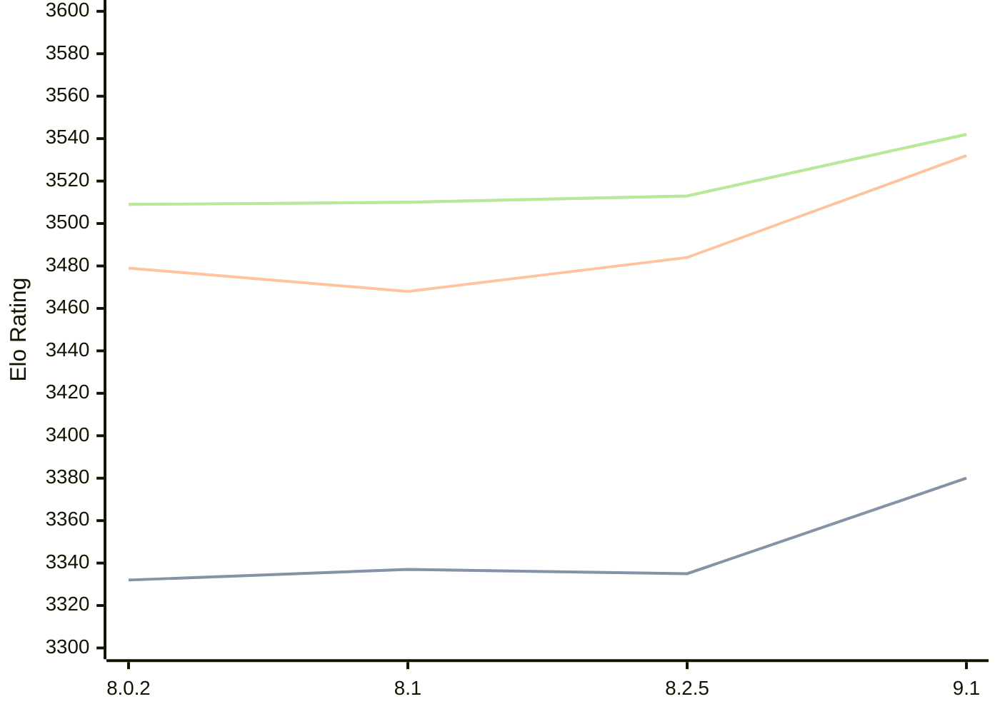

# Engine: Clover

Author: Luca Metehau

Home: https://github.com/lucametehau/CloverEngine

## Elo Ratings

| Version | Published | STC 8.0+0.08s  | LTC 60.0+0.60s | VLTC 2m24s+1.12s | Comment |
| --- | --- | --- | --- | --- | --- |
| 9.1 | 2025-09-14 | 3380(+45) | 3532(+48) | 3542(+29) |  |
| 8.2.5 | 2025-07-14 | 3335(-2) | 3484(+16) | 3513(+3) |  |
| 8.1 | 2024-12-03 | 3337(+5) | 3468(-11) | 3510(+1) |  |
| 8.0.2 | 2024-09-05 | 3332(+new) | 3479(+new) | 3509(+new) |  |
| 7.1 | 2024-08-11 |  |  |  |  |
 | | | cElo (∆ prev) | cElo (∆ prev) | cElo (∆ prev) | 

<a href="https://github.com/computer-chess-index/cci/issues/new?template=submit-version.yml&title=[VERSION]+Clover+<version>&body=###%20Engine%20name%0AClover%0A%0A###%20Version%0A9.1" target="_blank">Submit new version</a>

 Test Conditions:

GUI/CLI: <a href=https://github.com/cutechess/cutechess target="_blank">Cute-Chess</a> 
Elo Calculation: <a href=https://www.remi-coulom.fr/Bayesian-Elo/ target="_blank">Bayesian-Elo</a> 
CPU: Intel(R) Core(TM) i5-7500T 2.70GHz 
Opening book: 8_moves_v3 
\* STC: 8.0+0.08s, LTC: 60.0+0.60s, VLTC: 2m24s+1.12s

 Lists:
Ratings: <a href=https://github.com/computer-chess-index/cci/blob/main/lists/CCIRatings.csv target="_blank">Complete list</a>

Generated: 2026-08-20 06:24:15

## Ratings Verlauf

⬛ STC (8.0+0.08s) &nbsp;&nbsp; 🟧 LTC (60.0+0.60s) &nbsp;&nbsp; 🟩 VLTC (2m24s+1.12s)

dark mode: 🟩STC (8.0+0.08s) 🟧LTC (60.0+0.60s) ⬜VLTC (2m24s+1.12s)

## Detailed Evaluation Results

| Version | Time Control | Elo  | Range +/- | Matches | Score | Average Opponent Elo | Draws |
| --- | --- | --- | --- | --- | --- | --- | --- |
| 9.1 | VLTC (2m24s+1.12s) | 3542 | 22 | 470 | 50% | 3542 | 90% |
| 9.1 | LTC (60.0+0.60s) | 3532 | 22 | 492 | 50% | 3530 | 89% |
| 9.1 | STC (8.0+0.08s) | 3380 | 19 | 674 | 50% | 3378 | 74% |
| --- | --- | --- | --- | --- | --- | --- | --- |
| 8.2.5 | VLTC (2m24s+1.12s) | 3513 | 32 | 220 | 51% | 3509 | 91% |
| 8.2.5 | LTC (60.0+0.60s) | 3484 | 32 | 236 | 49% | 3491 | 81% |
| 8.2.5 | STC (8.0+0.08s) | 3335 | 31 | 254 | 49% | 3341 | 73% |
| --- | --- | --- | --- | --- | --- | --- | --- |
| 8.1 | VLTC (2m24s+1.12s) | 3510 | 14 | 1160 | 50% | 3507 | 84% |
| 8.1 | LTC (60.0+0.60s) | 3468 | 14 | 1176 | 50% | 3470 | 83% |
| 8.1 | STC (8.0+0.08s) | 3337 | 15 | 1124 | 51% | 3333 | 73% |
| --- | --- | --- | --- | --- | --- | --- | --- |
| 8.0.2 | VLTC (2m24s+1.12s) | 3509 | 18 | 748 | 51% | 3476 | 84% |
| 8.0.2 | LTC (60.0+0.60s) | 3479 | 19 | 676 | 51% | 3472 | 83% |
| 8.0.2 | STC (8.0+0.08s) | 3332 | 20 | 680 | 55% | 3205 | 66% |
| --- | --- | --- | --- | --- | --- | --- | --- |