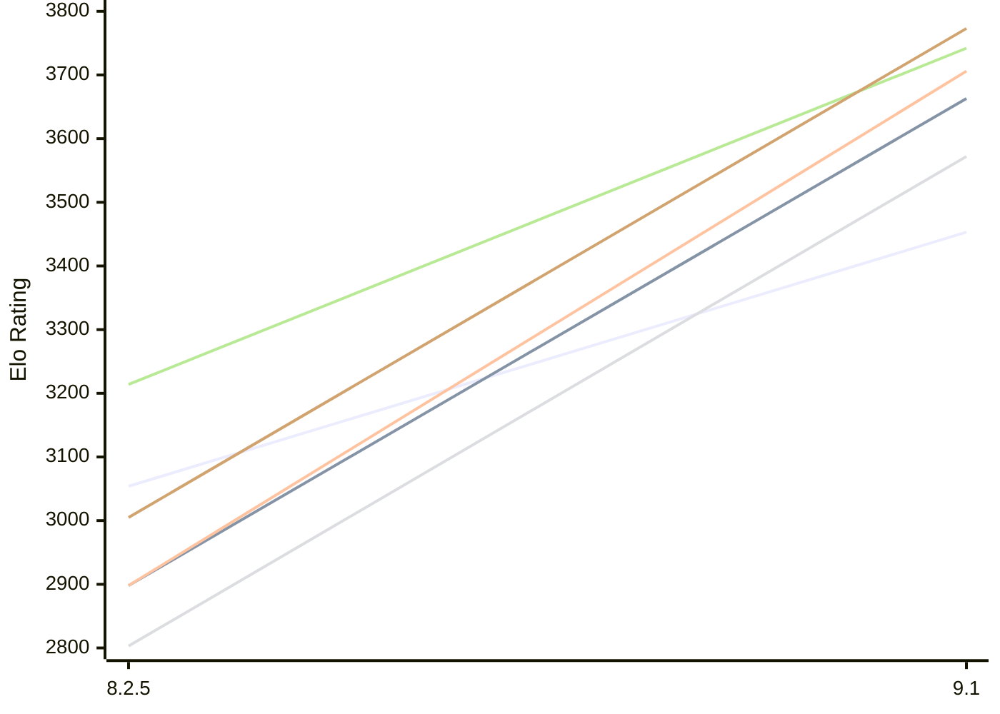
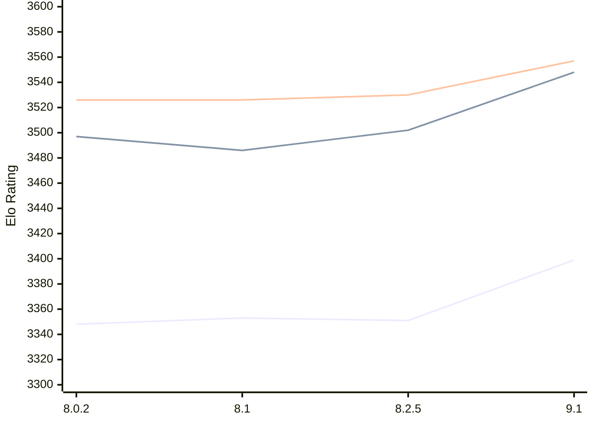

# Engine: Clover

Author: Luca Metehau

Home: https://github.com/lucametehau/CloverEngine

## Elo Ratings E1 (Ultra 7 265T (1.50 GHz) - E-Core)

| Version | Published | STC 8.0+0.08s  | LTC 60.0+0.60s | VLTC 2m24s+1.12s | Comment |
| --- | --- | --- | --- | --- | --- |
| 9.1 | 2025-09-14 | 3453(+399) | 3663(+765) | 3706(+808) |  |
| 8.2.5 | 2025-07-14 | 3054 | 2898 | 2898 |  |
 | | | cElo (∆ prev) | cElo (∆ prev) | cElo (∆ prev) | 

## Elo Ratings P1 (Ultra 7 265T (1.50 GHz) - P-Core)

| Version | Published | STC 8.0+0.08s  | LTC 60.0+0.60s | VLTC 2m24s+1.12s | Comment |
| --- | --- | --- | --- | --- | --- |
| 9.1 | 2025-09-14 | 3572(+769) | 3742(+528) | 3773(+768) |  |
| 8.2.5 | 2025-07-14 | 2803 | 3214 | 3005 |  |
 | | | cElo (∆ prev) | cElo (∆ prev) | cElo (∆ prev) | 

## Elo Ratings T1 (i5-7500T 2.70GHz)

| Version | Published | STC 8.0+0.08s  | LTC 60.0+0.60s | VLTC 2m24s+1.12s | Comment |
| --- | --- | --- | --- | --- | --- |
| 9.1 | 2025-09-14 | 3399(+48) | 3548(+46) | 3557(+27) |  |
| 8.2.5 | 2025-07-14 | 3351(-2) | 3502(+16) | 3530(+4) |  |
| 8.1 | 2024-12-03 | 3353(+5) | 3486(-11) | 3526(0) |  |
| 8.0.2 | 2024-09-05 | 3348 | 3497 | 3526 |  |
 | | | cElo (∆ prev) | cElo (∆ prev) | cElo (∆ prev) | 

<a href="https://github.com/computer-chess-index/cci/issues/new?template=submit-version.yml&title=[VERSION]+Clover+<version>&body=###%20Engine%20name%0AClover%0A%0A###%20Version%0A9.1" target="_blank">Submit new version</a>

 Test Conditions:

GUI/CLI: <a href=https://github.com/cutechess/cutechess target="_blank">Cute-Chess</a> 
Elo Calculation: <a href=https://www.remi-coulom.fr/Bayesian-Elo/ target="_blank">Bayesian-Elo</a> 
CPU for P1: Intel(R) Core(TM) Ultra 7 265T (1.50 GHz) - P-Core 
CPU for E1: Intel(R) Core(TM) Ultra 7 265T (1.50 GHz) - E-Core 
CPU for T1: Intel(R) Core(TM) i5-7500T 2.70GHz 
Opening book: 8_moves_v3 
\* STC: 8.0+0.08s, LTC: 60.0+0.60s, VLTC: 2m24s+1.12s

 Lists:
Ratings: <a href=https://github.com/computer-chess-index/cci/blob/main/lists/CCIRatings.csv target="_blank">Complete list</a>

Generated: 2026-11-12 05:37:20

## Ratings Verlauf E1 / P1

```mermaid
%%{init: {"theme":"base","themeVariables":{"seriesColors:['#a3a3a3','#222221','#faa371']}}}%%
xychart-beta
  x-axis ["8.2.5", "9.1"]
  y-axis "Elo Rating" 2800 --> 3800
  line "E1: STC (8.0+0.08s)" [3054, 3453]
  line "E1: LTC (60.0+0.60s)" [2898, 3663]
  line "E1: VLTC (2m24s+1.12s)" [2898, 3706]
  line "P1: STC (8.0+0.08s)" [2803, 3572]
  line "P1: LTC (60.0+0.60s)" [3214, 3742]
  line "P1: VLTC (2m24s+1.12s)" [3005, 3773]
```

## Ratings Verlauf T1

```mermaid
%%{init: {"theme":"base","themeVariables":{"seriesColors:['#a3a3a3','#222221','#faa371']}}}%%
xychart-beta
  x-axis ["8.0.2", "8.1", "8.2.5", "9.1"]
  y-axis "Elo Rating" 3300 --> 3600
  line "T1: STC (8.0+0.08s)" [3348, 3353, 3351, 3399]
  line "T1: LTC (60.0+0.60s)" [3497, 3486, 3502, 3548]
  line "T1: VLTC (2m24s+1.12s)" [3526, 3526, 3530, 3557]
```

## Detailed Evaluation Results

| Version | Time Control | Variant | Elo  | Range +/- | Matches | Score | Average Opponent Elo | Draws |
| --- | --- |--- | --- | --- | --- | --- | --- | --- |
| 9.1 | VLTC (2m24s+1.12s) | E1 | 3706 | 30 | 252 | 51% | 3696 | 85% |
|  |  | T1 | 3557 | 21 | 506 | 50% | 3560 | 89% |
|  |  | P1 | 3773 | 37 | 172 | 54% | 3746 | 83% |
|  | LTC (60.0+0.60s) | E1 | 3663 | 33 | 220 | 50% | 3663 | 82% |
|  |  | T1 | 3548 | 21 | 524 | 50% | 3548 | 89% |
|  |  | P1 | 3742 | 33 | 208 | 53% | 3719 | 86% |
|  | STC (8.0+0.08s) | P1 | 3572 | 32 | 248 | 51% | 3568 | 71% |
|  |  | E1 | 3453 | 25 | 408 | 49% | 3464 | 71% |
|  |  | T1 | 3399 | 18 | 736 | 51% | 3394 | 75% |
| --- | --- |--- | --- | --- | --- | --- | --- | --- |
| 8.2.5 | VLTC (2m24s+1.12s) | T1 | 3530 | 32 | 220 | 51% | 3526 | 91% |
|  |  | P1 | 3005 | 194 | 8 | 69% | 2788 | 38% |
|  |  | E1 | 2898 | 170 | 8 | 75% | 2716 | 50% |
|  | LTC (60.0+0.60s) | P1 | 3214 | 214 | 8 | 94% | 2862 | 13% |
|  |  | E1 | 2898 | 179 | 8 | 75% | 2677 | 50% |
|  |  | T1 | 3502 | 32 | 236 | 49% | 3509 | 81% |
|  | STC (8.0+0.08s) | P1 | 2803 | 164 | 8 | 38% | 2884 | 50% |
|  |  | E1 | 3054 | 247 | 4 | 100% | 2758 | 0% |
|  |  | T1 | 3351 | 31 | 254 | 49% | 3359 | 73% |
| --- | --- |--- | --- | --- | --- | --- | --- | --- |
| 8.1 | VLTC (2m24s+1.12s) | T1 | 3526 | 14 | 1160 | 50% | 3524 | 84% |
|  | LTC (60.0+0.60s) | T1 | 3486 | 14 | 1176 | 50% | 3487 | 83% |
|  | STC (8.0+0.08s) | T1 | 3353 | 15 | 1124 | 51% | 3349 | 73% |
| --- | --- |--- | --- | --- | --- | --- | --- | --- |
| 8.0.2 | VLTC (2m24s+1.12s) | T1 | 3526 | 18 | 748 | 51% | 3494 | 84% |
|  | LTC (60.0+0.60s) | T1 | 3497 | 19 | 676 | 51% | 3488 | 83% |
|  | STC (8.0+0.08s) | T1 | 3348 | 20 | 680 | 55% | 3221 | 66% |
| --- | --- |--- | --- | --- | --- | --- | --- | --- |