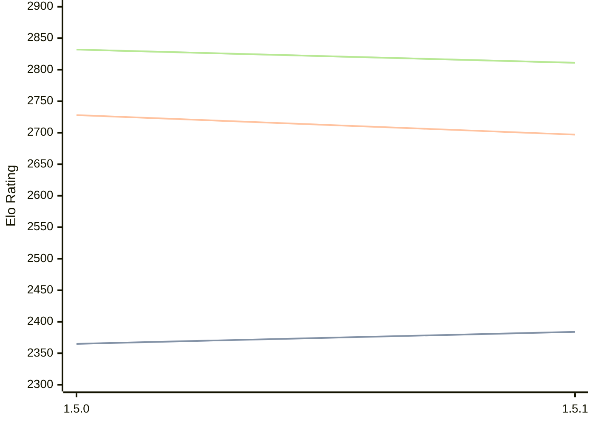

# Engine: Coco

Author: 

Home: https://github.com/NotKaede-11/Coco-Engine

## Elo Ratings E1

| Version | Published | STC 8.0+0.08s  | LTC 60.0+0.60s | VLTC 2m24s+1.12s | Comment |
| --- | --- | --- | --- | --- | --- |
| 1.5.0 | 2026-09-14 | 2147 | 2634 | 2763 |  |
 | | | cElo (∆ prev) | cElo (∆ prev) | cElo (∆ prev) | 

## Elo Ratings P1

| Version | Published | STC 8.0+0.08s  | LTC 60.0+0.60s | VLTC 2m24s+1.12s | Comment |
| --- | --- | --- | --- | --- | --- |
| 1.5.0 | 2026-09-14 | 2391 | 2849 | 2974 |  |
 | | | cElo (∆ prev) | cElo (∆ prev) | cElo (∆ prev) | 

## Elo Ratings T1

| Version | Published | STC 8.0+0.08s  | LTC 60.0+0.60s | VLTC 2m24s+1.12s | Comment |
| --- | --- | --- | --- | --- | --- |
| 1.5.1 | 2026-09-27 | 2384(+19) | 2697(-31) | 2811(-21) |  |
| 1.5.0 | 2026-09-14 | 2365 | 2728 | 2832 |  |
 | | | cElo (∆ prev) | cElo (∆ prev) | cElo (∆ prev) | 

<a href="https://github.com/computer-chess-index/cci/issues/new?template=submit-version.yml&title=[VERSION]+Coco+<version>&body=###%20Engine%20name%0ACoco%0A%0A###%20Version%0A1.5.1" target="_blank">Submit new version</a>

 Test Conditions:

GUI/CLI: <a href=https://github.com/cutechess/cutechess target="_blank">Cute-Chess</a> 
Elo Calculation: <a href=https://www.remi-coulom.fr/Bayesian-Elo/ target="_blank">Bayesian-Elo</a> 
CPU for P1: Intel(R) Core(TM) Ultra 7 265T (1.50 GHz) - P-Core 
CPU for E1: Intel(R) Core(TM) Ultra 7 265T (1.50 GHz) - E-Core 
CPU for T1: Intel(R) Core(TM) i5-7500T 2.70GHz 
Opening book: 8_moves_v3 
\* STC: 8.0+0.08s, LTC: 60.0+0.60s, VLTC: 2m24s+1.12s

 Lists:
Ratings: <a href=https://github.com/computer-chess-index/cci/blob/main/lists/CCIRatings.csv target="_blank">Complete list</a>

Generated: 2026-10-10 04:37:31

## Ratings Verlauf

## Detailed Evaluation Results

| Version | Time Control | Elo  | Range +/- | Matches | Score | Average Opponent Elo | Draws |
| --- | --- | --- | --- | --- | --- | --- | --- |
| 1.5.1 | VLTC (2m24s+1.12s) | 2811 | 41 | 190 | 49% | 2816 | 31% |
| 1.5.1 | LTC (60.0+0.60s) | 2697 | 41 | 194 | 50% | 2699 | 34% |
| 1.5.1 | STC (8.0+0.08s) | 2384 | 36 | 280 | 45% | 2435 | 24% |
| --- | --- | --- | --- | --- | --- | --- | --- |
| 1.5.0 | VLTC (2m24s+1.12s) | 2832 | 37 | 238 | 50% | 2824 | 30% |
| 1.5.0 | VLTC (2m24s+1.12s) | 2974 | 43 | 168 | 49% | 2985 | 40% |
| 1.5.0 | VLTC (2m24s+1.12s) | 2763 | 35 | 266 | 47% | 2786 | 32% |
| 1.5.0 | LTC (60.0+0.60s) | 2728 | 35 | 260 | 50% | 2726 | 33% |
| 1.5.0 | LTC (60.0+0.60s) | 2849 | 44 | 172 | 48% | 2876 | 30% |
| 1.5.0 | LTC (60.0+0.60s) | 2634 | 36 | 264 | 46% | 2670 | 30% |
| 1.5.0 | STC (8.0+0.08s) | 2365 | 35 | 280 | 50% | 2361 | 25% |
| --- | --- | --- | --- | --- | --- | --- | --- |
| 1.5.0 | STC (8.0+0.08s) | 2391 | 45 | 184 | 42% | 2484 | 20% |
| --- | --- | --- | --- | --- | --- | --- | --- |
| 1.5.0 | STC (8.0+0.08s) | 2147 | 37 | 268 | 41% | 2265 | 21% |
| --- | --- | --- | --- | --- | --- | --- | --- |