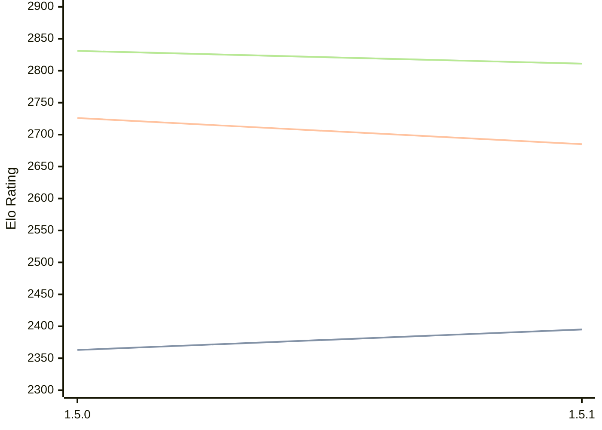

# Engine: Coco

Author: 

Home: https://github.com/NotKaede-11/Coco-Engine

## Elo Ratings

| Version | Published | STC 8.0+0.08s  | LTC 60.0+0.60s | VLTC 2m24s+1.12s | Comment |
| --- | --- | --- | --- | --- | --- |
| 1.5.1 | 2026-09-27 | 2395(+32) | 2685(-41) | 2811(-20) |  |
| 1.5.0 | 2026-09-14 | 2363(+new) | 2726(+new) | 2831(+new) |  |
| 1.4.0 | 2026-07-13 |  |  |  |  |
| 1.3.0 | 2026-07-10 |  |  |  |  |
| 1.1.1 | 2026-07-09 |  |  |  |  |
| 1.1.0 | 2026-07-09 |  |  |  |  |
| 1.0.1 | 2026-07-06 |  |  |  |  |
| 1.0.0 | 2026-07-01 |  |  |  |  |
 | | | cElo (∆ prev) | cElo (∆ prev) | cElo (∆ prev) | 

<a href="https://github.com/computer-chess-index/cci/issues/new?template=submit-version.yml&title=[VERSION]+Coco+<version>&body=###%20Engine%20name%0ACoco%0A%0A###%20Version%0A1.5.1" target="_blank">Submit new version</a>

 Test Conditions:

GUI/CLI: <a href=https://github.com/cutechess/cutechess target="_blank">Cute-Chess</a> 
Elo Calculation: <a href=https://www.remi-coulom.fr/Bayesian-Elo/ target="_blank">Bayesian-Elo</a> 
CPU: Intel(R) Core(TM) i5-7500T 2.70GHz 
Opening book: 8_moves_v3 
\* STC: 8.0+0.08s, LTC: 60.0+0.60s, VLTC: 2m24s+1.12s

 Lists:
Ratings: <a href=https://github.com/computer-chess-index/cci/blob/main/lists/CCIRatings.csv target="_blank">Complete list</a>

Generated: 2026-10-03 04:37:27

## Ratings Verlauf

## Detailed Evaluation Results

| Version | Time Control | Elo  | Range +/- | Matches | Score | Average Opponent Elo | Draws |
| --- | --- | --- | --- | --- | --- | --- | --- |
| 1.5.1 | VLTC (2m24s+1.12s) | 2811 | 43 | 178 | 49% | 2813 | 30% |
| 1.5.1 | LTC (60.0+0.60s) | 2685 | 56 | 104 | 49% | 2693 | 31% |
| 1.5.1 | STC (8.0+0.08s) | 2395 | 42 | 200 | 44% | 2457 | 25% |
| --- | --- | --- | --- | --- | --- | --- | --- |
| 1.5.0 | VLTC (2m24s+1.12s) | 2831 | 37 | 238 | 50% | 2823 | 30% |
| 1.5.0 | LTC (60.0+0.60s) | 2726 | 35 | 260 | 50% | 2723 | 33% |
| 1.5.0 | STC (8.0+0.08s) | 2363 | 35 | 280 | 50% | 2360 | 25% |
| --- | --- | --- | --- | --- | --- | --- | --- |