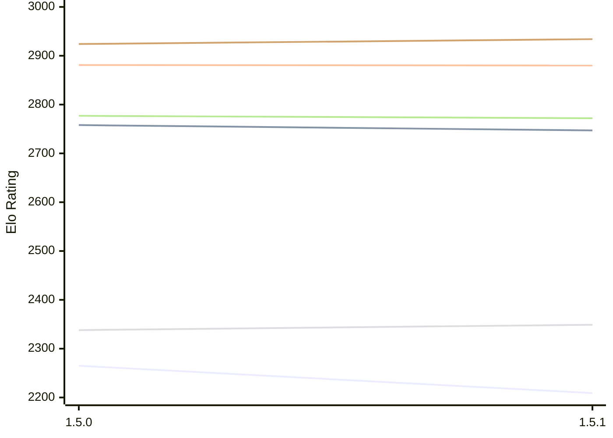
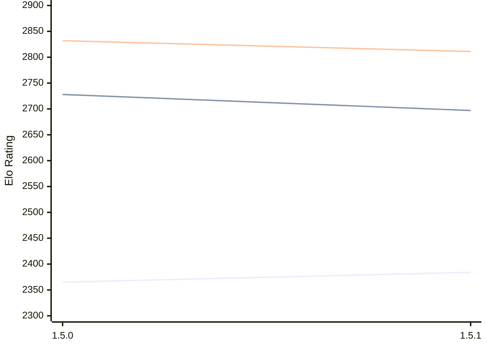

# Engine: Coco

Author: 

Home: https://github.com/NotKaede-11/Coco-Engine

## Elo Ratings E1 (Ultra 7 265T (1.50 GHz) - E-Core)

| Version | Published | STC 8.0+0.08s  | LTC 60.0+0.60s | VLTC 2m24s+1.12s | Comment |
| --- | --- | --- | --- | --- | --- |
| 1.5.1 | 2026-09-27 | 2209(-56) | 2747(-11) | 2880(-1) |  |
| 1.5.0 | 2026-09-14 | 2265 | 2758 | 2881 |  |
 | | | cElo (∆ prev) | cElo (∆ prev) | cElo (∆ prev) | 

## Elo Ratings P1 (Ultra 7 265T (1.50 GHz) - P-Core)

| Version | Published | STC 8.0+0.08s  | LTC 60.0+0.60s | VLTC 2m24s+1.12s | Comment |
| --- | --- | --- | --- | --- | --- |
| 1.5.1 | 2026-09-27 | 2349(+11) | 2772(-5) | 2934(+10) |  |
| 1.5.0 | 2026-09-14 | 2338 | 2777 | 2924 |  |
 | | | cElo (∆ prev) | cElo (∆ prev) | cElo (∆ prev) | 

## Elo Ratings T1 (i5-7500T 2.70GHz)

| Version | Published | STC 8.0+0.08s  | LTC 60.0+0.60s | VLTC 2m24s+1.12s | Comment |
| --- | --- | --- | --- | --- | --- |
| 1.5.1 | 2026-09-27 | 2384(+19) | 2697(-31) | 2811(-21) |  |
| 1.5.0 | 2026-09-14 | 2365 | 2728 | 2832 |  |
 | | | cElo (∆ prev) | cElo (∆ prev) | cElo (∆ prev) | 

<a href="https://github.com/computer-chess-index/cci/issues/new?template=submit-version.yml&title=[VERSION]+Coco+<version>&body=###%20Engine%20name%0ACoco%0A%0A###%20Version%0A1.5.1" target="_blank">Submit new version</a>

 Test Conditions:

GUI/CLI: <a href=https://github.com/cutechess/cutechess target="_blank">Cute-Chess</a> 
Elo Calculation: <a href=https://www.remi-coulom.fr/Bayesian-Elo/ target="_blank">Bayesian-Elo</a> 
CPU for P1: Intel(R) Core(TM) Ultra 7 265T (1.50 GHz) - P-Core 
CPU for E1: Intel(R) Core(TM) Ultra 7 265T (1.50 GHz) - E-Core 
CPU for T1: Intel(R) Core(TM) i5-7500T 2.70GHz 
Opening book: 8_moves_v3 
\* STC: 8.0+0.08s, LTC: 60.0+0.60s, VLTC: 2m24s+1.12s

 Lists:
Ratings: <a href=https://github.com/computer-chess-index/cci/blob/main/lists/CCIRatings.csv target="_blank">Complete list</a>

Generated: 2026-11-02 05:37:26

## Ratings Verlauf E1 / P1

```mermaid
%%{init: {"theme":"base","themeVariables":{"seriesColors:['#a3a3a3','#222221','#faa371']}}}%%
xychart-beta
  x-axis ["1.5.0", "1.5.1"]
  y-axis "Elo Rating" 2200 --> 3000
  line "E1: STC (8.0+0.08s)" [2265, 2209]
  line "E1: LTC (60.0+0.60s)" [2758, 2747]
  line "E1: VLTC (2m24s+1.12s)" [2881, 2880]
  line "P1: STC (8.0+0.08s)" [2338, 2349]
  line "P1: LTC (60.0+0.60s)" [2777, 2772]
  line "P1: VLTC (2m24s+1.12s)" [2924, 2934]
```

## Ratings Verlauf T1

```mermaid
%%{init: {"theme":"base","themeVariables":{"seriesColors:['#a3a3a3','#222221','#faa371']}}}%%
xychart-beta
  x-axis ["1.5.0", "1.5.1"]
  y-axis "Elo Rating" 2300 --> 2900
  line "T1: STC (8.0+0.08s)" [2365, 2384]
  line "T1: LTC (60.0+0.60s)" [2728, 2697]
  line "T1: VLTC (2m24s+1.12s)" [2832, 2811]
```

## Detailed Evaluation Results

| Version | Time Control | Variant | Elo  | Range +/- | Matches | Score | Average Opponent Elo | Draws |
| --- | --- |--- | --- | --- | --- | --- | --- | --- |
| 1.5.1 | VLTC (2m24s+1.12s) | P1 | 2934 | 40 | 208 | 47% | 2917 | 33% |
|  |  | E1 | 2880 | 34 | 282 | 48% | 2898 | 34% |
|  |  | T1 | 2811 | 41 | 190 | 49% | 2816 | 31% |
|  | LTC (60.0+0.60s) | E1 | 2747 | 39 | 212 | 54% | 2715 | 31% |
|  |  | T1 | 2697 | 41 | 194 | 50% | 2699 | 34% |
|  |  | P1 | 2772 | 42 | 184 | 49% | 2780 | 30% |
|  | STC (8.0+0.08s) | E1 | 2209 | 36 | 272 | 46% | 2255 | 20% |
|  |  | T1 | 2384 | 36 | 280 | 45% | 2435 | 24% |
|  |  | P1 | 2349 | 39 | 236 | 54% | 2313 | 20% |
| --- | --- |--- | --- | --- | --- | --- | --- | --- |
| 1.5.0 | VLTC (2m24s+1.12s) | T1 | 2832 | 37 | 238 | 50% | 2824 | 30% |
|  |  | P1 | 2924 | 40 | 188 | 48% | 2943 | 40% |
|  |  | E1 | 2881 | 32 | 318 | 47% | 2907 | 30% |
|  | LTC (60.0+0.60s) | T1 | 2728 | 35 | 260 | 50% | 2726 | 33% |
|  |  | P1 | 2777 | 38 | 236 | 47% | 2813 | 28% |
|  |  | E1 | 2758 | 34 | 284 | 47% | 2786 | 30% |
|  | STC (8.0+0.08s) | T1 | 2365 | 35 | 280 | 50% | 2361 | 25% |
|  |  | P1 | 2338 | 41 | 224 | 44% | 2394 | 18% |
|  |  | E1 | 2265 | 35 | 308 | 43% | 2365 | 22% |