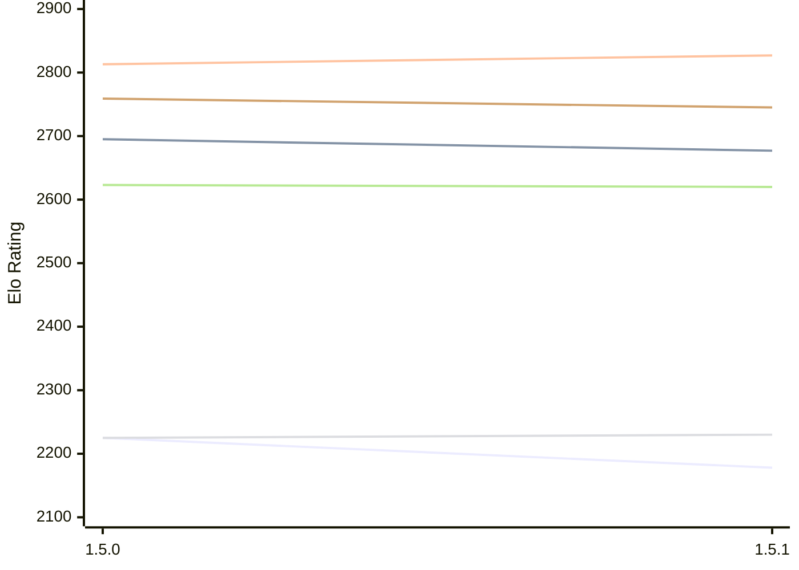
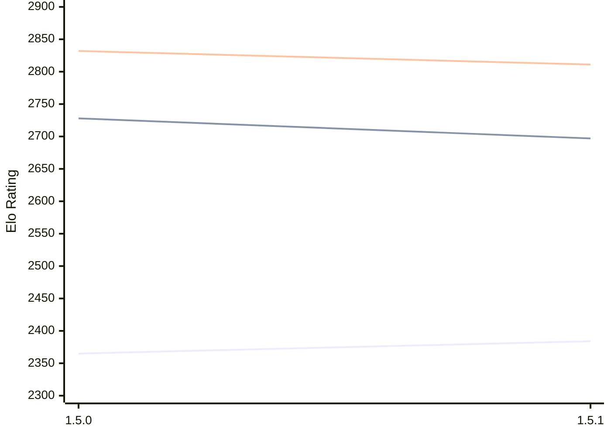

# Engine: Coco

Author: 

Home: https://github.com/NotKaede-11/Coco-Engine

## Elo Ratings E1 (Ultra 7 265T (1.50 GHz) - E-Core)

| Version | Published | STC 8.0+0.08s  | LTC 60.0+0.60s | VLTC 2m24s+1.12s | Comment |
| --- | --- | --- | --- | --- | --- |
| 1.5.1 | 2026-09-27 | 2178(-47) | 2677(-18) | 2827(+14) |  |
| 1.5.0 | 2026-09-14 | 2225 | 2695 | 2813 |  |
 | | | cElo (∆ prev) | cElo (∆ prev) | cElo (∆ prev) | 

## Elo Ratings P1 (Ultra 7 265T (1.50 GHz) - P-Core)

| Version | Published | STC 8.0+0.08s  | LTC 60.0+0.60s | VLTC 2m24s+1.12s | Comment |
| --- | --- | --- | --- | --- | --- |
| 1.5.1 | 2026-09-27 | 2230(+5) | 2620(-3) | 2745(-14) |  |
| 1.5.0 | 2026-09-14 | 2225 | 2623 | 2759 |  |
 | | | cElo (∆ prev) | cElo (∆ prev) | cElo (∆ prev) | 

## Elo Ratings T1 (i5-7500T 2.70GHz)

| Version | Published | STC 8.0+0.08s  | LTC 60.0+0.60s | VLTC 2m24s+1.12s | Comment |
| --- | --- | --- | --- | --- | --- |
| 1.5.1 | 2026-09-27 | 2384(+19) | 2697(-31) | 2811(-21) |  |
| 1.5.0 | 2026-09-14 | 2365 | 2728 | 2832 |  |
 | | | cElo (∆ prev) | cElo (∆ prev) | cElo (∆ prev) | 

<a href="https://github.com/computer-chess-index/cci/issues/new?template=submit-version.yml&title=[VERSION]+Coco+<version>&body=###%20Engine%20name%0ACoco%0A%0A###%20Version%0A1.5.1" target="_blank">Submit new version</a>

 Test Conditions:

GUI/CLI: <a href=https://github.com/cutechess/cutechess target="_blank">Cute-Chess</a> 
Elo Calculation: <a href=https://www.remi-coulom.fr/Bayesian-Elo/ target="_blank">Bayesian-Elo</a> 
CPU for P1: Intel(R) Core(TM) Ultra 7 265T (1.50 GHz) - P-Core 
CPU for E1: Intel(R) Core(TM) Ultra 7 265T (1.50 GHz) - E-Core 
CPU for T1: Intel(R) Core(TM) i5-7500T 2.70GHz 
Opening book: 8_moves_v3 
\* STC: 8.0+0.08s, LTC: 60.0+0.60s, VLTC: 2m24s+1.12s

 Lists:
Ratings: <a href=https://github.com/computer-chess-index/cci/blob/main/lists/CCIRatings.csv target="_blank">Complete list</a>

Generated: 2026-11-15 05:37:30

## Ratings Verlauf E1 / P1

```mermaid
%%{init: {"theme":"base","themeVariables":{"seriesColors:['#a3a3a3','#222221','#faa371']}}}%%
xychart-beta
  x-axis ["1.5.0", "1.5.1"]
  y-axis "Elo Rating" 2100 --> 2900
  line "E1: STC (8.0+0.08s)" [2225, 2178]
  line "E1: LTC (60.0+0.60s)" [2695, 2677]
  line "E1: VLTC (2m24s+1.12s)" [2813, 2827]
  line "P1: STC (8.0+0.08s)" [2225, 2230]
  line "P1: LTC (60.0+0.60s)" [2623, 2620]
  line "P1: VLTC (2m24s+1.12s)" [2759, 2745]
```

## Ratings Verlauf T1

```mermaid
%%{init: {"theme":"base","themeVariables":{"seriesColors:['#a3a3a3','#222221','#faa371']}}}%%
xychart-beta
  x-axis ["1.5.0", "1.5.1"]
  y-axis "Elo Rating" 2300 --> 2900
  line "T1: STC (8.0+0.08s)" [2365, 2384]
  line "T1: LTC (60.0+0.60s)" [2728, 2697]
  line "T1: VLTC (2m24s+1.12s)" [2832, 2811]
```

## Detailed Evaluation Results

| Version | Time Control | Variant | Elo  | Range +/- | Matches | Score | Average Opponent Elo | Draws |
| --- | --- |--- | --- | --- | --- | --- | --- | --- |
| 1.5.1 | VLTC (2m24s+1.12s) | E1 | 2827 | 30 | 354 | 48% | 2843 | 34% |
|  |  | T1 | 2811 | 41 | 190 | 49% | 2816 | 31% |
|  |  | P1 | 2745 | 33 | 302 | 45% | 2763 | 32% |
|  | LTC (60.0+0.60s) | T1 | 2697 | 41 | 194 | 50% | 2699 | 34% |
|  |  | P1 | 2620 | 38 | 232 | 49% | 2633 | 29% |
|  |  | E1 | 2677 | 35 | 272 | 53% | 2654 | 32% |
|  | STC (8.0+0.08s) | T1 | 2384 | 36 | 280 | 45% | 2435 | 24% |
|  |  | P1 | 2230 | 38 | 248 | 53% | 2201 | 20% |
|  |  | E1 | 2178 | 32 | 360 | 47% | 2207 | 20% |
| --- | --- |--- | --- | --- | --- | --- | --- | --- |
| 1.5.0 | VLTC (2m24s+1.12s) | T1 | 2832 | 37 | 238 | 50% | 2824 | 30% |
|  |  | P1 | 2759 | 39 | 208 | 47% | 2792 | 39% |
|  |  | E1 | 2813 | 31 | 342 | 46% | 2855 | 30% |
|  | LTC (60.0+0.60s) | T1 | 2728 | 35 | 260 | 50% | 2726 | 33% |
|  |  | P1 | 2623 | 37 | 248 | 46% | 2665 | 27% |
|  |  | E1 | 2695 | 33 | 308 | 46% | 2720 | 30% |
|  | STC (8.0+0.08s) | T1 | 2365 | 35 | 280 | 50% | 2361 | 25% |
|  |  | P1 | 2225 | 39 | 250 | 46% | 2267 | 18% |
|  |  | E1 | 2225 | 34 | 332 | 42% | 2329 | 20% |