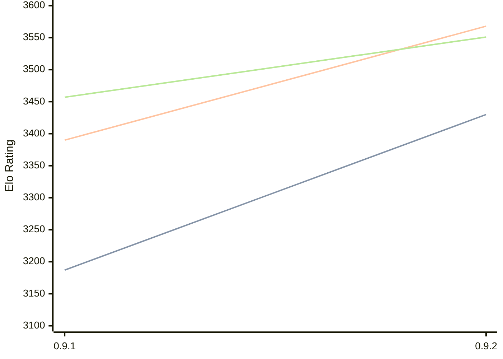

# Engine: Coda

Author: Adam Twiss

Home: https://github.com/adamtwiss/coda

## Elo Ratings

| Version | Published | STC 8.0+0.08s  | LTC 60.0+0.60s | VLTC 2m24s+1.12s | Comment |
| --- | --- | --- | --- | --- | --- |
| 0.9.2 | 2026-07-16 | 3430(+243) | 3568(+178) | 3551(+94) |  |
| 0.9.1 | 2026-07-14 | 3187 | 3390 | 3457 |  |
 | | | cElo (∆ prev) | cElo (∆ prev) | cElo (∆ prev) | 

<a href="https://github.com/computer-chess-index/cci/issues/new?template=submit-version.yml&title=[VERSION]+Coda+<version>&body=###%20Engine%20name%0ACoda%0A%0A###%20Version%0A0.9.2" target="_blank">Submit new version</a>

 Test Conditions:

GUI/CLI: <a href=https://github.com/cutechess/cutechess target="_blank">Cute-Chess</a> 
Elo Calculation: <a href=https://www.remi-coulom.fr/Bayesian-Elo/ target="_blank">Bayesian-Elo</a> 
CPU: Intel(R) Core(TM) i5-7500T 2.70GHz 
Opening book: 8_moves_v3 
\* STC: 8.0+0.08s, LTC: 60.0+0.60s, VLTC: 2m24s+1.12s

 Lists:
Ratings: <a href=https://github.com/computer-chess-index/cci/blob/main/lists/CCIRatings.csv target="_blank">Complete list</a>

Generated: 2026-07-19 06:24:02

## Ratings Verlauf

⬛ STC (8.0+0.08s) &nbsp;&nbsp; 🟧 LTC (60.0+0.60s) &nbsp;&nbsp; 🟩 VLTC (2m24s+1.12s)

dark mode: 🟩STC (8.0+0.08s) 🟧LTC (60.0+0.60s) ⬜VLTC (2m24s+1.12s)

## Detailed Evaluation Results

| Version | Time Control | Elo  | Range +/- | Matches | Score | Average Opponent Elo | Draws |
| --- | --- | --- | --- | --- | --- | --- | --- |
| 0.9.2 | VLTC (2m24s+1.12s) | 3551 | 41 | 134 | 51% | 3540 | 91% |
| 0.9.2 | LTC (60.0+0.60s) | 3568 | 54 | 80 | 51% | 3556 | 85% |
| 0.9.2 | STC (8.0+0.08s) | 3430 | 33 | 220 | 48% | 3441 | 76% |
| --- | --- | --- | --- | --- | --- | --- | --- |
| 0.9.1 | VLTC (2m24s+1.12s) | 3457 | 39 | 166 | 55% | 3409 | 73% |
| 0.9.1 | LTC (60.0+0.60s) | 3390 | 42 | 152 | 55% | 3329 | 63% |
| 0.9.1 | STC (8.0+0.08s) | 3187 | 41 | 172 | 52% | 3155 | 53% |
| --- | --- | --- | --- | --- | --- | --- | --- |