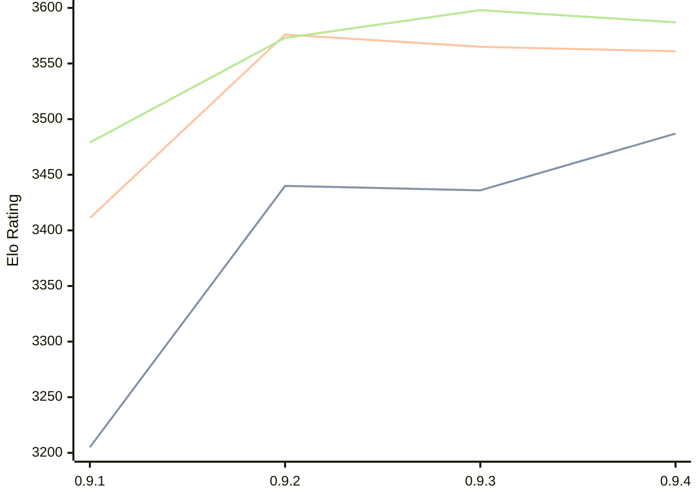

# Engine: Coda

Author: Adam Twiss

Home: https://github.com/adamtwiss/coda

## Elo Ratings

| Version | Published | STC 8.0+0.08s  | LTC 60.0+0.60s | VLTC 2m24s+1.12s | Comment |
| --- | --- | --- | --- | --- | --- |
| 0.9.4 | 2026-08-22 | 3487(+51) | 3561(-4) | 3587(-11) |  |
| 0.9.3 | 2026-07-26 | 3436(-4) | 3565(-11) | 3598(+25) |  |
| 0.9.2 | 2026-07-16 | 3440(+235) | 3576(+165) | 3573(+94) |  |
| 0.9.1 | 2026-07-14 | 3205 | 3411 | 3479 |  |
 | | | cElo (∆ prev) | cElo (∆ prev) | cElo (∆ prev) | 

<a href="https://github.com/computer-chess-index/cci/issues/new?template=submit-version.yml&title=[VERSION]+Coda+<version>&body=###%20Engine%20name%0ACoda%0A%0A###%20Version%0A0.9.4" target="_blank">Submit new version</a>

 Test Conditions:

GUI/CLI: <a href=https://github.com/cutechess/cutechess target="_blank">Cute-Chess</a> 
Elo Calculation: <a href=https://www.remi-coulom.fr/Bayesian-Elo/ target="_blank">Bayesian-Elo</a> 
CPU: Intel(R) Core(TM) i5-7500T 2.70GHz 
Opening book: 8_moves_v3 
\* STC: 8.0+0.08s, LTC: 60.0+0.60s, VLTC: 2m24s+1.12s

 Lists:
Ratings: <a href=https://github.com/computer-chess-index/cci/blob/main/lists/CCIRatings.csv target="_blank">Complete list</a>

Generated: 2026-09-16 04:37:17

## Ratings Verlauf

## Detailed Evaluation Results

| Version | Time Control | Elo  | Range +/- | Matches | Score | Average Opponent Elo | Draws |
| --- | --- | --- | --- | --- | --- | --- | --- |
| 0.9.4 | VLTC (2m24s+1.12s) | 3587 | 38 | 156 | 51% | 3580 | 90% |
| 0.9.4 | LTC (60.0+0.60s) | 3561 | 32 | 232 | 50% | 3560 | 83% |
| 0.9.4 | STC (8.0+0.08s) | 3487 | 28 | 306 | 51% | 3482 | 84% |
| --- | --- | --- | --- | --- | --- | --- | --- |
| 0.9.3 | VLTC (2m24s+1.12s) | 3598 | 43 | 124 | 53% | 3579 | 90% |
| 0.9.3 | LTC (60.0+0.60s) | 3565 | 32 | 228 | 51% | 3557 | 86% |
| 0.9.3 | STC (8.0+0.08s) | 3436 | 30 | 276 | 50% | 3434 | 75% |
| --- | --- | --- | --- | --- | --- | --- | --- |
| 0.9.2 | VLTC (2m24s+1.12s) | 3573 | 32 | 214 | 51% | 3567 | 91% |
| 0.9.2 | LTC (60.0+0.60s) | 3576 | 36 | 178 | 50% | 3575 | 89% |
| 0.9.2 | STC (8.0+0.08s) | 3440 | 27 | 328 | 48% | 3453 | 77% |
| --- | --- | --- | --- | --- | --- | --- | --- |
| 0.9.1 | VLTC (2m24s+1.12s) | 3479 | 39 | 166 | 55% | 3429 | 73% |
| 0.9.1 | LTC (60.0+0.60s) | 3411 | 42 | 152 | 55% | 3349 | 63% |
| 0.9.1 | STC (8.0+0.08s) | 3205 | 41 | 172 | 52% | 3171 | 53% |
| --- | --- | --- | --- | --- | --- | --- | --- |