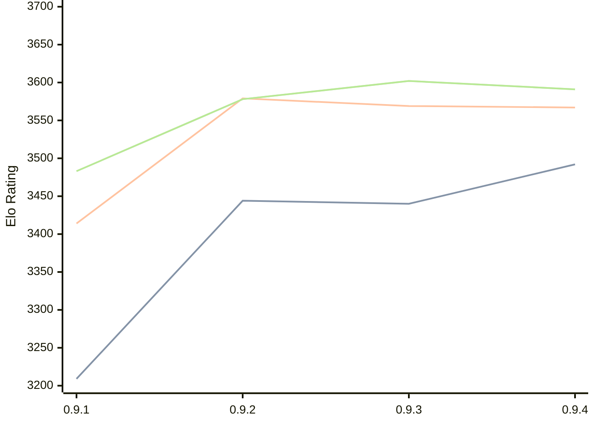

# Engine: Coda

Author: Adam Twiss

Home: https://github.com/adamtwiss/coda

## Elo Ratings

| Version | Published | STC 8.0+0.08s  | LTC 60.0+0.60s | VLTC 2m24s+1.12s | Comment |
| --- | --- | --- | --- | --- | --- |
| 0.9.4 | 2026-08-22 | 3492(+52) | 3567(-2) | 3591(-11) |  |
| 0.9.3 | 2026-07-26 | 3440(-4) | 3569(-10) | 3602(+24) |  |
| 0.9.2 | 2026-07-16 | 3444(+235) | 3579(+165) | 3578(+95) |  |
| 0.9.1 | 2026-07-14 | 3209 | 3414 | 3483 |  |
 | | | cElo (∆ prev) | cElo (∆ prev) | cElo (∆ prev) | 

<a href="https://github.com/computer-chess-index/cci/issues/new?template=submit-version.yml&title=[VERSION]+Coda+<version>&body=###%20Engine%20name%0ACoda%0A%0A###%20Version%0A0.9.4" target="_blank">Submit new version</a>

 Test Conditions:

GUI/CLI: <a href=https://github.com/cutechess/cutechess target="_blank">Cute-Chess</a> 
Elo Calculation: <a href=https://www.remi-coulom.fr/Bayesian-Elo/ target="_blank">Bayesian-Elo</a> 
CPU: Intel(R) Core(TM) i5-7500T 2.70GHz 
Opening book: 8_moves_v3 
\* STC: 8.0+0.08s, LTC: 60.0+0.60s, VLTC: 2m24s+1.12s

 Lists:
Ratings: <a href=https://github.com/computer-chess-index/cci/blob/main/lists/CCIRatings.csv target="_blank">Complete list</a>

Generated: 2026-10-08 04:37:33

## Ratings Verlauf

```mermaid
%%{init: {"theme":"base","themeVariables":{"seriesColors:['#a3a3a3','#222221','#faa371']}}}%%
xychart-beta
  x-axis ["0.9.1", "0.9.2", "0.9.3", "0.9.4"]
  y-axis "Elo Rating" 3200 --> 3700
  line "" [3209, 3444, 3440, 3492]
  line "STC (8.0+0.08s)" [3209, 3444, 3440, 3492]
  line "LTC (60.0+0.60s)" [3414, 3579, 3569, 3567]
  line "" [3483, 3578, 3602, 3591]
  line "VLTC (2m24s+1.12s)" [3483, 3578, 3602, 3591]
```

## Detailed Evaluation Results

| Version | Time Control | Elo  | Range +/- | Matches | Score | Average Opponent Elo | Draws |
| --- | --- | --- | --- | --- | --- | --- | --- |
| 0.9.4 | VLTC (2m24s+1.12s) | 3591 | 37 | 168 | 51% | 3583 | 90% |
| 0.9.4 | LTC (60.0+0.60s) | 3567 | 31 | 244 | 51% | 3563 | 83% |
| 0.9.4 | STC (8.0+0.08s) | 3492 | 27 | 318 | 51% | 3487 | 85% |
| --- | --- | --- | --- | --- | --- | --- | --- |
| 0.9.3 | VLTC (2m24s+1.12s) | 3602 | 43 | 124 | 53% | 3583 | 90% |
| 0.9.3 | LTC (60.0+0.60s) | 3569 | 32 | 228 | 51% | 3561 | 86% |
| 0.9.3 | STC (8.0+0.08s) | 3440 | 30 | 276 | 50% | 3438 | 75% |
| --- | --- | --- | --- | --- | --- | --- | --- |
| 0.9.2 | VLTC (2m24s+1.12s) | 3578 | 32 | 214 | 51% | 3571 | 91% |
| 0.9.2 | LTC (60.0+0.60s) | 3579 | 36 | 178 | 50% | 3578 | 89% |
| 0.9.2 | STC (8.0+0.08s) | 3444 | 27 | 328 | 48% | 3457 | 77% |
| --- | --- | --- | --- | --- | --- | --- | --- |
| 0.9.1 | VLTC (2m24s+1.12s) | 3483 | 39 | 166 | 55% | 3433 | 73% |
| 0.9.1 | LTC (60.0+0.60s) | 3414 | 42 | 152 | 55% | 3353 | 63% |
| 0.9.1 | STC (8.0+0.08s) | 3209 | 41 | 172 | 52% | 3175 | 53% |
| --- | --- | --- | --- | --- | --- | --- | --- |