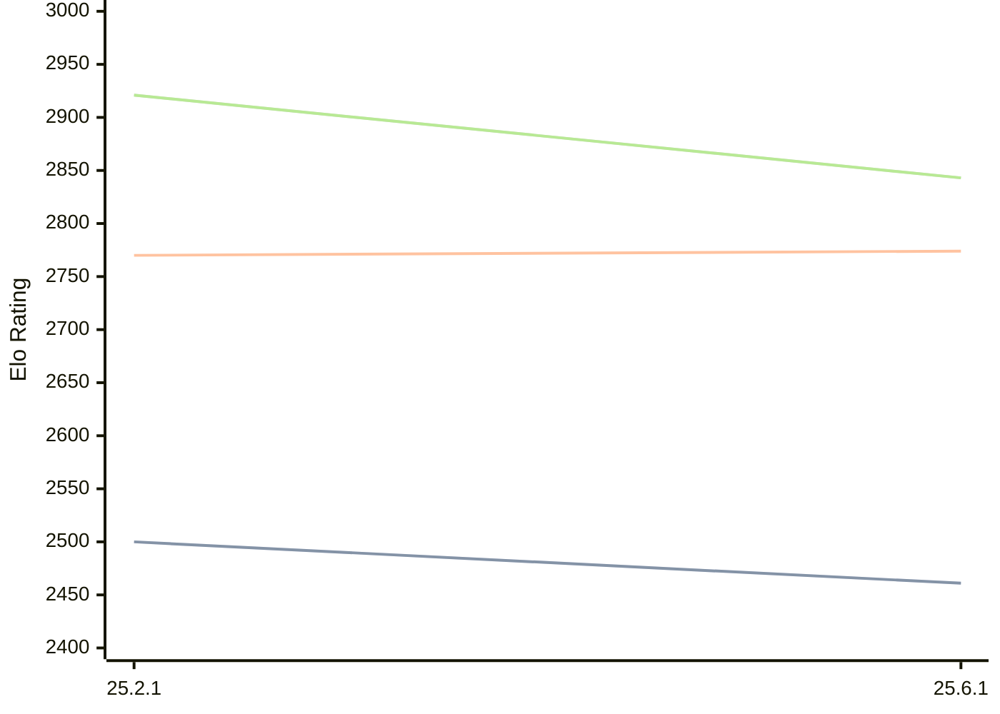

# Engine: Crafty

Author: Robert M. Hyatt

Home: https://github.com/stevemaughan/Crafty-Chess

## Elo Ratings

| Version | Published | STC 8.0+0.08s  | LTC 60.0+0.60s | VLTC 2m24s+1.12s | Comment |
| --- | --- | --- | --- | --- | --- |
| 25.6.1 | 2026-06-24 | 2461(-39) | 2774(+4) | 2843(-78) |  |
| 25.2.1 | 2026-06-20 | 2500 | 2770 | 2921 |  |
 | | | cElo (∆ prev) | cElo (∆ prev) | cElo (∆ prev) | 

<a href="https://github.com/computer-chess-index/cci/issues/new?template=submit-version.yml&title=[VERSION]+Crafty+<version>&body=###%20Engine%20name%0ACrafty%0A%0A###%20Version%0A25.6.1" target="_blank">Submit new version</a>

 Test Conditions:

GUI/CLI: <a href=https://github.com/cutechess/cutechess target="_blank">Cute-Chess</a> 
Elo Calculation: <a href=https://www.remi-coulom.fr/Bayesian-Elo/ target="_blank">Bayesian-Elo</a> 
CPU: Intel(R) Core(TM) i5-7500T 2.70GHz 
Opening book: 8_moves_v3 
\* STC: 8.0+0.08s, LTC: 60.0+0.60s, VLTC: 2m24s+1.12s

 Lists:
Ratings: <a href=https://github.com/computer-chess-index/cci/blob/main/lists/CCIRatings.csv target="_blank">Complete list</a>

Generated: 2026-08-03 06:24:12

## Ratings Verlauf

⬛ STC (8.0+0.08s) &nbsp;&nbsp; 🟧 LTC (60.0+0.60s) &nbsp;&nbsp; 🟩 VLTC (2m24s+1.12s)

dark mode: 🟩STC (8.0+0.08s) 🟧LTC (60.0+0.60s) ⬜VLTC (2m24s+1.12s)

## Detailed Evaluation Results

| Version | Time Control | Elo  | Range +/- | Matches | Score | Average Opponent Elo | Draws |
| --- | --- | --- | --- | --- | --- | --- | --- |
| 25.6.1 | VLTC (2m24s+1.12s) | 2843 | 33 | 304 | 49% | 2854 | 33% |
| 25.6.1 | LTC (60.0+0.60s) | 2774 | 35 | 268 | 51% | 2768 | 29% |
| 25.6.1 | STC (8.0+0.08s) | 2461 | 35 | 280 | 51% | 2448 | 28% |
| --- | --- | --- | --- | --- | --- | --- | --- |
| 25.2.1 | VLTC (2m24s+1.12s) | 2921 | 51 | 130 | 50% | 2924 | 28% |
| 25.2.1 | LTC (60.0+0.60s) | 2770 | 56 | 112 | 49% | 2785 | 24% |
| 25.2.1 | STC (8.0+0.08s) | 2500 | 59 | 96 | 52% | 2483 | 26% |
| --- | --- | --- | --- | --- | --- | --- | --- |