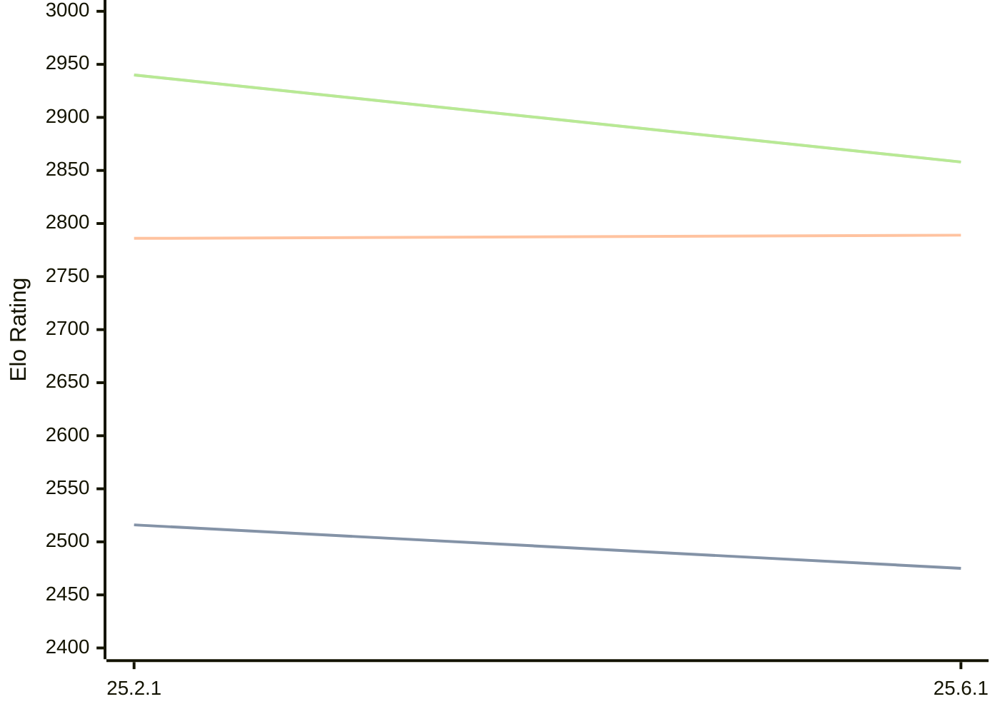

# Engine: Crafty

Author: Robert M. Hyatt

Home: https://github.com/stevemaughan/Crafty-Chess

## Elo Ratings E1

| Version | Published | STC 8.0+0.08s  | LTC 60.0+0.60s | VLTC 2m24s+1.12s | Comment |
| --- | --- | --- | --- | --- | --- |
| 25.6.1 | 2026-06-24 | 2357 | 2672 | 2784 |  |
 | | | cElo (∆ prev) | cElo (∆ prev) | cElo (∆ prev) | 

## Elo Ratings P1

| Version | Published | STC 8.0+0.08s  | LTC 60.0+0.60s | VLTC 2m24s+1.12s | Comment |
| --- | --- | --- | --- | --- | --- |
| 25.6.1 | 2026-06-24 | 2614 | 2876 | 2973 |  |
 | | | cElo (∆ prev) | cElo (∆ prev) | cElo (∆ prev) | 

## Elo Ratings T1

| Version | Published | STC 8.0+0.08s  | LTC 60.0+0.60s | VLTC 2m24s+1.12s | Comment |
| --- | --- | --- | --- | --- | --- |
| 25.6.1 | 2026-06-24 | 2475(-41) | 2789(+3) | 2858(-82) |  |
| 25.2.1 | 2026-06-20 | 2516 | 2786 | 2940 |  |
 | | | cElo (∆ prev) | cElo (∆ prev) | cElo (∆ prev) | 

<a href="https://github.com/computer-chess-index/cci/issues/new?template=submit-version.yml&title=[VERSION]+Crafty+<version>&body=###%20Engine%20name%0ACrafty%0A%0A###%20Version%0A25.6.1" target="_blank">Submit new version</a>

 Test Conditions:

GUI/CLI: <a href=https://github.com/cutechess/cutechess target="_blank">Cute-Chess</a> 
Elo Calculation: <a href=https://www.remi-coulom.fr/Bayesian-Elo/ target="_blank">Bayesian-Elo</a> 
CPU for P1: Intel(R) Core(TM) Ultra 7 265T (1.50 GHz) - P-Core 
CPU for E1: Intel(R) Core(TM) Ultra 7 265T (1.50 GHz) - E-Core 
CPU for T1: Intel(R) Core(TM) i5-7500T 2.70GHz 
Opening book: 8_moves_v3 
\* STC: 8.0+0.08s, LTC: 60.0+0.60s, VLTC: 2m24s+1.12s

 Lists:
Ratings: <a href=https://github.com/computer-chess-index/cci/blob/main/lists/CCIRatings.csv target="_blank">Complete list</a>

Generated: 2026-10-10 04:37:36

## Ratings Verlauf

```mermaid
%%{init: {"theme":"base","themeVariables":{"seriesColors:['#a3a3a3','#222221','#faa371']}}}%%
xychart-beta
  x-axis ["25.2.1", "25.6.1"]
  y-axis "Elo Rating" 2400 --> 3000
  line "" [2516, 2475]
  line "STC (8.0+0.08s)" [2516, 2475]
  line "LTC (60.0+0.60s)" [2786, 2789]
  line "" [2940, 2858]
  line "VLTC (2m24s+1.12s)" [2940, 2858]
```

## Detailed Evaluation Results

| Version | Time Control | Elo  | Range +/- | Matches | Score | Average Opponent Elo | Draws |
| --- | --- | --- | --- | --- | --- | --- | --- |
| 25.6.1 | VLTC (2m24s+1.12s) | 2784 | 36 | 254 | 49% | 2797 | 31% |
| 25.6.1 | VLTC (2m24s+1.12s) | 2858 | 27 | 424 | 49% | 2871 | 35% |
| 25.6.1 | VLTC (2m24s+1.12s) | 2973 | 43 | 172 | 47% | 2996 | 34% |
| 25.6.1 | LTC (60.0+0.60s) | 2789 | 32 | 328 | 50% | 2786 | 30% |
| 25.6.1 | LTC (60.0+0.60s) | 2876 | 40 | 216 | 50% | 2890 | 30% |
| 25.6.1 | LTC (60.0+0.60s) | 2672 | 34 | 284 | 46% | 2720 | 30% |
| 25.6.1 | STC (8.0+0.08s) | 2475 | 31 | 356 | 50% | 2473 | 28% |
| --- | --- | --- | --- | --- | --- | --- | --- |
| 25.6.1 | STC (8.0+0.08s) | 2614 | 42 | 204 | 52% | 2591 | 28% |
| --- | --- | --- | --- | --- | --- | --- | --- |
| 25.6.1 | STC (8.0+0.08s) | 2357 | 37 | 256 | 49% | 2361 | 28% |
| --- | --- | --- | --- | --- | --- | --- | --- |
| 25.2.1 | VLTC (2m24s+1.12s) | 2940 | 51 | 130 | 50% | 2943 | 28% |
| 25.2.1 | LTC (60.0+0.60s) | 2786 | 56 | 112 | 49% | 2801 | 24% |
| 25.2.1 | STC (8.0+0.08s) | 2516 | 59 | 96 | 52% | 2499 | 26% |
| --- | --- | --- | --- | --- | --- | --- | --- |