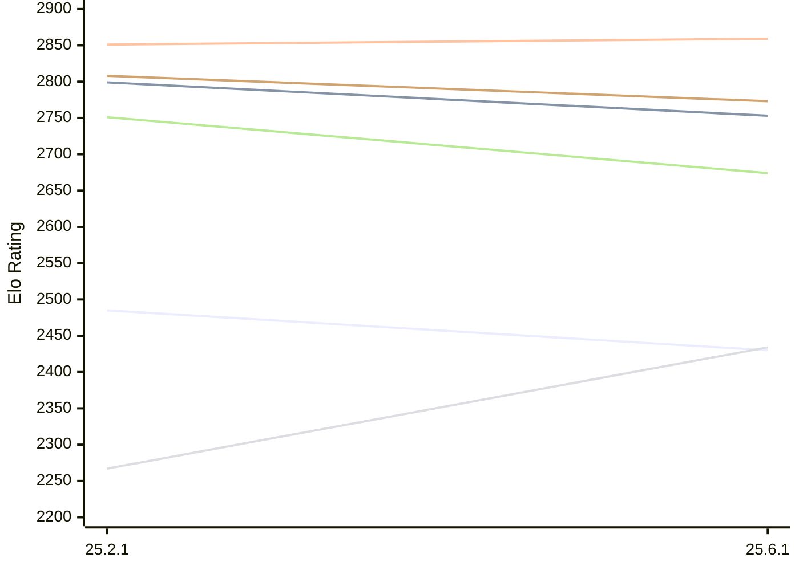
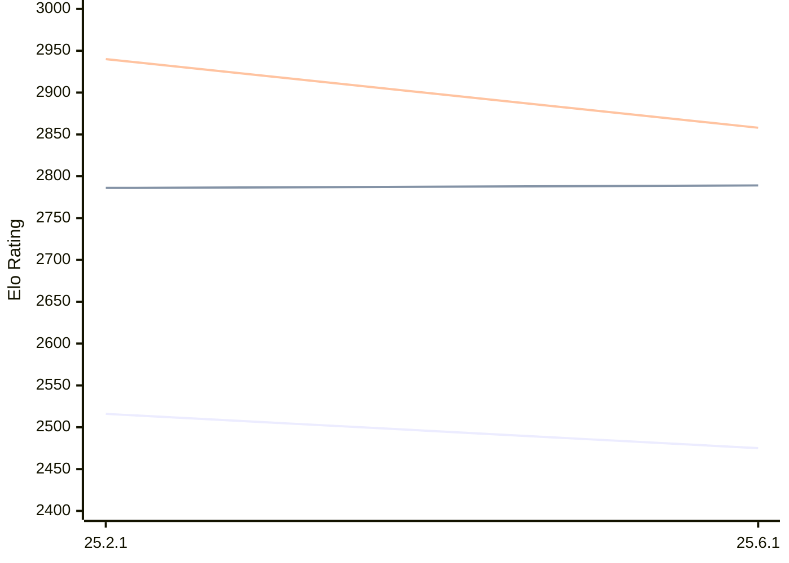

# Engine: Crafty

Author: Robert M. Hyatt

Home: https://github.com/stevemaughan/Crafty-Chess

## Elo Ratings E1 (Ultra 7 265T (1.50 GHz) - E-Core)

| Version | Published | STC 8.0+0.08s  | LTC 60.0+0.60s | VLTC 2m24s+1.12s | Comment |
| --- | --- | --- | --- | --- | --- |
| 25.6.1 | 2026-06-24 | 2430(-55) | 2753(-46) | 2859(+8) |  |
| 25.2.1 | 2026-06-20 | 2485 | 2799 | 2851 |  |
 | | | cElo (∆ prev) | cElo (∆ prev) | cElo (∆ prev) | 

## Elo Ratings P1 (Ultra 7 265T (1.50 GHz) - P-Core)

| Version | Published | STC 8.0+0.08s  | LTC 60.0+0.60s | VLTC 2m24s+1.12s | Comment |
| --- | --- | --- | --- | --- | --- |
| 25.6.1 | 2026-06-24 | 2434(+167) | 2674(-77) | 2773(-35) |  |
| 25.2.1 | 2026-06-20 | 2267 | 2751 | 2808 |  |
 | | | cElo (∆ prev) | cElo (∆ prev) | cElo (∆ prev) | 

## Elo Ratings T1 (i5-7500T 2.70GHz)

| Version | Published | STC 8.0+0.08s  | LTC 60.0+0.60s | VLTC 2m24s+1.12s | Comment |
| --- | --- | --- | --- | --- | --- |
| 25.6.1 | 2026-06-24 | 2475(-41) | 2789(+3) | 2858(-82) |  |
| 25.2.1 | 2026-06-20 | 2516 | 2786 | 2940 |  |
 | | | cElo (∆ prev) | cElo (∆ prev) | cElo (∆ prev) | 

<a href="https://github.com/computer-chess-index/cci/issues/new?template=submit-version.yml&title=[VERSION]+Crafty+<version>&body=###%20Engine%20name%0ACrafty%0A%0A###%20Version%0A25.6.1" target="_blank">Submit new version</a>

 Test Conditions:

GUI/CLI: <a href=https://github.com/cutechess/cutechess target="_blank">Cute-Chess</a> 
Elo Calculation: <a href=https://www.remi-coulom.fr/Bayesian-Elo/ target="_blank">Bayesian-Elo</a> 
CPU for P1: Intel(R) Core(TM) Ultra 7 265T (1.50 GHz) - P-Core 
CPU for E1: Intel(R) Core(TM) Ultra 7 265T (1.50 GHz) - E-Core 
CPU for T1: Intel(R) Core(TM) i5-7500T 2.70GHz 
Opening book: 8_moves_v3 
\* STC: 8.0+0.08s, LTC: 60.0+0.60s, VLTC: 2m24s+1.12s

 Lists:
Ratings: <a href=https://github.com/computer-chess-index/cci/blob/main/lists/CCIRatings.csv target="_blank">Complete list</a>

Generated: 2026-11-16 05:37:38

## Ratings Verlauf E1 / P1

```mermaid
%%{init: {"theme":"base","themeVariables":{"seriesColors:['#a3a3a3','#222221','#faa371']}}}%%
xychart-beta
  x-axis ["25.2.1", "25.6.1"]
  y-axis "Elo Rating" 2200 --> 2900
  line "E1: STC (8.0+0.08s)" [2485, 2430]
  line "E1: LTC (60.0+0.60s)" [2799, 2753]
  line "E1: VLTC (2m24s+1.12s)" [2851, 2859]
  line "P1: STC (8.0+0.08s)" [2267, 2434]
  line "P1: LTC (60.0+0.60s)" [2751, 2674]
  line "P1: VLTC (2m24s+1.12s)" [2808, 2773]
```

## Ratings Verlauf T1

```mermaid
%%{init: {"theme":"base","themeVariables":{"seriesColors:['#a3a3a3','#222221','#faa371']}}}%%
xychart-beta
  x-axis ["25.2.1", "25.6.1"]
  y-axis "Elo Rating" 2400 --> 3000
  line "T1: STC (8.0+0.08s)" [2516, 2475]
  line "T1: LTC (60.0+0.60s)" [2786, 2789]
  line "T1: VLTC (2m24s+1.12s)" [2940, 2858]
```

## Detailed Evaluation Results

| Version | Time Control | Variant | Elo  | Range +/- | Matches | Score | Average Opponent Elo | Draws |
| --- | --- |--- | --- | --- | --- | --- | --- | --- |
| 25.6.1 | VLTC (2m24s+1.12s) | P1 | 2773 | 35 | 272 | 47% | 2805 | 32% |
|  |  | E1 | 2859 | 30 | 374 | 49% | 2867 | 31% |
|  |  | T1 | 2858 | 27 | 424 | 49% | 2871 | 35% |
|  | LTC (60.0+0.60s) | E1 | 2753 | 27 | 474 | 46% | 2792 | 31% |
|  |  | T1 | 2789 | 32 | 328 | 50% | 2786 | 30% |
|  |  | P1 | 2674 | 33 | 304 | 49% | 2692 | 30% |
|  | STC (8.0+0.08s) | E1 | 2430 | 31 | 358 | 48% | 2442 | 26% |
|  |  | T1 | 2475 | 31 | 356 | 50% | 2473 | 28% |
|  |  | P1 | 2434 | 37 | 268 | 52% | 2403 | 27% |
| --- | --- |--- | --- | --- | --- | --- | --- | --- |
| 25.2.1 | VLTC (2m24s+1.12s) | T1 | 2940 | 51 | 130 | 50% | 2943 | 28% |
|  |  | P1 | 2808 | 83 | 56 | 59% | 2691 | 25% |
|  |  | E1 | 2851 | 65 | 88 | 45% | 2874 | 25% |
|  | LTC (60.0+0.60s) | T1 | 2786 | 56 | 112 | 49% | 2801 | 24% |
|  |  | P1 | 2751 | 104 | 56 | 67% | 2346 | 5% |
|  |  | E1 | 2799 | 69 | 76 | 55% | 2677 | 24% |
|  | STC (8.0+0.08s) | T1 | 2516 | 59 | 96 | 52% | 2499 | 26% |
|  |  | P1 | 2267 | 68 | 84 | 56% | 2138 | 26% |
|  |  | E1 | 2485 | 64 | 88 | 41% | 2592 | 22% |