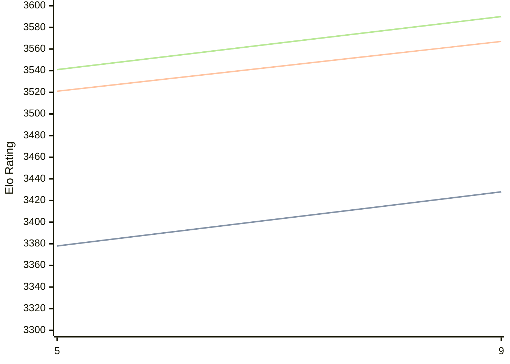

# Engine: Crystal

Author: Joseph Ellis

Home: https://github.com/jhellis3/Stockfish

## Elo Ratings

| Version | Published | STC 8.0+0.08s  | LTC 60.0+0.60s | VLTC 2m24s+1.12s | Comment |
| --- | --- | --- | --- | --- | --- |
| 9 | 2025-05-09 | 3428(+50) | 3567(+46) | 3590(+49) |  |
| 5 | 2022-11-05 | 3378 | 3521 | 3541 |  |
 | | | cElo (∆ prev) | cElo (∆ prev) | cElo (∆ prev) | 

<a href="https://github.com/computer-chess-index/cci/issues/new?template=submit-version.yml&title=[VERSION]+Crystal+<version>&body=###%20Engine%20name%0ACrystal%0A%0A###%20Version%0A9" target="_blank">Submit new version</a>

 Test Conditions:

GUI/CLI: <a href=https://github.com/cutechess/cutechess target="_blank">Cute-Chess</a> 
Elo Calculation: <a href=https://www.remi-coulom.fr/Bayesian-Elo/ target="_blank">Bayesian-Elo</a> 
CPU: Intel(R) Core(TM) i5-7500T 2.70GHz 
Opening book: 8_moves_v3 
\* STC: 8.0+0.08s, LTC: 60.0+0.60s, VLTC: 2m24s+1.12s

 Lists:
Ratings: <a href=https://github.com/computer-chess-index/cci/blob/main/lists/CCIRatings.csv target="_blank">Complete list</a>

Generated: 2026-08-26 06:24:20

## Ratings Verlauf

⬛ STC (8.0+0.08s) &nbsp;&nbsp; 🟧 LTC (60.0+0.60s) &nbsp;&nbsp; 🟩 VLTC (2m24s+1.12s)

dark mode: 🟩STC (8.0+0.08s) 🟧LTC (60.0+0.60s) ⬜VLTC (2m24s+1.12s)

## Detailed Evaluation Results

| Version | Time Control | Elo  | Range +/- | Matches | Score | Average Opponent Elo | Draws |
| --- | --- | --- | --- | --- | --- | --- | --- |
| 9 | VLTC (2m24s+1.12s) | 3590 | 33 | 204 | 53% | 3569 | 88% |
| 9 | LTC (60.0+0.60s) | 3567 | 21 | 528 | 51% | 3559 | 87% |
| 9 | STC (8.0+0.08s) | 3428 | 18 | 718 | 51% | 3421 | 77% |
| --- | --- | --- | --- | --- | --- | --- | --- |
| 5 | VLTC (2m24s+1.12s) | 3541 | 27 | 320 | 55% | 3498 | 85% |
| 5 | LTC (60.0+0.60s) | 3521 | 12 | 1640 | 50% | 3521 | 86% |
| 5 | STC (8.0+0.08s) | 3378 | 12 | 1796 | 52% | 3367 | 73% |
| --- | --- | --- | --- | --- | --- | --- | --- |