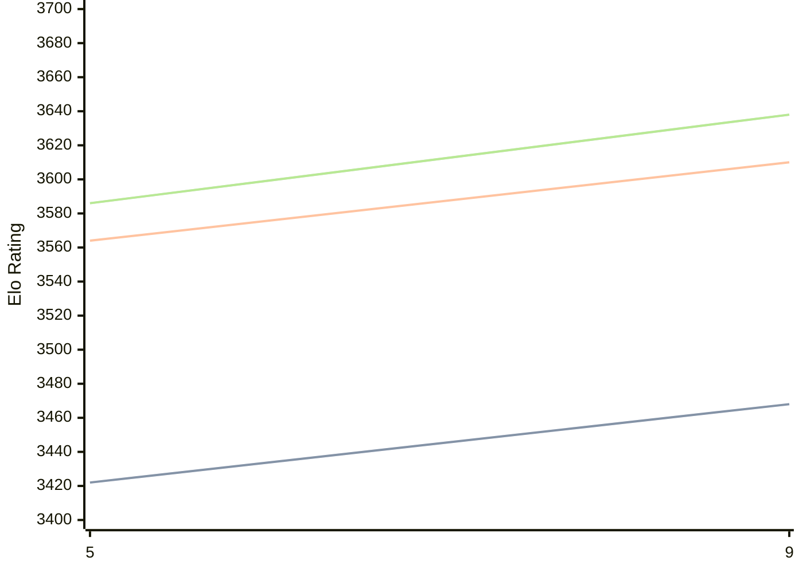

# Engine: Crystal

Author: Joseph Ellis

Home: https://github.com/jhellis3/Stockfish

## Elo Ratings

| Version | Published | STC 8.0+0.08s  | LTC 60.0+0.60s | VLTC 2m24s+1.12s | Comment |
| --- | --- | --- | --- | --- | --- |
| 9 | 2025-05-09 | 3468(+new) | 3610(+new) | 3638(+new) |  |
| 8 | 2024-04-05 |  |  |  |  |
| 8 | 2024-04-05 |  |  |  |  |
| 7 | 2023-11-09 |  |  |  |  |
| 7 | 2023-11-09 |  |  |  |  |
| 6 | 2023-05-14 |  |  |  |  |
| 6 | 2023-05-14 |  |  |  |  |
| 5 | 2022-11-05 | 3422(+new) | 3564(+new) | 3586(+new) |  |
| 4.1 | 2022-07-03 |  |  |  |  |
| 4.0 | 2021-12-25 |  |  |  |  |
| 4.0 | 2021-12-25 |  |  |  |  |
| 3.2 | 2021-06-23 |  |  |  |  |
| 3.1 | 2021-01-14 |  |  |  |  |
| 3.0 | 2020-09-10 |  |  |  |  |
| 2.0 | 2020-04-08 |  |  |  |  |
| 2.0 | 2020-04-08 |  |  |  |  |
| 1.1 | 2019-08-27 |  |  |  |  |
| 1.1 | 2019-08-27 |  |  |  |  |
| 1.1 | 2019-08-27 |  |  |  |  |
| MF_10 | 2018-12-04 |  |  |  |  |
| MF_10 | 2018-12-04 |  |  |  |  |
| MF_10 | 2018-12-04 |  |  |  |  |
| MF_9 | 2018-02-12 |  |  |  |  |
| MF_9 | 2018-02-12 |  |  |  |  |
| MF_9 | 2018-02-12 |  |  |  |  |
| MF_1 | 2017-11-20 |  |  |  |  |
| MF_1 | 2017-11-20 |  |  |  |  |
| MF_1 | 2017-11-20 |  |  |  |  |
| MF_1 | 2017-11-20 |  |  |  |  |
| MF_1 | 2017-11-20 |  |  |  |  |
 | | | cElo (∆ prev) | cElo (∆ prev) | cElo (∆ prev) | 

<a href="https://github.com/computer-chess-index/cci/issues/new?template=submit-version.yml&title=[VERSION]+Crystal+<version>&body=###%20Engine%20name%0ACrystal%0A%0A###%20Version%0A9" target="_blank">Submit new version</a>

 Test Conditions:

GUI/CLI: <a href=https://github.com/cutechess/cutechess target="_blank">Cute-Chess</a> 
Elo Calculation: <a href=https://www.remi-coulom.fr/Bayesian-Elo/ target="_blank">Bayesian-Elo</a> 
CPU: Intel(R) Core(TM) i5-7500T 2.70GHz 
Opening book: 8_moves_v3 
\* STC: 8.0+0.08s, LTC: 60.0+0.60s, VLTC: 2m24s+1.12s

 Lists:
Ratings: <a href=https://github.com/computer-chess-index/cci/blob/main/lists/CCIRatings.csv target="_blank">Complete list</a>

Generated: 2026-05-03 07:36:31

## Ratings Verlauf

⬛ STC (8.0+0.08s) &nbsp;&nbsp; 🟧 LTC (60.0+0.60s) &nbsp;&nbsp; 🟩 VLTC (2m24s+1.12s)

dark mode: 🟩STC (8.0+0.08s) 🟧LTC (60.0+0.60s) ⬜VLTC (2m24s+1.12s)

## Detailed Evaluation Results

| Version | Time Control | Elo  | Range +/- | Matches | Score | Average Opponent Elo | Draws |
| --- | --- | --- | --- | --- | --- | --- | --- |
| 9 | VLTC (2m24s+1.12s) | 3638 | 55 | 76 | 55% | 3609 | 86% |
| 9 | D10 | 3301 | 24 | 460 | 50% | 3298 | 63% |
| 9 | D11 | 3384 | 23 | 484 | 51% | 3374 | 69% |
| 9 | D2 | 1511 | 30 | 360 | 49% | 1526 | 33% |
| 9 | D3 | 1744 | 31 | 368 | 49% | 1751 | 25% |
| 9 | D4 | 2071 | 28 | 428 | 50% | 2076 | 29% |
| 9 | D5 | 2282 | 27 | 494 | 50% | 2283 | 23% |
| 9 | D6 | 2619 | 28 | 406 | 50% | 2620 | 33% |
| 9 | D7 | 2924 | 26 | 446 | 53% | 2903 | 39% |
| 9 | D8 | 3092 | 25 | 448 | 50% | 3089 | 48% |
| 9 | D9 | 3213 | 24 | 488 | 51% | 3204 | 55% |
| 9 | S10 | 3502 | 25 | 380 | 51% | 3495 | 79% |
| 9 | S40 | 3583 | 27 | 330 | 50% | 3583 | 85% |
| 9 | LTC (60.0+0.60s) | 3610 | 24 | 394 | 51% | 3602 | 88% |
| 9 | STC (8.0+0.08s) | 3468 | 21 | 550 | 51% | 3464 | 77% |
| --- | --- | --- | --- | --- | --- | --- | --- |
| 8 |  |  |  |  |  |  |  |
| 8 |  |  |  |  |  |  |  |
| 7 |  |  |  |  |  |  |  |
| 7 |  |  |  |  |  |  |  |
| 6 |  |  |  |  |  |  |  |
| 6 |  |  |  |  |  |  |  |
| 5 | VLTC (2m24s+1.12s) | 3586 | 27 | 320 | 55% | 3541 | 85% |
| 5 | D1 | 1183 | 16 | 1412 | 53% | 1152 | 24% |
| 5 | D10 | 3194 | 11 | 2396 | 51% | 3185 | 60% |
| 5 | D11 | 3275 | 14 | 1342 | 50% | 3278 | 65% |
| 5 | D12 | 3340 | 19 | 668 | 51% | 3330 | 71% |
| 5 | D13 | 3402 | 36 | 180 | 52% | 3391 | 80% |
| 5 | D14 | 3437 | 42 | 136 | 53% | 3416 | 74% |
| 5 | D15 | 3461 | 49 | 100 | 54% | 3433 | 76% |
| 5 | D16 | 3497 | 41 | 160 | 66% | 3376 | 63% |
| 5 | D2 | 1512 | 12 | 2444 | 53% | 1482 | 25% |
| 5 | D3 | 1812 | 12 | 2452 | 52% | 1789 | 21% |
| 5 | D4 | 1962 | 13 | 2260 | 51% | 1952 | 22% |
| 5 | D5 | 2201 | 13 | 2204 | 50% | 2207 | 24% |
| 5 | D6 | 2475 | 12 | 2440 | 50% | 2471 | 28% |
| 5 | D7 | 2712 | 12 | 2260 | 51% | 2708 | 35% |
| 5 | D8 | 2907 | 11 | 2283 | 50% | 2905 | 46% |
| 5 | D9 | 3063 | 11 | 2412 | 50% | 3063 | 54% |
| 5 | S10 | 3443 | 12 | 1804 | 50% | 3441 | 74% |
| 5 | S40 | 3552 | 12 | 1672 | 50% | 3549 | 83% |
| 5 | LTC (60.0+0.60s) | 3564 | 12 | 1640 | 50% | 3565 | 86% |
| 5 | STC (8.0+0.08s) | 3422 | 12 | 1796 | 52% | 3410 | 73% |
| --- | --- | --- | --- | --- | --- | --- | --- |
| 4.1 |  |  |  |  |  |  |  |
| 4.0 |  |  |  |  |  |  |  |
| 4.0 |  |  |  |  |  |  |  |
| 3.2 |  |  |  |  |  |  |  |
| 3.1 |  |  |  |  |  |  |  |
| 3.0 |  |  |  |  |  |  |  |
| 2.0 |  |  |  |  |  |  |  |
| 2.0 |  |  |  |  |  |  |  |
| 1.1 |  |  |  |  |  |  |  |
| 1.1 |  |  |  |  |  |  |  |
| 1.1 |  |  |  |  |  |  |  |
| MF_10 |  |  |  |  |  |  |  |
| MF_10 |  |  |  |  |  |  |  |
| MF_10 |  |  |  |  |  |  |  |
| MF_9 |  |  |  |  |  |  |  |
| MF_9 |  |  |  |  |  |  |  |
| MF_9 |  |  |  |  |  |  |  |
| MF_1 |  |  |  |  |  |  |  |
| MF_1 |  |  |  |  |  |  |  |
| MF_1 |  |  |  |  |  |  |  |
| MF_1 |  |  |  |  |  |  |  |
| MF_1 |  |  |  |  |  |  |  |