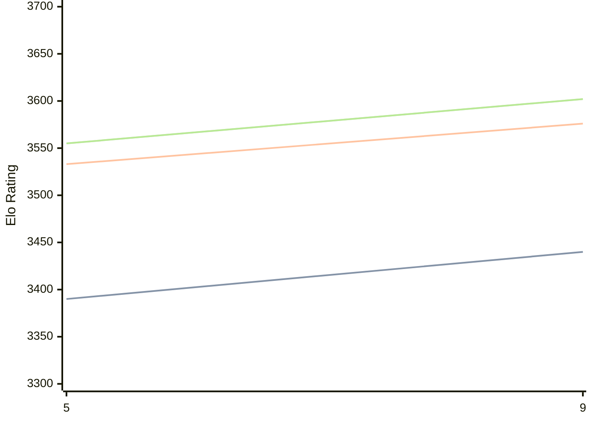

# Engine: Crystal

Author: Joseph Ellis

Home: https://github.com/jhellis3/Stockfish

## Elo Ratings E1

| Version | Published | STC 8.0+0.08s  | LTC 60.0+0.60s | VLTC 2m24s+1.12s | Comment |
| --- | --- | --- | --- | --- | --- |
| 9 | 2025-05-09 | 3360 | 3553 | 3609 |  |
 | | | cElo (∆ prev) | cElo (∆ prev) | cElo (∆ prev) | 

## Elo Ratings P1

| Version | Published | STC 8.0+0.08s  | LTC 60.0+0.60s | VLTC 2m24s+1.12s | Comment |
| --- | --- | --- | --- | --- | --- |
| 9 | 2025-05-09 | 3621 | 3783 | 3826 |  |
 | | | cElo (∆ prev) | cElo (∆ prev) | cElo (∆ prev) | 

## Elo Ratings T1

| Version | Published | STC 8.0+0.08s  | LTC 60.0+0.60s | VLTC 2m24s+1.12s | Comment |
| --- | --- | --- | --- | --- | --- |
| 9 | 2025-05-09 | 3440(+50) | 3576(+43) | 3602(+47) |  |
| 5 | 2022-11-05 | 3390 | 3533 | 3555 |  |
 | | | cElo (∆ prev) | cElo (∆ prev) | cElo (∆ prev) | 

<a href="https://github.com/computer-chess-index/cci/issues/new?template=submit-version.yml&title=[VERSION]+Crystal+<version>&body=###%20Engine%20name%0ACrystal%0A%0A###%20Version%0A9" target="_blank">Submit new version</a>

 Test Conditions:

GUI/CLI: <a href=https://github.com/cutechess/cutechess target="_blank">Cute-Chess</a> 
Elo Calculation: <a href=https://www.remi-coulom.fr/Bayesian-Elo/ target="_blank">Bayesian-Elo</a> 
CPU for P1: Intel(R) Core(TM) Ultra 7 265T (1.50 GHz) - P-Core 
CPU for E1: Intel(R) Core(TM) Ultra 7 265T (1.50 GHz) - E-Core 
CPU for T1: Intel(R) Core(TM) i5-7500T 2.70GHz 
Opening book: 8_moves_v3 
\* STC: 8.0+0.08s, LTC: 60.0+0.60s, VLTC: 2m24s+1.12s

 Lists:
Ratings: <a href=https://github.com/computer-chess-index/cci/blob/main/lists/CCIRatings.csv target="_blank">Complete list</a>

Generated: 2026-10-10 04:37:44

## Ratings Verlauf

```mermaid
%%{init: {"theme":"base","themeVariables":{"seriesColors:['#a3a3a3','#222221','#faa371']}}}%%
xychart-beta
  x-axis ["5", "9"]
  y-axis "Elo Rating" 3300 --> 3700
  line "" [3390, 3440]
  line "STC (8.0+0.08s)" [3390, 3440]
  line "LTC (60.0+0.60s)" [3533, 3576]
  line "" [3555, 3602]
  line "VLTC (2m24s+1.12s)" [3555, 3602]
```

## Detailed Evaluation Results

| Version | Time Control | Elo  | Range +/- | Matches | Score | Average Opponent Elo | Draws |
| --- | --- | --- | --- | --- | --- | --- | --- |
| 9 | VLTC (2m24s+1.12s) | 3609 | 37 | 160 | 51% | 3600 | 90% |
| 9 | VLTC (2m24s+1.12s) | 3826 | 52 | 82 | 53% | 3807 | 91% |
| 9 | VLTC (2m24s+1.12s) | 3602 | 31 | 236 | 53% | 3584 | 89% |
| 9 | LTC (60.0+0.60s) | 3783 | 44 | 120 | 49% | 3788 | 85% |
| 9 | LTC (60.0+0.60s) | 3576 | 20 | 566 | 51% | 3572 | 87% |
| 9 | LTC (60.0+0.60s) | 3553 | 34 | 200 | 48% | 3565 | 85% |
| 9 | STC (8.0+0.08s) | 3440 | 18 | 770 | 51% | 3434 | 76% |
| --- | --- | --- | --- | --- | --- | --- | --- |
| 9 | STC (8.0+0.08s) | 3360 | 31 | 268 | 47% | 3380 | 65% |
| --- | --- | --- | --- | --- | --- | --- | --- |
| 9 | STC (8.0+0.08s) | 3621 | 41 | 148 | 50% | 3623 | 73% |
| --- | --- | --- | --- | --- | --- | --- | --- |
| 5 | VLTC (2m24s+1.12s) | 3555 | 27 | 320 | 55% | 3510 | 85% |
| 5 | LTC (60.0+0.60s) | 3533 | 12 | 1640 | 50% | 3534 | 86% |
| 5 | STC (8.0+0.08s) | 3390 | 12 | 1796 | 52% | 3378 | 73% |
| --- | --- | --- | --- | --- | --- | --- | --- |