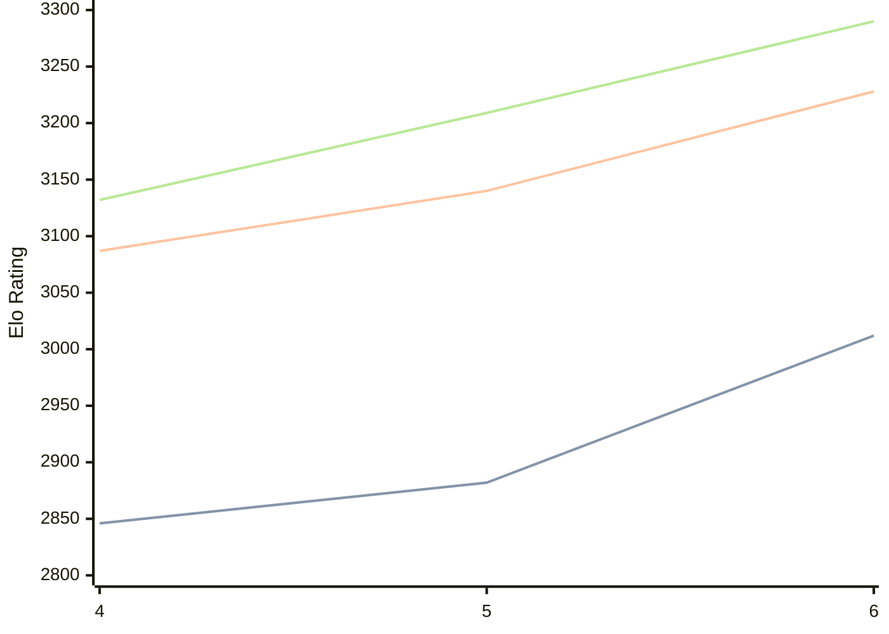

# Engine: Cwtch

Author: Colin Jenkins

Home: https://github.com/op12no2/cwtch

## Elo Ratings

| Version | Published | STC 8.0+0.08s  | LTC 60.0+0.60s | VLTC 2m24s+1.12s | Comment |
| --- | --- | --- | --- | --- | --- |
| 2to6 | 2026-07-09 |  |  |  |  |
| 6 | 2026-07-06 | 3012(+130) | 3228(+88) | 3290(+81) |  |
| 5 | 2026-04-06 | 2882(+36) | 3140(+53) | 3209(+77) |  |
| 4 | 2025-12-05 | 2846 | 3087 | 3132 |  |
 | | | cElo (∆ prev) | cElo (∆ prev) | cElo (∆ prev) | 

<a href="https://github.com/computer-chess-index/cci/issues/new?template=submit-version.yml&title=[VERSION]+Cwtch+<version>&body=###%20Engine%20name%0ACwtch%0A%0A###%20Version%0A2to6" target="_blank">Submit new version</a>

 Test Conditions:

GUI/CLI: <a href=https://github.com/cutechess/cutechess target="_blank">Cute-Chess</a> 
Elo Calculation: <a href=https://www.remi-coulom.fr/Bayesian-Elo/ target="_blank">Bayesian-Elo</a> 
CPU: Intel(R) Core(TM) i5-7500T 2.70GHz 
Opening book: 8_moves_v3 
\* STC: 8.0+0.08s, LTC: 60.0+0.60s, VLTC: 2m24s+1.12s

 Lists:
Ratings: <a href=https://github.com/computer-chess-index/cci/blob/main/lists/CCIRatings.csv target="_blank">Complete list</a>

Generated: 2026-08-30 06:24:22

## Ratings Verlauf

## Detailed Evaluation Results

| Version | Time Control | Elo  | Range +/- | Matches | Score | Average Opponent Elo | Draws |
| --- | --- | --- | --- | --- | --- | --- | --- |
| 6 | VLTC (2m24s+1.12s) | 3290 | 27 | 356 | 51% | 3283 | 67% |
| 6 | LTC (60.0+0.60s) | 3228 | 26 | 378 | 49% | 3235 | 62% |
| 6 | STC (8.0+0.08s) | 3012 | 26 | 432 | 47% | 3033 | 50% |
| --- | --- | --- | --- | --- | --- | --- | --- |
| 5 | VLTC (2m24s+1.12s) | 3209 | 25 | 438 | 48% | 3231 | 59% |
| 5 | LTC (60.0+0.60s) | 3140 | 28 | 358 | 50% | 3137 | 56% |
| 5 | STC (8.0+0.08s) | 2882 | 28 | 396 | 49% | 2894 | 40% |
| --- | --- | --- | --- | --- | --- | --- | --- |
| 4 | VLTC (2m24s+1.12s) | 3132 | 26 | 428 | 50% | 3132 | 50% |
| 4 | LTC (60.0+0.60s) | 3087 | 27 | 376 | 53% | 3060 | 55% |
| 4 | STC (8.0+0.08s) | 2846 | 25 | 482 | 53% | 2813 | 41% |
| --- | --- | --- | --- | --- | --- | --- | --- |