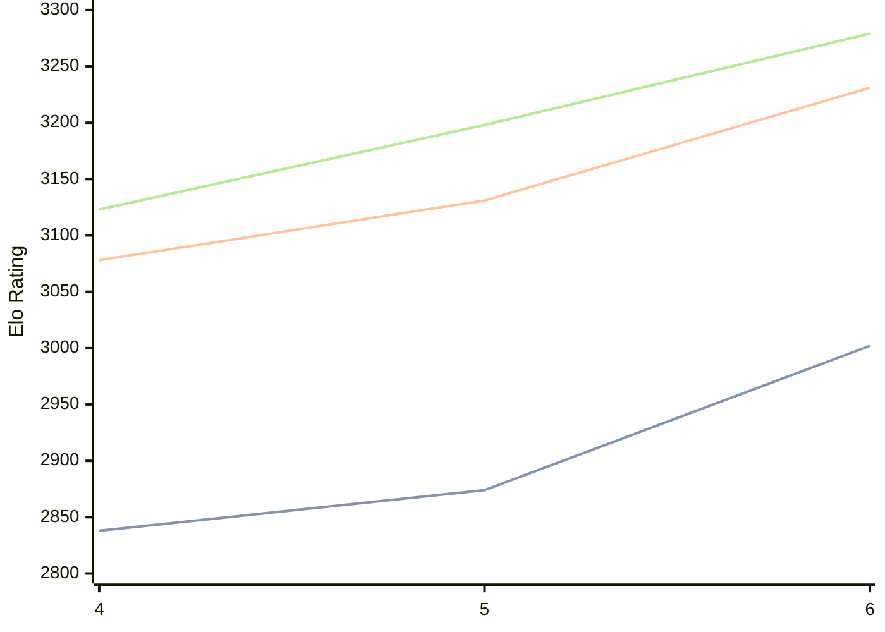

# Engine: Cwtch

Author: Colin Jenkins

Home: https://github.com/op12no2/cwtch

## Elo Ratings

| Version | Published | STC 8.0+0.08s  | LTC 60.0+0.60s | VLTC 2m24s+1.12s | Comment |
| --- | --- | --- | --- | --- | --- |
| 2to6 | 2026-07-09 |  |  |  |  |
| 6 | 2026-07-06 | 3002(+128) | 3231(+100) | 3279(+81) |  |
| 5 | 2026-04-06 | 2874(+36) | 3131(+53) | 3198(+75) |  |
| 4 | 2025-12-05 | 2838 | 3078 | 3123 |  |
 | | | cElo (∆ prev) | cElo (∆ prev) | cElo (∆ prev) | 

<a href="https://github.com/computer-chess-index/cci/issues/new?template=submit-version.yml&title=[VERSION]+Cwtch+<version>&body=###%20Engine%20name%0ACwtch%0A%0A###%20Version%0A2to6" target="_blank">Submit new version</a>

 Test Conditions:

GUI/CLI: <a href=https://github.com/cutechess/cutechess target="_blank">Cute-Chess</a> 
Elo Calculation: <a href=https://www.remi-coulom.fr/Bayesian-Elo/ target="_blank">Bayesian-Elo</a> 
CPU: Intel(R) Core(TM) i5-7500T 2.70GHz 
Opening book: 8_moves_v3 
\* STC: 8.0+0.08s, LTC: 60.0+0.60s, VLTC: 2m24s+1.12s

 Lists:
Ratings: <a href=https://github.com/computer-chess-index/cci/blob/main/lists/CCIRatings.csv target="_blank">Complete list</a>

Generated: 2026-08-10 07:01:11

## Ratings Verlauf

⬛ STC (8.0+0.08s) &nbsp;&nbsp; 🟧 LTC (60.0+0.60s) &nbsp;&nbsp; 🟩 VLTC (2m24s+1.12s)

dark mode: 🟩STC (8.0+0.08s) 🟧LTC (60.0+0.60s) ⬜VLTC (2m24s+1.12s)

## Detailed Evaluation Results

| Version | Time Control | Elo  | Range +/- | Matches | Score | Average Opponent Elo | Draws |
| --- | --- | --- | --- | --- | --- | --- | --- |
| 6 | VLTC (2m24s+1.12s) | 3279 | 28 | 324 | 51% | 3272 | 67% |
| 6 | LTC (60.0+0.60s) | 3231 | 29 | 306 | 50% | 3227 | 64% |
| 6 | STC (8.0+0.08s) | 3002 | 26 | 420 | 47% | 3024 | 50% |
| --- | --- | --- | --- | --- | --- | --- | --- |
| 5 | VLTC (2m24s+1.12s) | 3198 | 25 | 438 | 48% | 3221 | 59% |
| 5 | LTC (60.0+0.60s) | 3131 | 28 | 358 | 50% | 3128 | 56% |
| 5 | STC (8.0+0.08s) | 2874 | 28 | 396 | 49% | 2886 | 40% |
| --- | --- | --- | --- | --- | --- | --- | --- |
| 4 | VLTC (2m24s+1.12s) | 3123 | 26 | 428 | 50% | 3123 | 50% |
| 4 | LTC (60.0+0.60s) | 3078 | 27 | 376 | 53% | 3052 | 55% |
| 4 | STC (8.0+0.08s) | 2838 | 25 | 482 | 53% | 2805 | 41% |
| --- | --- | --- | --- | --- | --- | --- | --- |