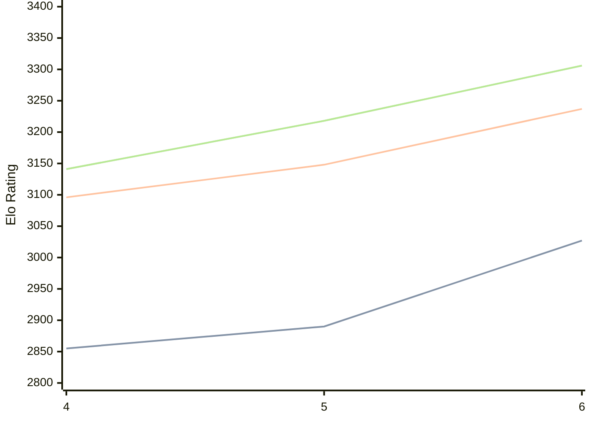

# Engine: Cwtch

Author: Colin Jenkins

Home: https://github.com/op12no2/cwtch

## Elo Ratings E1

| Version | Published | STC 8.0+0.08s  | LTC 60.0+0.60s | VLTC 2m24s+1.12s | Comment |
| --- | --- | --- | --- | --- | --- |
| 6 | 2026-07-06 | 2924 | 3198 | 3282 |  |
 | | | cElo (∆ prev) | cElo (∆ prev) | cElo (∆ prev) | 

## Elo Ratings P1

| Version | Published | STC 8.0+0.08s  | LTC 60.0+0.60s | VLTC 2m24s+1.12s | Comment |
| --- | --- | --- | --- | --- | --- |
| 6 | 2026-07-06 | 3158 | 3433 | 3522 |  |
 | | | cElo (∆ prev) | cElo (∆ prev) | cElo (∆ prev) | 

## Elo Ratings T1

| Version | Published | STC 8.0+0.08s  | LTC 60.0+0.60s | VLTC 2m24s+1.12s | Comment |
| --- | --- | --- | --- | --- | --- |
| 6 | 2026-07-06 | 3027(+137) | 3237(+89) | 3306(+88) |  |
| 5 | 2026-04-06 | 2890(+35) | 3148(+52) | 3218(+77) |  |
| 4 | 2025-12-05 | 2855 | 3096 | 3141 |  |
 | | | cElo (∆ prev) | cElo (∆ prev) | cElo (∆ prev) | 

<a href="https://github.com/computer-chess-index/cci/issues/new?template=submit-version.yml&title=[VERSION]+Cwtch+<version>&body=###%20Engine%20name%0ACwtch%0A%0A###%20Version%0A6" target="_blank">Submit new version</a>

 Test Conditions:

GUI/CLI: <a href=https://github.com/cutechess/cutechess target="_blank">Cute-Chess</a> 
Elo Calculation: <a href=https://www.remi-coulom.fr/Bayesian-Elo/ target="_blank">Bayesian-Elo</a> 
CPU for P1: Intel(R) Core(TM) Ultra 7 265T (1.50 GHz) - P-Core 
CPU for E1: Intel(R) Core(TM) Ultra 7 265T (1.50 GHz) - E-Core 
CPU for T1: Intel(R) Core(TM) i5-7500T 2.70GHz 
Opening book: 8_moves_v3 
\* STC: 8.0+0.08s, LTC: 60.0+0.60s, VLTC: 2m24s+1.12s

 Lists:
Ratings: <a href=https://github.com/computer-chess-index/cci/blob/main/lists/CCIRatings.csv target="_blank">Complete list</a>

Generated: 2026-10-09 14:10:41

## Ratings Verlauf

```mermaid
%%{init: {"theme":"base","themeVariables":{"seriesColors:['#a3a3a3','#222221','#faa371']}}}%%
xychart-beta
  x-axis ["4", "5", "6"]
  y-axis "Elo Rating" 2800 --> 3400
  line "" [2855, 2890, 3027]
  line "STC (8.0+0.08s)" [2855, 2890, 3027]
  line "LTC (60.0+0.60s)" [3096, 3148, 3237]
  line "" [3141, 3218, 3306]
  line "VLTC (2m24s+1.12s)" [3141, 3218, 3306]
```

## Detailed Evaluation Results

| Version | Time Control | Elo  | Range +/- | Matches | Score | Average Opponent Elo | Draws |
| --- | --- | --- | --- | --- | --- | --- | --- |
| 6 | VLTC (2m24s+1.12s) | 3306 | 26 | 396 | 52% | 3295 | 66% |
| 6 | VLTC (2m24s+1.12s) | 3522 | 37 | 188 | 51% | 3519 | 64% |
| 6 | VLTC (2m24s+1.12s) | 3282 | 32 | 248 | 51% | 3276 | 65% |
| 6 | LTC (60.0+0.60s) | 3433 | 39 | 184 | 52% | 3417 | 52% |
| 6 | LTC (60.0+0.60s) | 3198 | 35 | 230 | 51% | 3186 | 55% |
| 6 | LTC (60.0+0.60s) | 3237 | 25 | 416 | 49% | 3245 | 61% |
| 6 | STC (8.0+0.08s) | 3158 | 35 | 244 | 53% | 3124 | 46% |
| --- | --- | --- | --- | --- | --- | --- | --- |
| 6 | STC (8.0+0.08s) | 2924 | 33 | 268 | 48% | 2936 | 43% |
| --- | --- | --- | --- | --- | --- | --- | --- |
| 6 | STC (8.0+0.08s) | 3027 | 24 | 488 | 48% | 3039 | 49% |
| --- | --- | --- | --- | --- | --- | --- | --- |
| 5 | VLTC (2m24s+1.12s) | 3218 | 25 | 438 | 48% | 3240 | 59% |
| 5 | LTC (60.0+0.60s) | 3148 | 28 | 358 | 50% | 3147 | 56% |
| 5 | STC (8.0+0.08s) | 2890 | 28 | 396 | 49% | 2903 | 40% |
| --- | --- | --- | --- | --- | --- | --- | --- |
| 4 | VLTC (2m24s+1.12s) | 3141 | 26 | 428 | 50% | 3141 | 50% |
| 4 | LTC (60.0+0.60s) | 3096 | 27 | 376 | 53% | 3070 | 55% |
| 4 | STC (8.0+0.08s) | 2855 | 25 | 482 | 53% | 2823 | 41% |
| --- | --- | --- | --- | --- | --- | --- | --- |