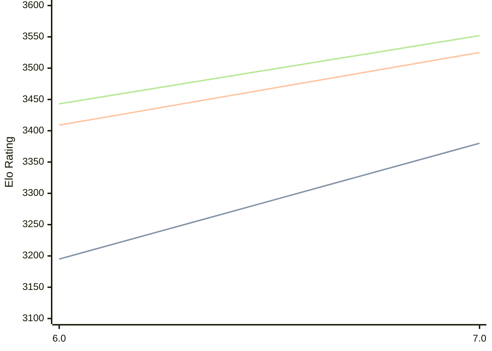

# Engine: Devre

Author: Ömer Faruk Tutkun

Home: https://github.com/OmerFarukTutkun/Devre

## Elo Ratings

| Version | Published | STC 8.0+0.08s  | LTC 60.0+0.60s | VLTC 2m24s+1.12s | Comment |
| --- | --- | --- | --- | --- | --- |
| 7.0 | 2026-08-07 | 3380(+185) | 3525(+116) | 3552(+109) |  |
| 6.0 | 2024-08-10 | 3195 | 3409 | 3443 |  |
 | | | cElo (∆ prev) | cElo (∆ prev) | cElo (∆ prev) | 

<a href="https://github.com/computer-chess-index/cci/issues/new?template=submit-version.yml&title=[VERSION]+Devre+<version>&body=###%20Engine%20name%0ADevre%0A%0A###%20Version%0A7.0" target="_blank">Submit new version</a>

 Test Conditions:

GUI/CLI: <a href=https://github.com/cutechess/cutechess target="_blank">Cute-Chess</a> 
Elo Calculation: <a href=https://www.remi-coulom.fr/Bayesian-Elo/ target="_blank">Bayesian-Elo</a> 
CPU: Intel(R) Core(TM) i5-7500T 2.70GHz 
Opening book: 8_moves_v3 
\* STC: 8.0+0.08s, LTC: 60.0+0.60s, VLTC: 2m24s+1.12s

 Lists:
Ratings: <a href=https://github.com/computer-chess-index/cci/blob/main/lists/CCIRatings.csv target="_blank">Complete list</a>

Generated: 2026-09-14 04:37:25

## Ratings Verlauf

## Detailed Evaluation Results

| Version | Time Control | Elo  | Range +/- | Matches | Score | Average Opponent Elo | Draws |
| --- | --- | --- | --- | --- | --- | --- | --- |
| 7.0 | VLTC (2m24s+1.12s) | 3552 | 30 | 258 | 51% | 3540 | 84% |
| 7.0 | LTC (60.0+0.60s) | 3525 | 26 | 346 | 51% | 3505 | 81% |
| 7.0 | STC (8.0+0.08s) | 3380 | 26 | 378 | 54% | 3332 | 70% |
| --- | --- | --- | --- | --- | --- | --- | --- |
| 6.0 | VLTC (2m24s+1.12s) | 3443 | 32 | 236 | 49% | 3448 | 75% |
| 6.0 | LTC (60.0+0.60s) | 3409 | 31 | 254 | 51% | 3403 | 70% |
| 6.0 | STC (8.0+0.08s) | 3195 | 33 | 252 | 49% | 3205 | 61% |
| --- | --- | --- | --- | --- | --- | --- | --- |