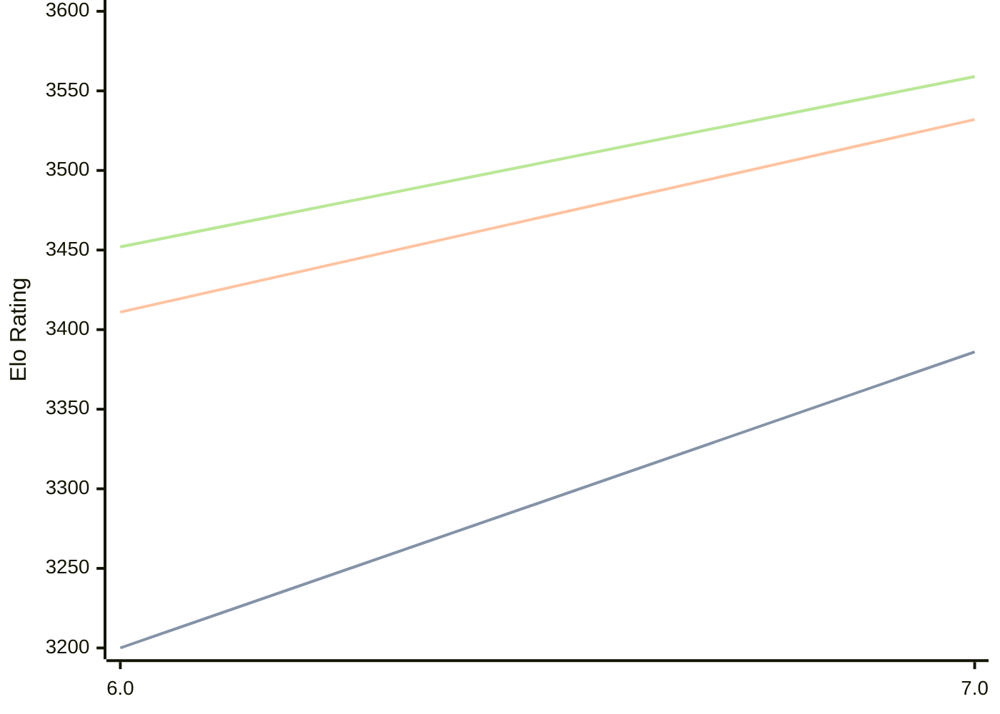

# Engine: Devre

Author: Ömer Faruk Tutkun

Home: https://github.com/OmerFarukTutkun/Devre

## Elo Ratings E1

| Version | Published | STC 8.0+0.08s  | LTC 60.0+0.60s | VLTC 2m24s+1.12s | Comment |
| --- | --- | --- | --- | --- | --- |
| 6.0 | 2024-08-10 | 3040 | 3333 | 3398 |  |
 | | | cElo (∆ prev) | cElo (∆ prev) | cElo (∆ prev) | 

## Elo Ratings P1

| Version | Published | STC 8.0+0.08s  | LTC 60.0+0.60s | VLTC 2m24s+1.12s | Comment |
| --- | --- | --- | --- | --- | --- |
| 6.0 | 2024-08-10 | 3339 | 3606 | 3640 |  |
 | | | cElo (∆ prev) | cElo (∆ prev) | cElo (∆ prev) | 

## Elo Ratings T1

| Version | Published | STC 8.0+0.08s  | LTC 60.0+0.60s | VLTC 2m24s+1.12s | Comment |
| --- | --- | --- | --- | --- | --- |
| 7.0 | 2026-08-07 | 3386(+186) | 3532(+121) | 3559(+107) |  |
| 6.0 | 2024-08-10 | 3200 | 3411 | 3452 |  |
 | | | cElo (∆ prev) | cElo (∆ prev) | cElo (∆ prev) | 

<a href="https://github.com/computer-chess-index/cci/issues/new?template=submit-version.yml&title=[VERSION]+Devre+<version>&body=###%20Engine%20name%0ADevre%0A%0A###%20Version%0A7.0" target="_blank">Submit new version</a>

 Test Conditions:

GUI/CLI: <a href=https://github.com/cutechess/cutechess target="_blank">Cute-Chess</a> 
Elo Calculation: <a href=https://www.remi-coulom.fr/Bayesian-Elo/ target="_blank">Bayesian-Elo</a> 
CPU for P1: Intel(R) Core(TM) Ultra 7 265T (1.50 GHz) - P-Core 
CPU for E1: Intel(R) Core(TM) Ultra 7 265T (1.50 GHz) - E-Core 
CPU for T1: Intel(R) Core(TM) i5-7500T 2.70GHz 
Opening book: 8_moves_v3 
\* STC: 8.0+0.08s, LTC: 60.0+0.60s, VLTC: 2m24s+1.12s

 Lists:
Ratings: <a href=https://github.com/computer-chess-index/cci/blob/main/lists/CCIRatings.csv target="_blank">Complete list</a>

Generated: 2026-10-09 14:10:44

## Ratings Verlauf

```mermaid
%%{init: {"theme":"base","themeVariables":{"seriesColors:['#a3a3a3','#222221','#faa371']}}}%%
xychart-beta
  x-axis ["6.0", "7.0"]
  y-axis "Elo Rating" 3200 --> 3600
  line "" [3200, 3386]
  line "STC (8.0+0.08s)" [3200, 3386]
  line "LTC (60.0+0.60s)" [3411, 3532]
  line "" [3452, 3559]
  line "VLTC (2m24s+1.12s)" [3452, 3559]
```

## Detailed Evaluation Results

| Version | Time Control | Elo  | Range +/- | Matches | Score | Average Opponent Elo | Draws |
| --- | --- | --- | --- | --- | --- | --- | --- |
| 7.0 | VLTC (2m24s+1.12s) | 3559 | 30 | 258 | 51% | 3545 | 84% |
| 7.0 | LTC (60.0+0.60s) | 3532 | 26 | 346 | 51% | 3511 | 81% |
| 7.0 | STC (8.0+0.08s) | 3386 | 26 | 378 | 54% | 3339 | 70% |
| --- | --- | --- | --- | --- | --- | --- | --- |
| 6.0 | VLTC (2m24s+1.12s) | 3452 | 32 | 244 | 49% | 3456 | 76% |
| 6.0 | VLTC (2m24s+1.12s) | 3640 | 42 | 140 | 49% | 3650 | 73% |
| 6.0 | VLTC (2m24s+1.12s) | 3398 | 31 | 252 | 49% | 3403 | 72% |
| 6.0 | LTC (60.0+0.60s) | 3411 | 30 | 286 | 50% | 3411 | 71% |
| 6.0 | LTC (60.0+0.60s) | 3606 | 41 | 144 | 51% | 3595 | 76% |
| 6.0 | LTC (60.0+0.60s) | 3333 | 31 | 254 | 47% | 3359 | 73% |
| 6.0 | STC (8.0+0.08s) | 3200 | 32 | 268 | 48% | 3213 | 61% |
| --- | --- | --- | --- | --- | --- | --- | --- |
| 6.0 | STC (8.0+0.08s) | 3339 | 36 | 206 | 48% | 3355 | 61% |
| --- | --- | --- | --- | --- | --- | --- | --- |
| 6.0 | STC (8.0+0.08s) | 3040 | 32 | 272 | 42% | 3104 | 57% |
| --- | --- | --- | --- | --- | --- | --- | --- |