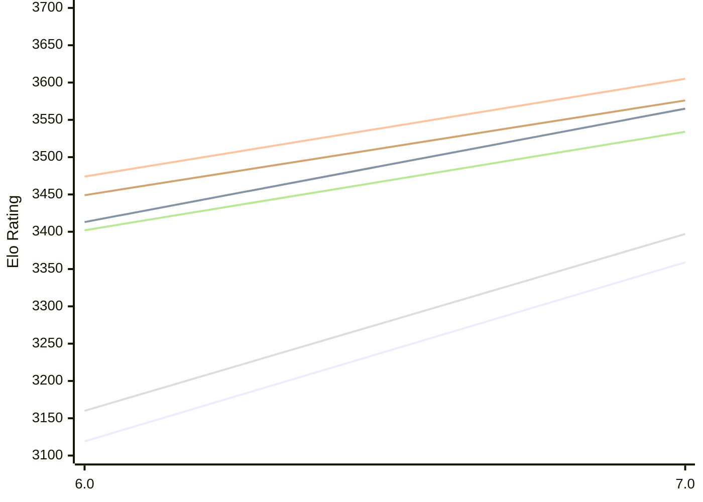
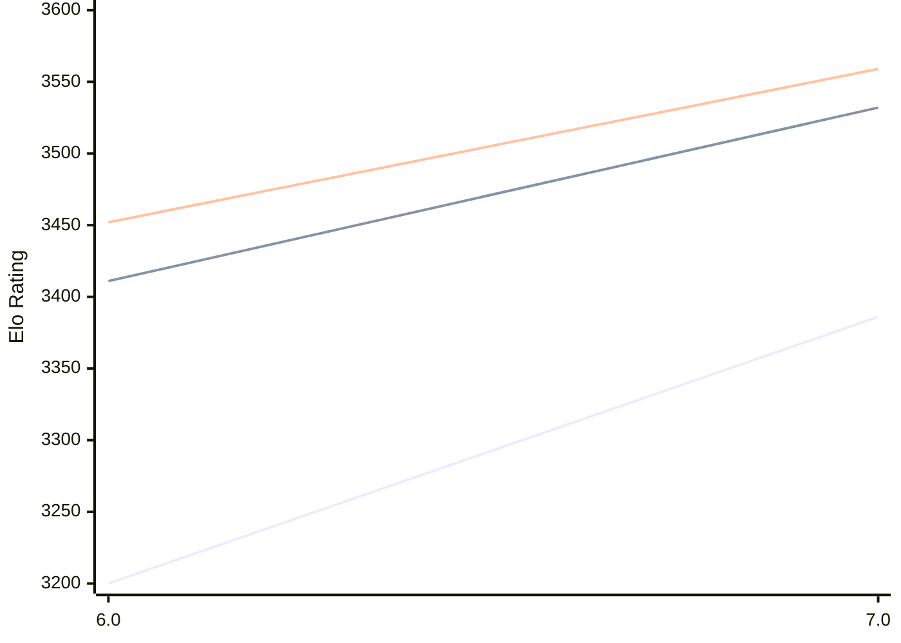

# Engine: Devre

Author: Ömer Faruk Tutkun

Home: https://github.com/OmerFarukTutkun/Devre

## Elo Ratings E1 (Ultra 7 265T (1.50 GHz) - E-Core)

| Version | Published | STC 8.0+0.08s  | LTC 60.0+0.60s | VLTC 2m24s+1.12s | Comment |
| --- | --- | --- | --- | --- | --- |
| 7.0 | 2026-08-07 | 3359(+240) | 3565(+152) | 3605(+131) |  |
| 6.0 | 2024-08-10 | 3119 | 3413 | 3474 |  |
 | | | cElo (∆ prev) | cElo (∆ prev) | cElo (∆ prev) | 

## Elo Ratings P1 (Ultra 7 265T (1.50 GHz) - P-Core)

| Version | Published | STC 8.0+0.08s  | LTC 60.0+0.60s | VLTC 2m24s+1.12s | Comment |
| --- | --- | --- | --- | --- | --- |
| 7.0 | 2026-08-07 | 3397(+237) | 3534(+132) | 3576(+127) |  |
| 6.0 | 2024-08-10 | 3160 | 3402 | 3449 |  |
 | | | cElo (∆ prev) | cElo (∆ prev) | cElo (∆ prev) | 

## Elo Ratings T1 (i5-7500T 2.70GHz)

| Version | Published | STC 8.0+0.08s  | LTC 60.0+0.60s | VLTC 2m24s+1.12s | Comment |
| --- | --- | --- | --- | --- | --- |
| 7.0 | 2026-08-07 | 3386(+186) | 3532(+121) | 3559(+107) |  |
| 6.0 | 2024-08-10 | 3200 | 3411 | 3452 |  |
 | | | cElo (∆ prev) | cElo (∆ prev) | cElo (∆ prev) | 

<a href="https://github.com/computer-chess-index/cci/issues/new?template=submit-version.yml&title=[VERSION]+Devre+<version>&body=###%20Engine%20name%0ADevre%0A%0A###%20Version%0A7.0" target="_blank">Submit new version</a>

 Test Conditions:

GUI/CLI: <a href=https://github.com/cutechess/cutechess target="_blank">Cute-Chess</a> 
Elo Calculation: <a href=https://www.remi-coulom.fr/Bayesian-Elo/ target="_blank">Bayesian-Elo</a> 
CPU for P1: Intel(R) Core(TM) Ultra 7 265T (1.50 GHz) - P-Core 
CPU for E1: Intel(R) Core(TM) Ultra 7 265T (1.50 GHz) - E-Core 
CPU for T1: Intel(R) Core(TM) i5-7500T 2.70GHz 
Opening book: 8_moves_v3 
\* STC: 8.0+0.08s, LTC: 60.0+0.60s, VLTC: 2m24s+1.12s

 Lists:
Ratings: <a href=https://github.com/computer-chess-index/cci/blob/main/lists/CCIRatings.csv target="_blank">Complete list</a>

Generated: 2026-11-26 05:37:59

## Ratings Verlauf E1 / P1

```mermaid
%%{init: {"theme":"base","themeVariables":{"seriesColors:['#a3a3a3','#222221','#faa371']}}}%%
xychart-beta
  x-axis ["6.0", "7.0"]
  y-axis "Elo Rating" 3100 --> 3700
  line "E1: STC (8.0+0.08s)" [3119, 3359]
  line "E1: LTC (60.0+0.60s)" [3413, 3565]
  line "E1: VLTC (2m24s+1.12s)" [3474, 3605]
  line "P1: STC (8.0+0.08s)" [3160, 3397]
  line "P1: LTC (60.0+0.60s)" [3402, 3534]
  line "P1: VLTC (2m24s+1.12s)" [3449, 3576]
```

## Ratings Verlauf T1

```mermaid
%%{init: {"theme":"base","themeVariables":{"seriesColors:['#a3a3a3','#222221','#faa371']}}}%%
xychart-beta
  x-axis ["6.0", "7.0"]
  y-axis "Elo Rating" 3200 --> 3600
  line "T1: STC (8.0+0.08s)" [3200, 3386]
  line "T1: LTC (60.0+0.60s)" [3411, 3532]
  line "T1: VLTC (2m24s+1.12s)" [3452, 3559]
```

## Detailed Evaluation Results

| Version | Time Control | Variant | Elo  | Range +/- | Matches | Score | Average Opponent Elo | Draws |
| --- | --- |--- | --- | --- | --- | --- | --- | --- |
| 7.0 | VLTC (2m24s+1.12s) | T1 | 3559 | 30 | 258 | 51% | 3545 | 84% |
|  |  | P1 | 3576 | 99 | 32 | 73% | 3314 | 53% |
|  |  | E1 | 3605 | 61 | 80 | 57% | 3413 | 59% |
|  | LTC (60.0+0.60s) | T1 | 3532 | 26 | 346 | 51% | 3511 | 81% |
|  |  | P1 | 3534 | 132 | 24 | 81% | 3120 | 38% |
|  |  | E1 | 3565 | 47 | 120 | 62% | 3410 | 69% |
|  | STC (8.0+0.08s) | T1 | 3386 | 26 | 378 | 54% | 3339 | 70% |
|  |  | P1 | 3397 | 96 | 30 | 60% | 3312 | 53% |
|  |  | E1 | 3359 | 48 | 112 | 50% | 3345 | 69% |
| --- | --- |--- | --- | --- | --- | --- | --- | --- |
| 6.0 | VLTC (2m24s+1.12s) | T1 | 3452 | 32 | 244 | 49% | 3456 | 76% |
|  |  | P1 | 3449 | 34 | 208 | 49% | 3456 | 76% |
|  |  | E1 | 3474 | 25 | 398 | 50% | 3478 | 73% |
|  | LTC (60.0+0.60s) | T1 | 3411 | 30 | 286 | 50% | 3411 | 71% |
|  |  | P1 | 3402 | 32 | 242 | 49% | 3410 | 75% |
|  |  | E1 | 3413 | 24 | 434 | 49% | 3421 | 73% |
|  | STC (8.0+0.08s) | T1 | 3200 | 32 | 268 | 48% | 3213 | 61% |
|  |  | P1 | 3160 | 29 | 304 | 48% | 3173 | 62% |
|  |  | E1 | 3119 | 24 | 484 | 45% | 3156 | 52% |