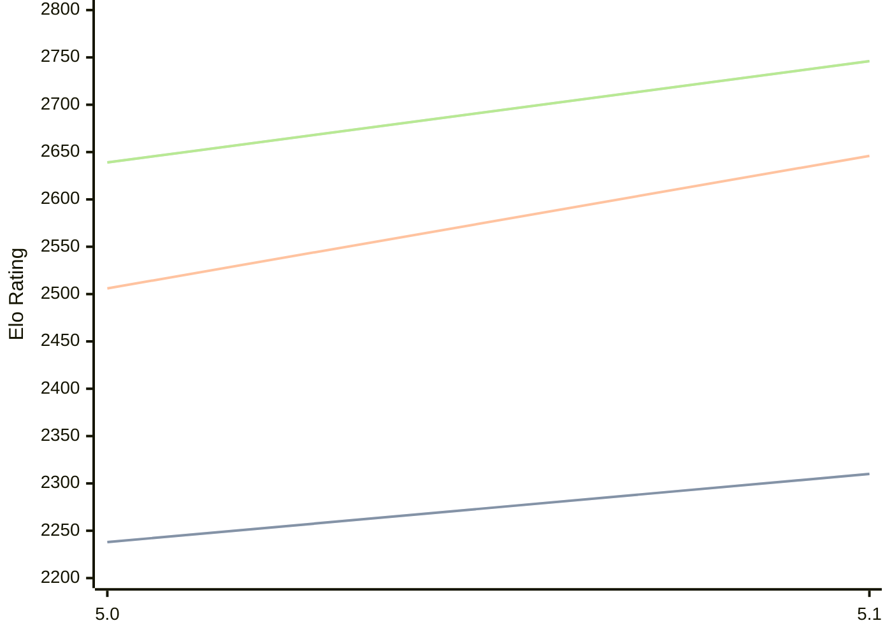

# Engine: Dorky

Author: Matt KcKnight

Home: https://github.com/matt-dot-net/dorky-release

## Elo Ratings

| Version | Published | STC 8.0+0.08s  | LTC 60.0+0.60s | VLTC 2m24s+1.12s | Comment |
| --- | --- | --- | --- | --- | --- |
| 5.1 | 2026-08-21 | 2310(+72) | 2646(+140) | 2746(+107) |  |
| 5.0 | 2026-08-08 | 2238 | 2506 | 2639 |  |
 | | | cElo (∆ prev) | cElo (∆ prev) | cElo (∆ prev) | 

<a href="https://github.com/computer-chess-index/cci/issues/new?template=submit-version.yml&title=[VERSION]+Dorky+<version>&body=###%20Engine%20name%0ADorky%0A%0A###%20Version%0A5.1" target="_blank">Submit new version</a>

 Test Conditions:

GUI/CLI: <a href=https://github.com/cutechess/cutechess target="_blank">Cute-Chess</a> 
Elo Calculation: <a href=https://www.remi-coulom.fr/Bayesian-Elo/ target="_blank">Bayesian-Elo</a> 
CPU: Intel(R) Core(TM) i5-7500T 2.70GHz 
Opening book: 8_moves_v3 
\* STC: 8.0+0.08s, LTC: 60.0+0.60s, VLTC: 2m24s+1.12s

 Lists:
Ratings: <a href=https://github.com/computer-chess-index/cci/blob/main/lists/CCIRatings.csv target="_blank">Complete list</a>

Generated: 2026-08-31 04:34:35

## Ratings Verlauf

## Detailed Evaluation Results

| Version | Time Control | Elo  | Range +/- | Matches | Score | Average Opponent Elo | Draws |
| --- | --- | --- | --- | --- | --- | --- | --- |
| 5.1 | VLTC (2m24s+1.12s) | 2746 | 32 | 304 | 52% | 2728 | 38% |
| 5.1 | LTC (60.0+0.60s) | 2646 | 33 | 300 | 53% | 2623 | 30% |
| 5.1 | STC (8.0+0.08s) | 2310 | 39 | 208 | 51% | 2303 | 32% |
| --- | --- | --- | --- | --- | --- | --- | --- |
| 5.0 | VLTC (2m24s+1.12s) | 2639 | 34 | 298 | 48% | 2661 | 27% |
| 5.0 | LTC (60.0+0.60s) | 2506 | 37 | 246 | 50% | 2472 | 29% |
| 5.0 | STC (8.0+0.08s) | 2238 | 32 | 336 | 50% | 2222 | 28% |
| --- | --- | --- | --- | --- | --- | --- | --- |