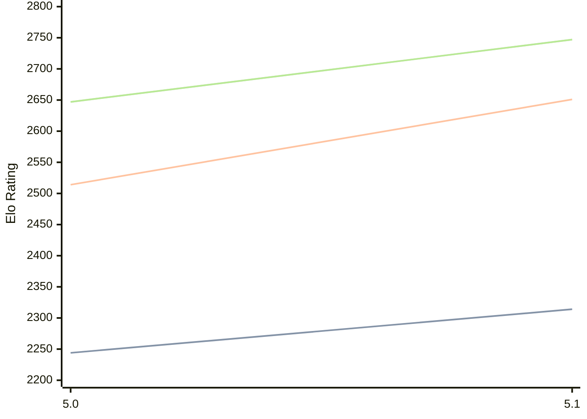

# Engine: Dorky

Author: Matt KcKnight

Home: https://github.com/matt-dot-net/dorky-release

## Elo Ratings E1

| Version | Published | STC 8.0+0.08s  | LTC 60.0+0.60s | VLTC 2m24s+1.12s | Comment |
| --- | --- | --- | --- | --- | --- |
| 5.1 | 2026-08-21 | 2164 | 2581 | 2687 |  |
 | | | cElo (∆ prev) | cElo (∆ prev) | cElo (∆ prev) | 

## Elo Ratings P1

| Version | Published | STC 8.0+0.08s  | LTC 60.0+0.60s | VLTC 2m24s+1.12s | Comment |
| --- | --- | --- | --- | --- | --- |
| 5.1 | 2026-08-21 | 2390 | 2813 | 2831 |  |
 | | | cElo (∆ prev) | cElo (∆ prev) | cElo (∆ prev) | 

## Elo Ratings T1

| Version | Published | STC 8.0+0.08s  | LTC 60.0+0.60s | VLTC 2m24s+1.12s | Comment |
| --- | --- | --- | --- | --- | --- |
| 5.1 | 2026-08-21 | 2314(+70) | 2651(+137) | 2747(+100) |  |
| 5.0 | 2026-08-08 | 2244 | 2514 | 2647 |  |
 | | | cElo (∆ prev) | cElo (∆ prev) | cElo (∆ prev) | 

<a href="https://github.com/computer-chess-index/cci/issues/new?template=submit-version.yml&title=[VERSION]+Dorky+<version>&body=###%20Engine%20name%0ADorky%0A%0A###%20Version%0A5.1" target="_blank">Submit new version</a>

 Test Conditions:

GUI/CLI: <a href=https://github.com/cutechess/cutechess target="_blank">Cute-Chess</a> 
Elo Calculation: <a href=https://www.remi-coulom.fr/Bayesian-Elo/ target="_blank">Bayesian-Elo</a> 
CPU for P1: Intel(R) Core(TM) Ultra 7 265T (1.50 GHz) - P-Core 
CPU for E1: Intel(R) Core(TM) Ultra 7 265T (1.50 GHz) - E-Core 
CPU for T1: Intel(R) Core(TM) i5-7500T 2.70GHz 
Opening book: 8_moves_v3 
\* STC: 8.0+0.08s, LTC: 60.0+0.60s, VLTC: 2m24s+1.12s

 Lists:
Ratings: <a href=https://github.com/computer-chess-index/cci/blob/main/lists/CCIRatings.csv target="_blank">Complete list</a>

Generated: 2026-10-10 04:37:59

## Ratings Verlauf

```mermaid
%%{init: {"theme":"base","themeVariables":{"seriesColors:['#a3a3a3','#222221','#faa371']}}}%%
xychart-beta
  x-axis ["5.0", "5.1"]
  y-axis "Elo Rating" 2200 --> 2800
  line "" [2244, 2314]
  line "STC (8.0+0.08s)" [2244, 2314]
  line "LTC (60.0+0.60s)" [2514, 2651]
  line "" [2647, 2747]
  line "VLTC (2m24s+1.12s)" [2647, 2747]
```

## Detailed Evaluation Results

| Version | Time Control | Elo  | Range +/- | Matches | Score | Average Opponent Elo | Draws |
| --- | --- | --- | --- | --- | --- | --- | --- |
| 5.1 | VLTC (2m24s+1.12s) | 2687 | 35 | 274 | 48% | 2711 | 29% |
| 5.1 | VLTC (2m24s+1.12s) | 2747 | 31 | 322 | 51% | 2736 | 37% |
| 5.1 | VLTC (2m24s+1.12s) | 2831 | 43 | 182 | 48% | 2857 | 30% |
| 5.1 | LTC (60.0+0.60s) | 2581 | 38 | 226 | 48% | 2592 | 32% |
| 5.1 | LTC (60.0+0.60s) | 2651 | 31 | 338 | 52% | 2631 | 30% |
| 5.1 | LTC (60.0+0.60s) | 2813 | 43 | 190 | 47% | 2839 | 25% |
| 5.1 | STC (8.0+0.08s) | 2164 | 39 | 214 | 48% | 2180 | 29% |
| --- | --- | --- | --- | --- | --- | --- | --- |
| 5.1 | STC (8.0+0.08s) | 2314 | 37 | 236 | 50% | 2310 | 34% |
| --- | --- | --- | --- | --- | --- | --- | --- |
| 5.1 | STC (8.0+0.08s) | 2390 | 43 | 186 | 48% | 2410 | 25% |
| --- | --- | --- | --- | --- | --- | --- | --- |
| 5.0 | VLTC (2m24s+1.12s) | 2647 | 34 | 298 | 48% | 2668 | 27% |
| 5.0 | LTC (60.0+0.60s) | 2514 | 37 | 246 | 50% | 2480 | 29% |
| 5.0 | STC (8.0+0.08s) | 2244 | 32 | 336 | 50% | 2229 | 28% |
| --- | --- | --- | --- | --- | --- | --- | --- |