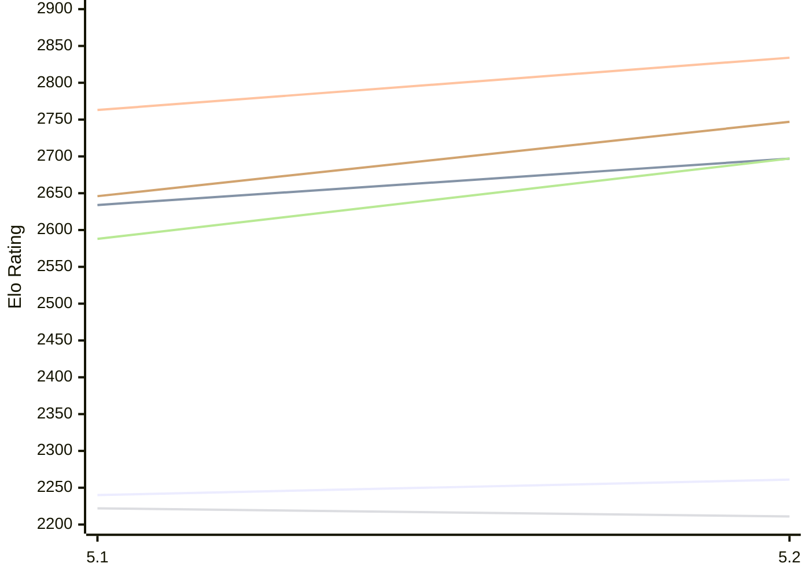
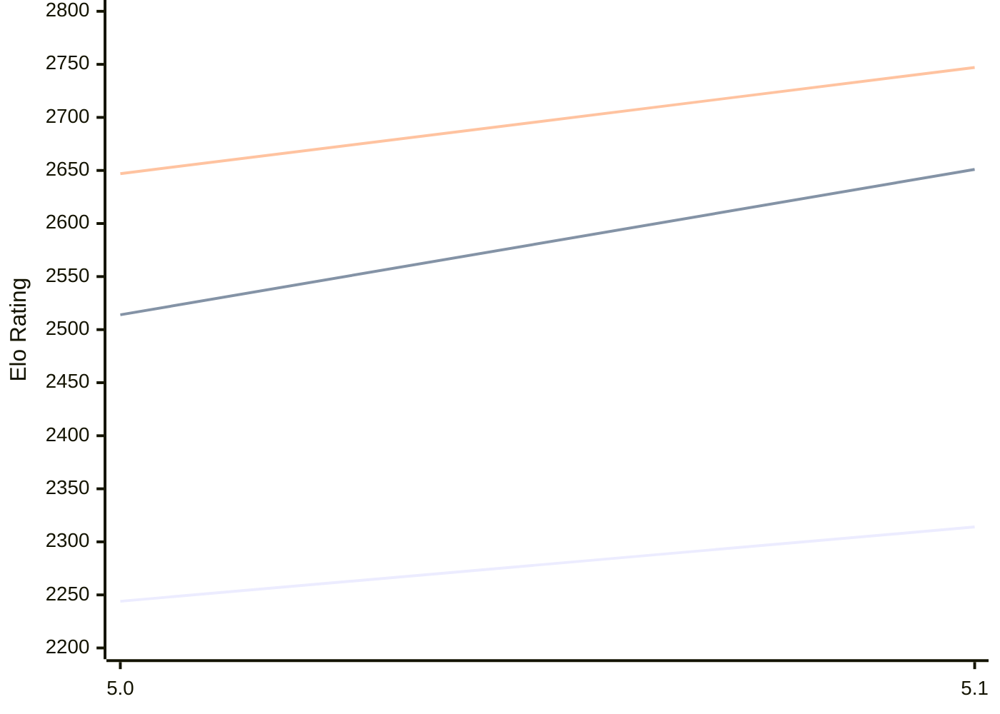

# Engine: Dorky

Author: Matt KcKnight

Home: https://github.com/matt-dot-net/dorky-release

## Elo Ratings E1 (Ultra 7 265T (1.50 GHz) - E-Core)

| Version | Published | STC 8.0+0.08s  | LTC 60.0+0.60s | VLTC 2m24s+1.12s | Comment |
| --- | --- | --- | --- | --- | --- |
| 5.2 | 2026-10-23 | 2261(+21) | 2697(+63) | 2834(+71) |  |
| 5.1 | 2026-08-21 | 2240 | 2634 | 2763 |  |
 | | | cElo (∆ prev) | cElo (∆ prev) | cElo (∆ prev) | 

## Elo Ratings P1 (Ultra 7 265T (1.50 GHz) - P-Core)

| Version | Published | STC 8.0+0.08s  | LTC 60.0+0.60s | VLTC 2m24s+1.12s | Comment |
| --- | --- | --- | --- | --- | --- |
| 5.2 | 2026-10-23 | 2211(-11) | 2697(+109) | 2747(+101) |  |
| 5.1 | 2026-08-21 | 2222 | 2588 | 2646 |  |
 | | | cElo (∆ prev) | cElo (∆ prev) | cElo (∆ prev) | 

## Elo Ratings T1 (i5-7500T 2.70GHz)

| Version | Published | STC 8.0+0.08s  | LTC 60.0+0.60s | VLTC 2m24s+1.12s | Comment |
| --- | --- | --- | --- | --- | --- |
| 5.1 | 2026-08-21 | 2314(+70) | 2651(+137) | 2747(+100) |  |
| 5.0 | 2026-08-08 | 2244 | 2514 | 2647 |  |
 | | | cElo (∆ prev) | cElo (∆ prev) | cElo (∆ prev) | 

<a href="https://github.com/computer-chess-index/cci/issues/new?template=submit-version.yml&title=[VERSION]+Dorky+<version>&body=###%20Engine%20name%0ADorky%0A%0A###%20Version%0A5.1" target="_blank">Submit new version</a>

 Test Conditions:

GUI/CLI: <a href=https://github.com/cutechess/cutechess target="_blank">Cute-Chess</a> 
Elo Calculation: <a href=https://www.remi-coulom.fr/Bayesian-Elo/ target="_blank">Bayesian-Elo</a> 
CPU for P1: Intel(R) Core(TM) Ultra 7 265T (1.50 GHz) - P-Core 
CPU for E1: Intel(R) Core(TM) Ultra 7 265T (1.50 GHz) - E-Core 
CPU for T1: Intel(R) Core(TM) i5-7500T 2.70GHz 
Opening book: 8_moves_v3 
\* STC: 8.0+0.08s, LTC: 60.0+0.60s, VLTC: 2m24s+1.12s

 Lists:
Ratings: <a href=https://github.com/computer-chess-index/cci/blob/main/lists/CCIRatings.csv target="_blank">Complete list</a>

Generated: 2026-11-14 05:37:44

## Ratings Verlauf E1 / P1

```mermaid
%%{init: {"theme":"base","themeVariables":{"seriesColors:['#a3a3a3','#222221','#faa371']}}}%%
xychart-beta
  x-axis ["5.1", "5.2"]
  y-axis "Elo Rating" 2200 --> 2900
  line "E1: STC (8.0+0.08s)" [2240, 2261]
  line "E1: LTC (60.0+0.60s)" [2634, 2697]
  line "E1: VLTC (2m24s+1.12s)" [2763, 2834]
  line "P1: STC (8.0+0.08s)" [2222, 2211]
  line "P1: LTC (60.0+0.60s)" [2588, 2697]
  line "P1: VLTC (2m24s+1.12s)" [2646, 2747]
```

## Ratings Verlauf T1

```mermaid
%%{init: {"theme":"base","themeVariables":{"seriesColors:['#a3a3a3','#222221','#faa371']}}}%%
xychart-beta
  x-axis ["5.0", "5.1"]
  y-axis "Elo Rating" 2200 --> 2800
  line "T1: STC (8.0+0.08s)" [2244, 2314]
  line "T1: LTC (60.0+0.60s)" [2514, 2651]
  line "T1: VLTC (2m24s+1.12s)" [2647, 2747]
```

## Detailed Evaluation Results

| Version | Time Control | Variant | Elo  | Range +/- | Matches | Score | Average Opponent Elo | Draws |
| --- | --- |--- | --- | --- | --- | --- | --- | --- |
| 5.2 | VLTC (2m24s+1.12s) | P1 | 2747 | 42 | 170 | 49% | 2758 | 41% |
|  |  | E1 | 2834 | 32 | 312 | 50% | 2807 | 36% |
|  | LTC (60.0+0.60s) | P1 | 2697 | 38 | 220 | 49% | 2720 | 34% |
|  |  | E1 | 2697 | 31 | 340 | 48% | 2714 | 33% |
|  | STC (8.0+0.08s) | P1 | 2211 | 43 | 164 | 50% | 2214 | 37% |
|  |  | E1 | 2261 | 35 | 286 | 51% | 2253 | 26% |
| --- | --- |--- | --- | --- | --- | --- | --- | --- |
| 5.1 | VLTC (2m24s+1.12s) | P1 | 2646 | 36 | 262 | 48% | 2669 | 31% |
|  |  | E1 | 2763 | 30 | 384 | 47% | 2801 | 29% |
|  |  | T1 | 2747 | 31 | 322 | 51% | 2736 | 37% |
|  | LTC (60.0+0.60s) | E1 | 2634 | 32 | 326 | 46% | 2670 | 33% |
|  |  | T1 | 2651 | 31 | 338 | 52% | 2631 | 30% |
|  |  | P1 | 2588 | 36 | 272 | 44% | 2641 | 26% |
|  | STC (8.0+0.08s) | E1 | 2240 | 36 | 272 | 49% | 2245 | 26% |
|  |  | T1 | 2314 | 37 | 236 | 50% | 2310 | 34% |
|  |  | P1 | 2222 | 39 | 226 | 48% | 2246 | 24% |
| --- | --- |--- | --- | --- | --- | --- | --- | --- |
| 5.0 | VLTC (2m24s+1.12s) | T1 | 2647 | 34 | 298 | 48% | 2668 | 27% |
|  | LTC (60.0+0.60s) | T1 | 2514 | 37 | 246 | 50% | 2480 | 29% |
|  | STC (8.0+0.08s) | T1 | 2244 | 32 | 336 | 50% | 2229 | 28% |