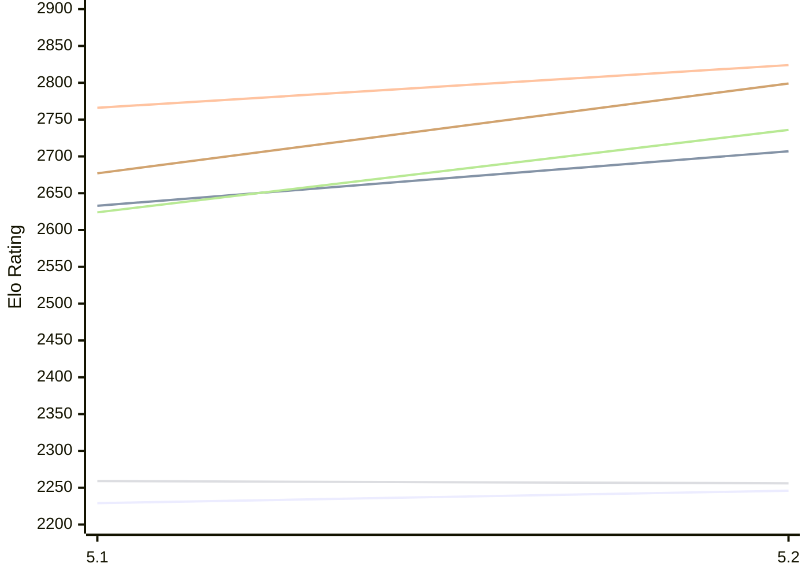
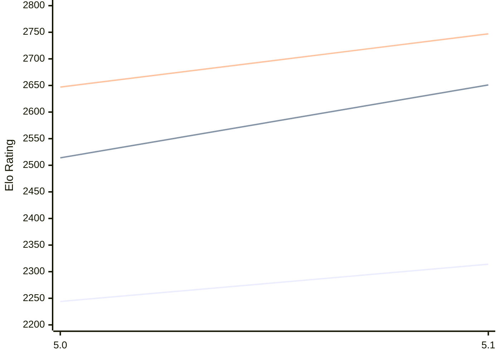

# Engine: Dorky

Author: Matt KcKnight

Home: https://github.com/matt-dot-net/dorky-release

## Elo Ratings E1 (Ultra 7 265T (1.50 GHz) - E-Core)

| Version | Published | STC 8.0+0.08s  | LTC 60.0+0.60s | VLTC 2m24s+1.12s | Comment |
| --- | --- | --- | --- | --- | --- |
| 5.2 | 2026-10-23 | 2246(+17) | 2707(+74) | 2824(+58) |  |
| 5.1 | 2026-08-21 | 2229 | 2633 | 2766 |  |
 | | | cElo (∆ prev) | cElo (∆ prev) | cElo (∆ prev) | 

## Elo Ratings P1 (Ultra 7 265T (1.50 GHz) - P-Core)

| Version | Published | STC 8.0+0.08s  | LTC 60.0+0.60s | VLTC 2m24s+1.12s | Comment |
| --- | --- | --- | --- | --- | --- |
| 5.2 | 2026-10-23 | 2256(-3) | 2736(+112) | 2799(+122) |  |
| 5.1 | 2026-08-21 | 2259 | 2624 | 2677 |  |
 | | | cElo (∆ prev) | cElo (∆ prev) | cElo (∆ prev) | 

## Elo Ratings T1 (i5-7500T 2.70GHz)

| Version | Published | STC 8.0+0.08s  | LTC 60.0+0.60s | VLTC 2m24s+1.12s | Comment |
| --- | --- | --- | --- | --- | --- |
| 5.1 | 2026-08-21 | 2314(+70) | 2651(+137) | 2747(+100) |  |
| 5.0 | 2026-08-08 | 2244 | 2514 | 2647 |  |
 | | | cElo (∆ prev) | cElo (∆ prev) | cElo (∆ prev) | 

<a href="https://github.com/computer-chess-index/cci/issues/new?template=submit-version.yml&title=[VERSION]+Dorky+<version>&body=###%20Engine%20name%0ADorky%0A%0A###%20Version%0A5.1" target="_blank">Submit new version</a>

 Test Conditions:

GUI/CLI: <a href=https://github.com/cutechess/cutechess target="_blank">Cute-Chess</a> 
Elo Calculation: <a href=https://www.remi-coulom.fr/Bayesian-Elo/ target="_blank">Bayesian-Elo</a> 
CPU for P1: Intel(R) Core(TM) Ultra 7 265T (1.50 GHz) - P-Core 
CPU for E1: Intel(R) Core(TM) Ultra 7 265T (1.50 GHz) - E-Core 
CPU for T1: Intel(R) Core(TM) i5-7500T 2.70GHz 
Opening book: 8_moves_v3 
\* STC: 8.0+0.08s, LTC: 60.0+0.60s, VLTC: 2m24s+1.12s

 Lists:
Ratings: <a href=https://github.com/computer-chess-index/cci/blob/main/lists/CCIRatings.csv target="_blank">Complete list</a>

Generated: 2026-11-24 05:37:57

## Ratings Verlauf E1 / P1

```mermaid
%%{init: {"theme":"base","themeVariables":{"seriesColors:['#a3a3a3','#222221','#faa371']}}}%%
xychart-beta
  x-axis ["5.1", "5.2"]
  y-axis "Elo Rating" 2200 --> 2900
  line "E1: STC (8.0+0.08s)" [2229, 2246]
  line "E1: LTC (60.0+0.60s)" [2633, 2707]
  line "E1: VLTC (2m24s+1.12s)" [2766, 2824]
  line "P1: STC (8.0+0.08s)" [2259, 2256]
  line "P1: LTC (60.0+0.60s)" [2624, 2736]
  line "P1: VLTC (2m24s+1.12s)" [2677, 2799]
```

## Ratings Verlauf T1

```mermaid
%%{init: {"theme":"base","themeVariables":{"seriesColors:['#a3a3a3','#222221','#faa371']}}}%%
xychart-beta
  x-axis ["5.0", "5.1"]
  y-axis "Elo Rating" 2200 --> 2800
  line "T1: STC (8.0+0.08s)" [2244, 2314]
  line "T1: LTC (60.0+0.60s)" [2514, 2651]
  line "T1: VLTC (2m24s+1.12s)" [2647, 2747]
```

## Detailed Evaluation Results

| Version | Time Control | Variant | Elo  | Range +/- | Matches | Score | Average Opponent Elo | Draws |
| --- | --- |--- | --- | --- | --- | --- | --- | --- |
| 5.2 | VLTC (2m24s+1.12s) | P1 | 2799 | 40 | 190 | 51% | 2799 | 39% |
|  |  | E1 | 2824 | 29 | 372 | 49% | 2813 | 35% |
|  | LTC (60.0+0.60s) | E1 | 2707 | 30 | 364 | 49% | 2718 | 33% |
|  |  | P1 | 2736 | 37 | 240 | 49% | 2754 | 33% |
|  | STC (8.0+0.08s) | E1 | 2246 | 33 | 314 | 50% | 2242 | 26% |
|  |  | P1 | 2256 | 41 | 188 | 51% | 2242 | 34% |
| --- | --- |--- | --- | --- | --- | --- | --- | --- |
| 5.1 | VLTC (2m24s+1.12s) | T1 | 2747 | 31 | 322 | 51% | 2736 | 37% |
|  |  | P1 | 2677 | 35 | 278 | 48% | 2705 | 32% |
|  |  | E1 | 2766 | 29 | 404 | 47% | 2804 | 29% |
|  | LTC (60.0+0.60s) | T1 | 2651 | 31 | 338 | 52% | 2631 | 30% |
|  |  | P1 | 2624 | 35 | 280 | 44% | 2681 | 27% |
|  |  | E1 | 2633 | 31 | 342 | 46% | 2670 | 33% |
|  | STC (8.0+0.08s) | T1 | 2314 | 37 | 236 | 50% | 2310 | 34% |
|  |  | P1 | 2259 | 37 | 250 | 48% | 2284 | 25% |
|  |  | E1 | 2229 | 34 | 292 | 48% | 2236 | 27% |
| --- | --- |--- | --- | --- | --- | --- | --- | --- |
| 5.0 | VLTC (2m24s+1.12s) | T1 | 2647 | 34 | 298 | 48% | 2668 | 27% |
|  | LTC (60.0+0.60s) | T1 | 2514 | 37 | 246 | 50% | 2480 | 29% |
|  | STC (8.0+0.08s) | T1 | 2244 | 32 | 336 | 50% | 2229 | 28% |