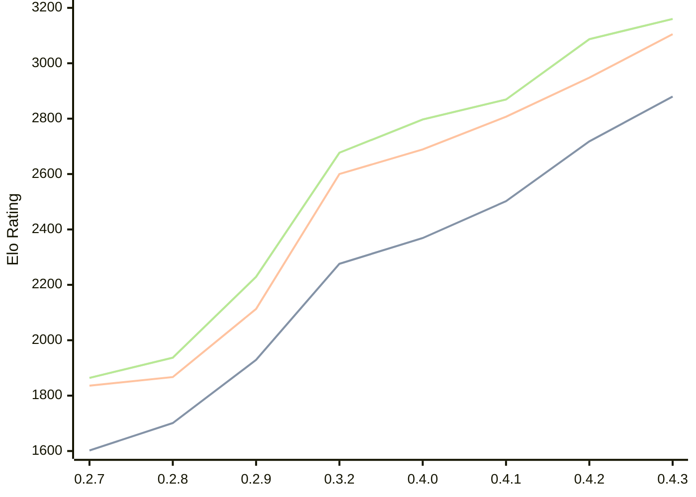

# Engine: Dual

Author: Tomasz Stawowy

Home: https://github.com/DSTGU/Dual

## Elo Ratings

| Version | Published | STC 8.0+0.08s  | LTC 60.0+0.60s | VLTC 2m24s+1.12s | Comment |
| --- | --- | --- | --- | --- | --- |
| 0.4.3 | 2026-09-04 | 2880(+162) | 3105(+157) | 3160(+73) |  |
| 0.4.2 | 2026-08-08 | 2718(+216) | 2948(+141) | 3087(+218) |  |
| 0.4.1 | 2026-07-26 | 2502(+133) | 2807(+118) | 2869(+72) |  |
| 0.4.0 | 2026-07-19 | 2369(+93) | 2689(+89) | 2797(+120) |  |
| 0.3.2 | 2026-07-06 | 2276(+new) | 2600(+new) | 2677(+new) |  |
| 0.3.1 | 2026-07-05 |  |  |  |  |
| 0.3.0 | 2026-05-23 |  |  |  |  |
| 0.2.9 | 2026-05-19 | 1929(+228) | 2113(+246) | 2229(+292) |  |
| 0.2.8 | 2026-05-15 | 1701(+99) | 1867(+31) | 1937(+73) |  |
| 0.2.7 | 2026-05-11 | 1602 | 1836 | 1864 |  |
 | | | cElo (∆ prev) | cElo (∆ prev) | cElo (∆ prev) | 

<a href="https://github.com/computer-chess-index/cci/issues/new?template=submit-version.yml&title=[VERSION]+Dual+<version>&body=###%20Engine%20name%0ADual%0A%0A###%20Version%0A0.4.3" target="_blank">Submit new version</a>

 Test Conditions:

GUI/CLI: <a href=https://github.com/cutechess/cutechess target="_blank">Cute-Chess</a> 
Elo Calculation: <a href=https://www.remi-coulom.fr/Bayesian-Elo/ target="_blank">Bayesian-Elo</a> 
CPU: Intel(R) Core(TM) i5-7500T 2.70GHz 
Opening book: 8_moves_v3 
\* STC: 8.0+0.08s, LTC: 60.0+0.60s, VLTC: 2m24s+1.12s

 Lists:
Ratings: <a href=https://github.com/computer-chess-index/cci/blob/main/lists/CCIRatings.csv target="_blank">Complete list</a>

Generated: 2026-09-24 04:37:43

## Ratings Verlauf

## Detailed Evaluation Results

| Version | Time Control | Elo  | Range +/- | Matches | Score | Average Opponent Elo | Draws |
| --- | --- | --- | --- | --- | --- | --- | --- |
| 0.4.3 | VLTC (2m24s+1.12s) | 3160 | 33 | 244 | 50% | 3156 | 65% |
| 0.4.3 | LTC (60.0+0.60s) | 3105 | 29 | 314 | 53% | 3085 | 61% |
| 0.4.3 | STC (8.0+0.08s) | 2880 | 35 | 240 | 52% | 2866 | 45% |
| --- | --- | --- | --- | --- | --- | --- | --- |
| 0.4.2 | VLTC (2m24s+1.12s) | 3087 | 31 | 286 | 50% | 3083 | 55% |
| 0.4.2 | LTC (60.0+0.60s) | 2948 | 33 | 256 | 51% | 2940 | 50% |
| 0.4.2 | STC (8.0+0.08s) | 2718 | 33 | 278 | 51% | 2704 | 41% |
| --- | --- | --- | --- | --- | --- | --- | --- |
| 0.4.1 | VLTC (2m24s+1.12s) | 2869 | 33 | 276 | 52% | 2855 | 42% |
| 0.4.1 | LTC (60.0+0.60s) | 2807 | 33 | 272 | 48% | 2822 | 41% |
| 0.4.1 | STC (8.0+0.08s) | 2502 | 33 | 304 | 48% | 2519 | 32% |
| --- | --- | --- | --- | --- | --- | --- | --- |
| 0.4.0 | VLTC (2m24s+1.12s) | 2797 | 35 | 244 | 53% | 2776 | 42% |
| 0.4.0 | LTC (60.0+0.60s) | 2689 | 39 | 216 | 53% | 2666 | 31% |
| 0.4.0 | STC (8.0+0.08s) | 2369 | 39 | 216 | 49% | 2379 | 30% |
| --- | --- | --- | --- | --- | --- | --- | --- |
| 0.3.2 | VLTC (2m24s+1.12s) | 2677 | 39 | 200 | 50% | 2670 | 40% |
| 0.3.2 | LTC (60.0+0.60s) | 2600 | 44 | 174 | 54% | 2558 | 30% |
| 0.3.2 | STC (8.0+0.08s) | 2276 | 42 | 200 | 48% | 2290 | 21% |
| --- | --- | --- | --- | --- | --- | --- | --- |
| 0.2.9 | VLTC (2m24s+1.12s) | 2229 | 34 | 298 | 51% | 2228 | 23% |
| 0.2.9 | LTC (60.0+0.60s) | 2113 | 37 | 258 | 52% | 2095 | 24% |
| 0.2.9 | STC (8.0+0.08s) | 1929 | 35 | 288 | 51% | 1922 | 20% |
| --- | --- | --- | --- | --- | --- | --- | --- |
| 0.2.8 | VLTC (2m24s+1.12s) | 1937 | 34 | 312 | 48% | 1951 | 21% |
| 0.2.8 | LTC (60.0+0.60s) | 1867 | 35 | 276 | 51% | 1851 | 29% |
| 0.2.8 | STC (8.0+0.08s) | 1701 | 33 | 314 | 46% | 1731 | 31% |
| --- | --- | --- | --- | --- | --- | --- | --- |
| 0.2.7 | VLTC (2m24s+1.12s) | 1864 | 32 | 334 | 47% | 1893 | 25% |
| 0.2.7 | LTC (60.0+0.60s) | 1836 | 35 | 304 | 49% | 1852 | 19% |
| 0.2.7 | STC (8.0+0.08s) | 1602 | 36 | 292 | 50% | 1597 | 16% |
| --- | --- | --- | --- | --- | --- | --- | --- |