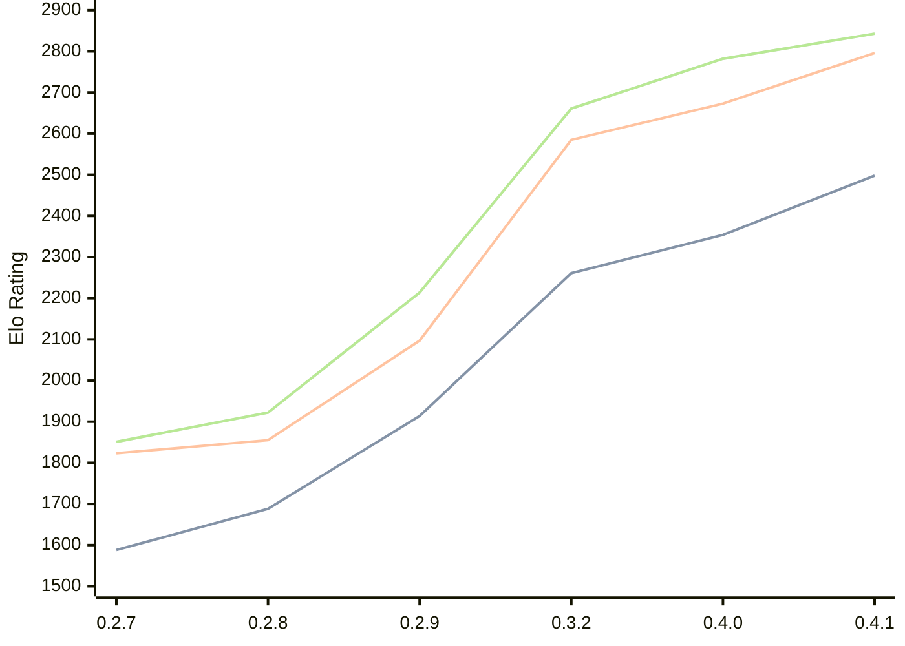

# Engine: Dual

Author: Tomasz Stawowy

Home: https://github.com/DSTGU/Dual

## Elo Ratings

| Version | Published | STC 8.0+0.08s  | LTC 60.0+0.60s | VLTC 2m24s+1.12s | Comment |
| --- | --- | --- | --- | --- | --- |
| 0.4.1 | 2026-07-26 | 2498(+144) | 2796(+123) | 2843(+61) |  |
| 0.4.0 | 2026-07-19 | 2354(+93) | 2673(+88) | 2782(+121) |  |
| 0.3.2 | 2026-07-06 | 2261(+new) | 2585(+new) | 2661(+new) |  |
| 0.3.1 | 2026-07-05 |  |  |  |  |
| 0.3.0 | 2026-05-23 |  |  |  |  |
| 0.2.9 | 2026-05-19 | 1914(+226) | 2097(+242) | 2214(+292) |  |
| 0.2.8 | 2026-05-15 | 1688(+100) | 1855(+32) | 1922(+71) |  |
| 0.2.7 | 2026-05-11 | 1588(+new) | 1823(+new) | 1851(+new) |  |
| 0.2.6 | 2024-11-29 |  |  |  |  |
| 0.2.5 | 2024-11-26 |  |  |  |  |
| 0.2.4 | 2024-11-24 |  |  |  |  |
| 0.2.3 | 2024-11-22 |  |  |  |  |
| 0.2.2 | 2024-11-22 |  |  |  |  |
| 0.2.1 | 2024-11-20 |  |  |  |  |
| 0.2.0 | 2024-11-19 |  |  |  |  |
| 0.1.0 | 2024-11-19 |  |  |  |  |
 | | | cElo (∆ prev) | cElo (∆ prev) | cElo (∆ prev) | 

<a href="https://github.com/computer-chess-index/cci/issues/new?template=submit-version.yml&title=[VERSION]+Dual+<version>&body=###%20Engine%20name%0ADual%0A%0A###%20Version%0A0.4.1" target="_blank">Submit new version</a>

 Test Conditions:

GUI/CLI: <a href=https://github.com/cutechess/cutechess target="_blank">Cute-Chess</a> 
Elo Calculation: <a href=https://www.remi-coulom.fr/Bayesian-Elo/ target="_blank">Bayesian-Elo</a> 
CPU: Intel(R) Core(TM) i5-7500T 2.70GHz 
Opening book: 8_moves_v3 
\* STC: 8.0+0.08s, LTC: 60.0+0.60s, VLTC: 2m24s+1.12s

 Lists:
Ratings: <a href=https://github.com/computer-chess-index/cci/blob/main/lists/CCIRatings.csv target="_blank">Complete list</a>

Generated: 2026-08-05 06:24:46

## Ratings Verlauf

⬛ STC (8.0+0.08s) &nbsp;&nbsp; 🟧 LTC (60.0+0.60s) &nbsp;&nbsp; 🟩 VLTC (2m24s+1.12s)

dark mode: 🟩STC (8.0+0.08s) 🟧LTC (60.0+0.60s) ⬜VLTC (2m24s+1.12s)

## Detailed Evaluation Results

| Version | Time Control | Elo  | Range +/- | Matches | Score | Average Opponent Elo | Draws |
| --- | --- | --- | --- | --- | --- | --- | --- |
| 0.4.1 | VLTC (2m24s+1.12s) | 2843 | 38 | 208 | 52% | 2830 | 42% |
| 0.4.1 | LTC (60.0+0.60s) | 2796 | 35 | 248 | 49% | 2805 | 42% |
| 0.4.1 | STC (8.0+0.08s) | 2498 | 33 | 292 | 49% | 2506 | 33% |
| --- | --- | --- | --- | --- | --- | --- | --- |
| 0.4.0 | VLTC (2m24s+1.12s) | 2782 | 35 | 244 | 53% | 2761 | 42% |
| 0.4.0 | LTC (60.0+0.60s) | 2673 | 39 | 216 | 53% | 2649 | 31% |
| 0.4.0 | STC (8.0+0.08s) | 2354 | 39 | 216 | 49% | 2365 | 30% |
| --- | --- | --- | --- | --- | --- | --- | --- |
| 0.3.2 | VLTC (2m24s+1.12s) | 2661 | 39 | 200 | 50% | 2655 | 40% |
| 0.3.2 | LTC (60.0+0.60s) | 2585 | 44 | 174 | 54% | 2543 | 30% |
| 0.3.2 | STC (8.0+0.08s) | 2261 | 42 | 200 | 48% | 2275 | 21% |
| --- | --- | --- | --- | --- | --- | --- | --- |
| 0.2.9 | VLTC (2m24s+1.12s) | 2214 | 34 | 298 | 51% | 2211 | 23% |
| 0.2.9 | LTC (60.0+0.60s) | 2097 | 37 | 258 | 52% | 2079 | 24% |
| 0.2.9 | STC (8.0+0.08s) | 1914 | 35 | 288 | 51% | 1908 | 20% |
| --- | --- | --- | --- | --- | --- | --- | --- |
| 0.2.8 | VLTC (2m24s+1.12s) | 1922 | 34 | 312 | 48% | 1936 | 21% |
| 0.2.8 | LTC (60.0+0.60s) | 1855 | 35 | 276 | 51% | 1837 | 29% |
| 0.2.8 | STC (8.0+0.08s) | 1688 | 33 | 314 | 46% | 1717 | 31% |
| --- | --- | --- | --- | --- | --- | --- | --- |
| 0.2.7 | VLTC (2m24s+1.12s) | 1851 | 32 | 334 | 47% | 1881 | 25% |
| 0.2.7 | LTC (60.0+0.60s) | 1823 | 35 | 304 | 49% | 1839 | 19% |
| 0.2.7 | STC (8.0+0.08s) | 1588 | 36 | 292 | 50% | 1584 | 16% |
| --- | --- | --- | --- | --- | --- | --- | --- |