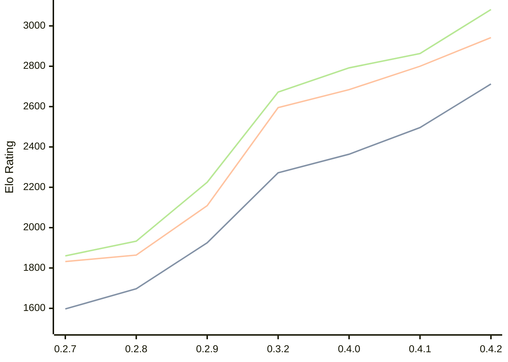

# Engine: Dual

Author: Tomasz Stawowy

Home: https://github.com/DSTGU/Dual

## Elo Ratings

| Version | Published | STC 8.0+0.08s  | LTC 60.0+0.60s | VLTC 2m24s+1.12s | Comment |
| --- | --- | --- | --- | --- | --- |
| 0.4.2 | 2026-08-08 | 2712(+216) | 2942(+142) | 3081(+218) |  |
| 0.4.1 | 2026-07-26 | 2496(+132) | 2800(+116) | 2863(+71) |  |
| 0.4.0 | 2026-07-19 | 2364(+92) | 2684(+89) | 2792(+120) |  |
| 0.3.2 | 2026-07-06 | 2272(+new) | 2595(+new) | 2672(+new) |  |
| 0.3.1 | 2026-07-05 |  |  |  |  |
| 0.3.0 | 2026-05-23 |  |  |  |  |
| 0.2.9 | 2026-05-19 | 1925(+228) | 2109(+245) | 2225(+292) |  |
| 0.2.8 | 2026-05-15 | 1697(+100) | 1864(+32) | 1933(+73) |  |
| 0.2.7 | 2026-05-11 | 1597 | 1832 | 1860 |  |
 | | | cElo (∆ prev) | cElo (∆ prev) | cElo (∆ prev) | 

<a href="https://github.com/computer-chess-index/cci/issues/new?template=submit-version.yml&title=[VERSION]+Dual+<version>&body=###%20Engine%20name%0ADual%0A%0A###%20Version%0A0.4.2" target="_blank">Submit new version</a>

 Test Conditions:

GUI/CLI: <a href=https://github.com/cutechess/cutechess target="_blank">Cute-Chess</a> 
Elo Calculation: <a href=https://www.remi-coulom.fr/Bayesian-Elo/ target="_blank">Bayesian-Elo</a> 
CPU: Intel(R) Core(TM) i5-7500T 2.70GHz 
Opening book: 8_moves_v3 
\* STC: 8.0+0.08s, LTC: 60.0+0.60s, VLTC: 2m24s+1.12s

 Lists:
Ratings: <a href=https://github.com/computer-chess-index/cci/blob/main/lists/CCIRatings.csv target="_blank">Complete list</a>

Generated: 2026-09-04 04:34:35

## Ratings Verlauf

## Detailed Evaluation Results

| Version | Time Control | Elo  | Range +/- | Matches | Score | Average Opponent Elo | Draws |
| --- | --- | --- | --- | --- | --- | --- | --- |
| 0.4.2 | VLTC (2m24s+1.12s) | 3081 | 31 | 286 | 50% | 3077 | 55% |
| 0.4.2 | LTC (60.0+0.60s) | 2942 | 33 | 256 | 51% | 2934 | 50% |
| 0.4.2 | STC (8.0+0.08s) | 2712 | 33 | 278 | 51% | 2699 | 41% |
| --- | --- | --- | --- | --- | --- | --- | --- |
| 0.4.1 | VLTC (2m24s+1.12s) | 2863 | 33 | 276 | 52% | 2849 | 42% |
| 0.4.1 | LTC (60.0+0.60s) | 2800 | 33 | 272 | 48% | 2816 | 41% |
| 0.4.1 | STC (8.0+0.08s) | 2496 | 33 | 304 | 48% | 2514 | 32% |
| --- | --- | --- | --- | --- | --- | --- | --- |
| 0.4.0 | VLTC (2m24s+1.12s) | 2792 | 35 | 244 | 53% | 2770 | 42% |
| 0.4.0 | LTC (60.0+0.60s) | 2684 | 39 | 216 | 53% | 2661 | 31% |
| 0.4.0 | STC (8.0+0.08s) | 2364 | 39 | 216 | 49% | 2375 | 30% |
| --- | --- | --- | --- | --- | --- | --- | --- |
| 0.3.2 | VLTC (2m24s+1.12s) | 2672 | 39 | 200 | 50% | 2666 | 40% |
| 0.3.2 | LTC (60.0+0.60s) | 2595 | 44 | 174 | 54% | 2553 | 30% |
| 0.3.2 | STC (8.0+0.08s) | 2272 | 42 | 200 | 48% | 2284 | 21% |
| --- | --- | --- | --- | --- | --- | --- | --- |
| 0.2.9 | VLTC (2m24s+1.12s) | 2225 | 34 | 298 | 51% | 2223 | 23% |
| 0.2.9 | LTC (60.0+0.60s) | 2109 | 37 | 258 | 52% | 2091 | 24% |
| 0.2.9 | STC (8.0+0.08s) | 1925 | 35 | 288 | 51% | 1918 | 20% |
| --- | --- | --- | --- | --- | --- | --- | --- |
| 0.2.8 | VLTC (2m24s+1.12s) | 1933 | 34 | 312 | 48% | 1947 | 21% |
| 0.2.8 | LTC (60.0+0.60s) | 1864 | 35 | 276 | 51% | 1847 | 29% |
| 0.2.8 | STC (8.0+0.08s) | 1697 | 33 | 314 | 46% | 1727 | 31% |
| --- | --- | --- | --- | --- | --- | --- | --- |
| 0.2.7 | VLTC (2m24s+1.12s) | 1860 | 32 | 334 | 47% | 1890 | 25% |
| 0.2.7 | LTC (60.0+0.60s) | 1832 | 35 | 304 | 49% | 1850 | 19% |
| 0.2.7 | STC (8.0+0.08s) | 1597 | 36 | 292 | 50% | 1593 | 16% |
| --- | --- | --- | --- | --- | --- | --- | --- |