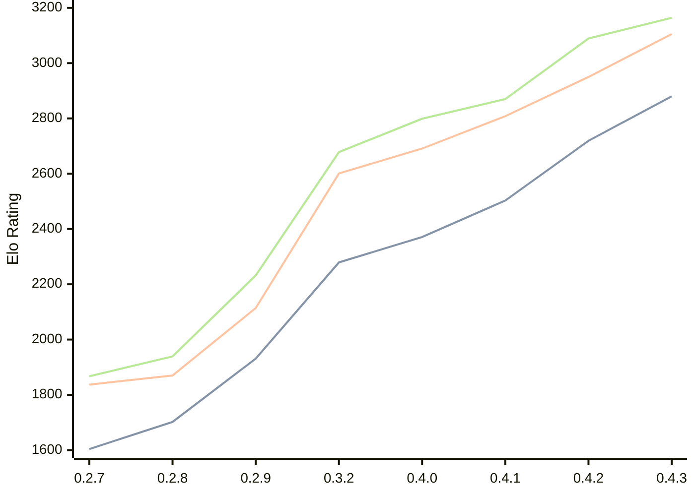

# Engine: Dual

Author: Tomasz Stawowy

Home: https://github.com/DSTGU/Dual

## Elo Ratings E1

| Version | Published | STC 8.0+0.08s  | LTC 60.0+0.60s | VLTC 2m24s+1.12s | Comment |
| --- | --- | --- | --- | --- | --- |
| 0.4.3 | 2026-09-04 | 2754 | 3065 | 3136 |  |
 | | | cElo (∆ prev) | cElo (∆ prev) | cElo (∆ prev) | 

## Elo Ratings P1

| Version | Published | STC 8.0+0.08s  | LTC 60.0+0.60s | VLTC 2m24s+1.12s | Comment |
| --- | --- | --- | --- | --- | --- |
| 0.4.3 | 2026-09-04 | 3011 | 3251 | 3357 |  |
 | | | cElo (∆ prev) | cElo (∆ prev) | cElo (∆ prev) | 

## Elo Ratings T1

| Version | Published | STC 8.0+0.08s  | LTC 60.0+0.60s | VLTC 2m24s+1.12s | Comment |
| --- | --- | --- | --- | --- | --- |
| 0.4.3 | 2026-09-04 | 2880(+161) | 3105(+155) | 3164(+75) |  |
| 0.4.2 | 2026-08-08 | 2719(+216) | 2950(+142) | 3089(+219) |  |
| 0.4.1 | 2026-07-26 | 2503(+132) | 2808(+117) | 2870(+71) |  |
| 0.4.0 | 2026-07-19 | 2371(+92) | 2691(+90) | 2799(+121) |  |
| 0.3.2 | 2026-07-06 | 2279(+348) | 2601(+487) | 2678(+446) |  |
| 0.2.9 | 2026-05-19 | 1931(+229) | 2114(+244) | 2232(+293) |  |
| 0.2.8 | 2026-05-15 | 1702(+98) | 1870(+33) | 1939(+72) |  |
| 0.2.7 | 2026-05-11 | 1604 | 1837 | 1867 |  |
 | | | cElo (∆ prev) | cElo (∆ prev) | cElo (∆ prev) | 

<a href="https://github.com/computer-chess-index/cci/issues/new?template=submit-version.yml&title=[VERSION]+Dual+<version>&body=###%20Engine%20name%0ADual%0A%0A###%20Version%0A0.4.3" target="_blank">Submit new version</a>

 Test Conditions:

GUI/CLI: <a href=https://github.com/cutechess/cutechess target="_blank">Cute-Chess</a> 
Elo Calculation: <a href=https://www.remi-coulom.fr/Bayesian-Elo/ target="_blank">Bayesian-Elo</a> 
CPU for P1: Intel(R) Core(TM) Ultra 7 265T (1.50 GHz) - P-Core 
CPU for E1: Intel(R) Core(TM) Ultra 7 265T (1.50 GHz) - E-Core 
CPU for T1: Intel(R) Core(TM) i5-7500T 2.70GHz 
Opening book: 8_moves_v3 
\* STC: 8.0+0.08s, LTC: 60.0+0.60s, VLTC: 2m24s+1.12s

 Lists:
Ratings: <a href=https://github.com/computer-chess-index/cci/blob/main/lists/CCIRatings.csv target="_blank">Complete list</a>

Generated: 2026-10-09 14:10:58

## Ratings Verlauf

```mermaid
%%{init: {"theme":"base","themeVariables":{"seriesColors:['#a3a3a3','#222221','#faa371']}}}%%
xychart-beta
  x-axis ["0.2.7", "0.2.8", "0.2.9", "0.3.2", "0.4.0", "0.4.1", "0.4.2", "0.4.3"]
  y-axis "Elo Rating" 1600 --> 3200
  line "" [1604, 1702, 1931, 2279, 2371, 2503, 2719, 2880]
  line "STC (8.0+0.08s)" [1604, 1702, 1931, 2279, 2371, 2503, 2719, 2880]
  line "LTC (60.0+0.60s)" [1837, 1870, 2114, 2601, 2691, 2808, 2950, 3105]
  line "" [1867, 1939, 2232, 2678, 2799, 2870, 3089, 3164]
  line "VLTC (2m24s+1.12s)" [1867, 1939, 2232, 2678, 2799, 2870, 3089, 3164]
```

## Detailed Evaluation Results

| Version | Time Control | Elo  | Range +/- | Matches | Score | Average Opponent Elo | Draws |
| --- | --- | --- | --- | --- | --- | --- | --- |
| 0.4.3 | VLTC (2m24s+1.12s) | 3164 | 32 | 252 | 51% | 3158 | 64% |
| 0.4.3 | VLTC (2m24s+1.12s) | 3357 | 39 | 184 | 49% | 3364 | 57% |
| 0.4.3 | VLTC (2m24s+1.12s) | 3136 | 33 | 256 | 50% | 3139 | 57% |
| 0.4.3 | LTC (60.0+0.60s) | 3105 | 29 | 322 | 52% | 3087 | 60% |
| 0.4.3 | LTC (60.0+0.60s) | 3251 | 44 | 144 | 48% | 3274 | 56% |
| 0.4.3 | LTC (60.0+0.60s) | 3065 | 32 | 260 | 51% | 3060 | 63% |
| 0.4.3 | STC (8.0+0.08s) | 2880 | 35 | 244 | 52% | 2867 | 44% |
| --- | --- | --- | --- | --- | --- | --- | --- |
| 0.4.3 | STC (8.0+0.08s) | 3011 | 42 | 158 | 51% | 3000 | 55% |
| --- | --- | --- | --- | --- | --- | --- | --- |
| 0.4.3 | STC (8.0+0.08s) | 2754 | 32 | 294 | 44% | 2799 | 43% |
| --- | --- | --- | --- | --- | --- | --- | --- |
| 0.4.2 | VLTC (2m24s+1.12s) | 3089 | 31 | 286 | 50% | 3086 | 55% |
| 0.4.2 | LTC (60.0+0.60s) | 2950 | 33 | 256 | 51% | 2942 | 50% |
| 0.4.2 | STC (8.0+0.08s) | 2719 | 33 | 278 | 51% | 2705 | 41% |
| --- | --- | --- | --- | --- | --- | --- | --- |
| 0.4.1 | VLTC (2m24s+1.12s) | 2870 | 33 | 276 | 52% | 2857 | 42% |
| 0.4.1 | LTC (60.0+0.60s) | 2808 | 33 | 272 | 48% | 2823 | 41% |
| 0.4.1 | STC (8.0+0.08s) | 2503 | 33 | 304 | 48% | 2520 | 32% |
| --- | --- | --- | --- | --- | --- | --- | --- |
| 0.4.0 | VLTC (2m24s+1.12s) | 2799 | 35 | 244 | 53% | 2777 | 42% |
| 0.4.0 | LTC (60.0+0.60s) | 2691 | 39 | 216 | 53% | 2668 | 31% |
| 0.4.0 | STC (8.0+0.08s) | 2371 | 39 | 216 | 49% | 2380 | 30% |
| --- | --- | --- | --- | --- | --- | --- | --- |
| 0.3.2 | VLTC (2m24s+1.12s) | 2678 | 39 | 200 | 50% | 2673 | 40% |
| 0.3.2 | LTC (60.0+0.60s) | 2601 | 44 | 174 | 54% | 2561 | 30% |
| 0.3.2 | STC (8.0+0.08s) | 2279 | 42 | 200 | 48% | 2291 | 21% |
| --- | --- | --- | --- | --- | --- | --- | --- |
| 0.2.9 | VLTC (2m24s+1.12s) | 2232 | 34 | 298 | 51% | 2229 | 23% |
| 0.2.9 | LTC (60.0+0.60s) | 2114 | 37 | 258 | 52% | 2098 | 24% |
| 0.2.9 | STC (8.0+0.08s) | 1931 | 35 | 288 | 51% | 1924 | 20% |
| --- | --- | --- | --- | --- | --- | --- | --- |
| 0.2.8 | VLTC (2m24s+1.12s) | 1939 | 34 | 312 | 48% | 1952 | 21% |
| 0.2.8 | LTC (60.0+0.60s) | 1870 | 35 | 276 | 51% | 1852 | 29% |
| 0.2.8 | STC (8.0+0.08s) | 1702 | 33 | 314 | 46% | 1732 | 31% |
| --- | --- | --- | --- | --- | --- | --- | --- |
| 0.2.7 | VLTC (2m24s+1.12s) | 1867 | 32 | 334 | 47% | 1895 | 25% |
| 0.2.7 | LTC (60.0+0.60s) | 1837 | 35 | 304 | 49% | 1855 | 19% |
| 0.2.7 | STC (8.0+0.08s) | 1604 | 36 | 292 | 50% | 1600 | 16% |
| --- | --- | --- | --- | --- | --- | --- | --- |