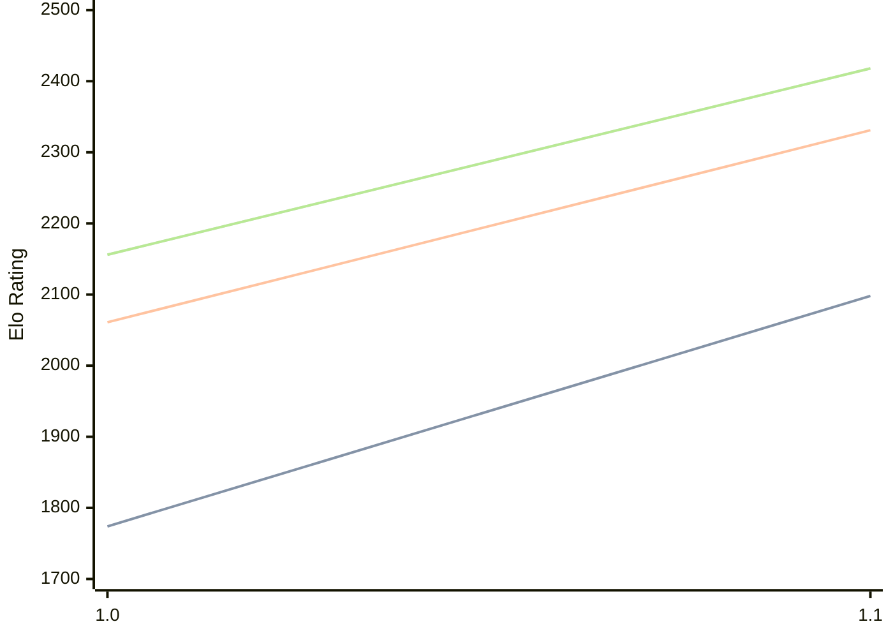

# Engine: Echekinator

Author: Timothee Fixy

Home: https://github.com/Tym972/Echekinator

## Elo Ratings

| Version | Published | STC 8.0+0.08s  | LTC 60.0+0.60s | VLTC 2m24s+1.12s | Comment |
| --- | --- | --- | --- | --- | --- |
| 1.1 | 2026-09-30 | 2098(+324) | 2331(+270) | 2418(+262) |  |
| 1.0 | 2025-11-25 | 1774 | 2061 | 2156 |  |
 | | | cElo (∆ prev) | cElo (∆ prev) | cElo (∆ prev) | 

<a href="https://github.com/computer-chess-index/cci/issues/new?template=submit-version.yml&title=[VERSION]+Echekinator+<version>&body=###%20Engine%20name%0AEchekinator%0A%0A###%20Version%0A1.1" target="_blank">Submit new version</a>

 Test Conditions:

GUI/CLI: <a href=https://github.com/cutechess/cutechess target="_blank">Cute-Chess</a> 
Elo Calculation: <a href=https://www.remi-coulom.fr/Bayesian-Elo/ target="_blank">Bayesian-Elo</a> 
CPU: Intel(R) Core(TM) i5-7500T 2.70GHz 
Opening book: 8_moves_v3 
\* STC: 8.0+0.08s, LTC: 60.0+0.60s, VLTC: 2m24s+1.12s

 Lists:
Ratings: <a href=https://github.com/computer-chess-index/cci/blob/main/lists/CCIRatings.csv target="_blank">Complete list</a>

Generated: 2026-10-09 04:37:56

## Ratings Verlauf

## Detailed Evaluation Results

| Version | Time Control | Elo  | Range +/- | Matches | Score | Average Opponent Elo | Draws |
| --- | --- | --- | --- | --- | --- | --- | --- |
| 1.1 | VLTC (2m24s+1.12s) | 2418 | 43 | 188 | 53% | 2383 | 27% |
| 1.1 | LTC (60.0+0.60s) | 2331 | 42 | 194 | 51% | 2321 | 28% |
| 1.1 | STC (8.0+0.08s) | 2098 | 37 | 268 | 49% | 2109 | 21% |
| --- | --- | --- | --- | --- | --- | --- | --- |
| 1.0 | VLTC (2m24s+1.12s) | 2156 | 26 | 544 | 47% | 2196 | 24% |
| 1.0 | LTC (60.0+0.60s) | 2061 | 23 | 684 | 51% | 2049 | 24% |
| 1.0 | STC (8.0+0.08s) | 1774 | 22 | 796 | 48% | 1790 | 18% |
| --- | --- | --- | --- | --- | --- | --- | --- |