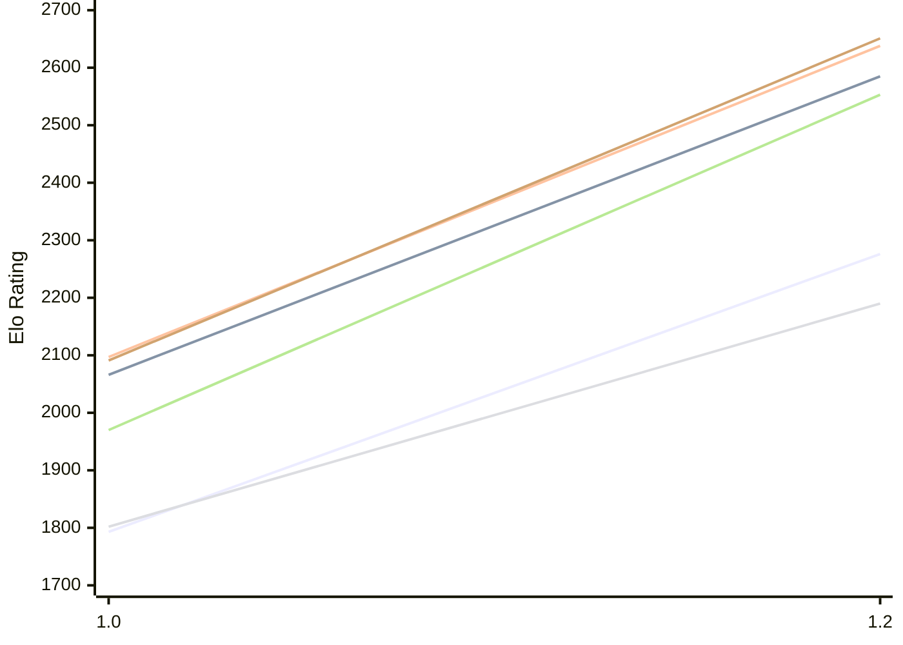
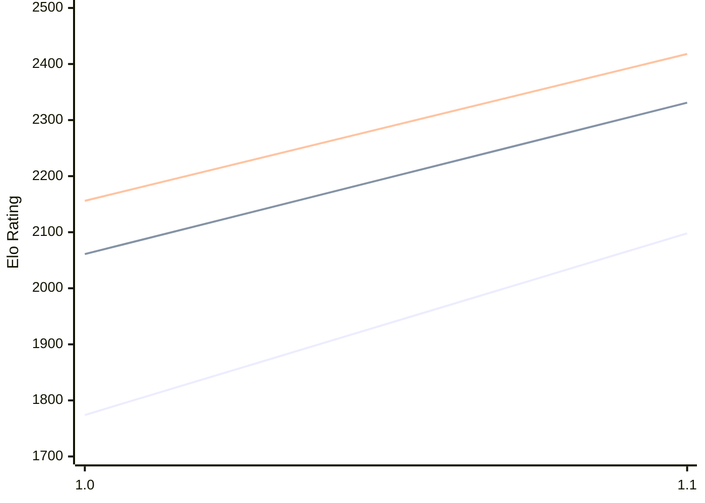

# Engine: Echekinator

Author: Timothee Fixy

Home: https://github.com/Tym972/Echekinator

## Elo Ratings E1 (Ultra 7 265T (1.50 GHz) - E-Core)

| Version | Published | STC 8.0+0.08s  | LTC 60.0+0.60s | VLTC 2m24s+1.12s | Comment |
| --- | --- | --- | --- | --- | --- |
| 1.2 | 2026-10-14 | 2276(+483) | 2585(+519) | 2638(+541) |  |
| 1.0 | 2025-11-25 | 1793 | 2066 | 2097 |  |
 | | | cElo (∆ prev) | cElo (∆ prev) | cElo (∆ prev) | 

## Elo Ratings P1 (Ultra 7 265T (1.50 GHz) - P-Core)

| Version | Published | STC 8.0+0.08s  | LTC 60.0+0.60s | VLTC 2m24s+1.12s | Comment |
| --- | --- | --- | --- | --- | --- |
| 1.2 | 2026-10-14 | 2190(+388) | 2553(+583) | 2651(+560) |  |
| 1.0 | 2025-11-25 | 1802 | 1970 | 2091 |  |
 | | | cElo (∆ prev) | cElo (∆ prev) | cElo (∆ prev) | 

## Elo Ratings T1 (i5-7500T 2.70GHz)

| Version | Published | STC 8.0+0.08s  | LTC 60.0+0.60s | VLTC 2m24s+1.12s | Comment |
| --- | --- | --- | --- | --- | --- |
| 1.1 | 2026-09-30 | 2098(+324) | 2331(+270) | 2418(+262) |  |
| 1.0 | 2025-11-25 | 1774 | 2061 | 2156 |  |
 | | | cElo (∆ prev) | cElo (∆ prev) | cElo (∆ prev) | 

<a href="https://github.com/computer-chess-index/cci/issues/new?template=submit-version.yml&title=[VERSION]+Echekinator+<version>&body=###%20Engine%20name%0AEchekinator%0A%0A###%20Version%0A1.1" target="_blank">Submit new version</a>

 Test Conditions:

GUI/CLI: <a href=https://github.com/cutechess/cutechess target="_blank">Cute-Chess</a> 
Elo Calculation: <a href=https://www.remi-coulom.fr/Bayesian-Elo/ target="_blank">Bayesian-Elo</a> 
CPU for P1: Intel(R) Core(TM) Ultra 7 265T (1.50 GHz) - P-Core 
CPU for E1: Intel(R) Core(TM) Ultra 7 265T (1.50 GHz) - E-Core 
CPU for T1: Intel(R) Core(TM) i5-7500T 2.70GHz 
Opening book: 8_moves_v3 
\* STC: 8.0+0.08s, LTC: 60.0+0.60s, VLTC: 2m24s+1.12s

 Lists:
Ratings: <a href=https://github.com/computer-chess-index/cci/blob/main/lists/CCIRatings.csv target="_blank">Complete list</a>

Generated: 2026-10-30 05:38:08

## Ratings Verlauf E1 / P1

```mermaid
%%{init: {"theme":"base","themeVariables":{"seriesColors:['#a3a3a3','#222221','#faa371']}}}%%
xychart-beta
  x-axis ["1.0", "1.2"]
  y-axis "Elo Rating" 1700 --> 2700
  line "E1: STC (8.0+0.08s)" [1793, 2276]
  line "E1: LTC (60.0+0.60s)" [2066, 2585]
  line "E1: VLTC (2m24s+1.12s)" [2097, 2638]
  line "P1: STC (8.0+0.08s)" [1802, 2190]
  line "P1: LTC (60.0+0.60s)" [1970, 2553]
  line "P1: VLTC (2m24s+1.12s)" [2091, 2651]
```

## Ratings Verlauf T1

```mermaid
%%{init: {"theme":"base","themeVariables":{"seriesColors:['#a3a3a3','#222221','#faa371']}}}%%
xychart-beta
  x-axis ["1.0", "1.1"]
  y-axis "Elo Rating" 1700 --> 2500
  line "T1: STC (8.0+0.08s)" [1774, 2098]
  line "T1: LTC (60.0+0.60s)" [2061, 2331]
  line "T1: VLTC (2m24s+1.12s)" [2156, 2418]
```

## Detailed Evaluation Results

| Version | Time Control | Variant | Elo  | Range +/- | Matches | Score | Average Opponent Elo | Draws |
| --- | --- |--- | --- | --- | --- | --- | --- | --- |
| 1.2 | VLTC (2m24s+1.12s) | P1 | 2651 | 47 | 148 | 54% | 2612 | 33% |
|  |  | E1 | 2638 | 40 | 226 | 49% | 2639 | 24% |
|  | LTC (60.0+0.60s) | P1 | 2553 | 49 | 144 | 53% | 2511 | 27% |
|  |  | E1 | 2585 | 39 | 234 | 51% | 2569 | 25% |
|  | STC (8.0+0.08s) | P1 | 2190 | 50 | 142 | 49% | 2198 | 20% |
|  |  | E1 | 2276 | 38 | 244 | 49% | 2288 | 26% |
| --- | --- |--- | --- | --- | --- | --- | --- | --- |
| 1.1 | VLTC (2m24s+1.12s) | T1 | 2418 | 43 | 188 | 53% | 2383 | 27% |
|  | LTC (60.0+0.60s) | T1 | 2331 | 42 | 194 | 51% | 2321 | 28% |
|  | STC (8.0+0.08s) | T1 | 2098 | 37 | 268 | 49% | 2109 | 21% |
| --- | --- |--- | --- | --- | --- | --- | --- | --- |
| 1.0 | VLTC (2m24s+1.12s) | T1 | 2156 | 26 | 544 | 47% | 2196 | 24% |
|  |  | P1 | 2091 | 51 | 156 | 54% | 2039 | 15% |
|  |  | E1 | 2097 | 42 | 208 | 45% | 2198 | 24% |
|  | LTC (60.0+0.60s) | T1 | 2061 | 23 | 684 | 51% | 2049 | 24% |
|  |  | P1 | 1970 | 46 | 164 | 49% | 1993 | 25% |
|  |  | E1 | 2066 | 40 | 228 | 45% | 2145 | 23% |
|  | STC (8.0+0.08s) | T1 | 1774 | 22 | 796 | 48% | 1790 | 18% |
|  |  | P1 | 1802 | 40 | 216 | 50% | 1802 | 23% |
|  |  | E1 | 1793 | 42 | 204 | 50% | 1794 | 20% |