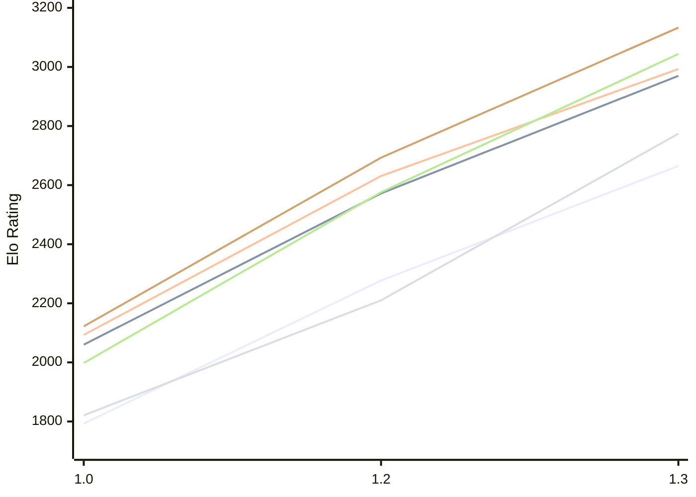
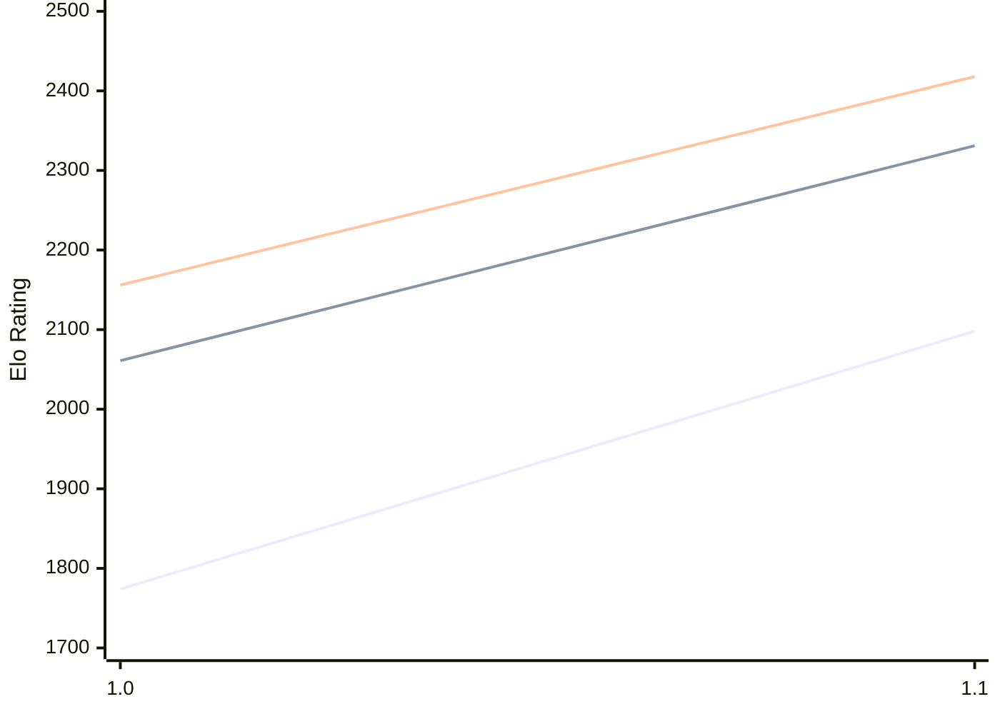

# Engine: Echekinator

Author: Timothee Fixy

Home: https://github.com/Tym972/Echekinator

## Elo Ratings E1 (Ultra 7 265T (1.50 GHz) - E-Core)

| Version | Published | STC 8.0+0.08s  | LTC 60.0+0.60s | VLTC 2m24s+1.12s | Comment |
| --- | --- | --- | --- | --- | --- |
| 1.3 | 2026-11-06 | 2665(+388) | 2970(+398) | 2993(+362) |  |
| 1.2 | 2026-10-14 | 2277(+484) | 2572(+512) | 2631(+538) |  |
| 1.0 | 2025-11-25 | 1793 | 2060 | 2093 |  |
 | | | cElo (∆ prev) | cElo (∆ prev) | cElo (∆ prev) | 

## Elo Ratings P1 (Ultra 7 265T (1.50 GHz) - P-Core)

| Version | Published | STC 8.0+0.08s  | LTC 60.0+0.60s | VLTC 2m24s+1.12s | Comment |
| --- | --- | --- | --- | --- | --- |
| 1.3 | 2026-11-06 | 2774(+564) | 3044(+468) | 3133(+440) |  |
| 1.2 | 2026-10-14 | 2210(+389) | 2576(+578) | 2693(+571) |  |
| 1.0 | 2025-11-25 | 1821 | 1998 | 2122 |  |
 | | | cElo (∆ prev) | cElo (∆ prev) | cElo (∆ prev) | 

## Elo Ratings T1 (i5-7500T 2.70GHz)

| Version | Published | STC 8.0+0.08s  | LTC 60.0+0.60s | VLTC 2m24s+1.12s | Comment |
| --- | --- | --- | --- | --- | --- |
| 1.1 | 2026-09-30 | 2098(+324) | 2331(+270) | 2418(+262) |  |
| 1.0 | 2025-11-25 | 1774 | 2061 | 2156 |  |
 | | | cElo (∆ prev) | cElo (∆ prev) | cElo (∆ prev) | 

<a href="https://github.com/computer-chess-index/cci/issues/new?template=submit-version.yml&title=[VERSION]+Echekinator+<version>&body=###%20Engine%20name%0AEchekinator%0A%0A###%20Version%0A1.1" target="_blank">Submit new version</a>

 Test Conditions:

GUI/CLI: <a href=https://github.com/cutechess/cutechess target="_blank">Cute-Chess</a> 
Elo Calculation: <a href=https://www.remi-coulom.fr/Bayesian-Elo/ target="_blank">Bayesian-Elo</a> 
CPU for P1: Intel(R) Core(TM) Ultra 7 265T (1.50 GHz) - P-Core 
CPU for E1: Intel(R) Core(TM) Ultra 7 265T (1.50 GHz) - E-Core 
CPU for T1: Intel(R) Core(TM) i5-7500T 2.70GHz 
Opening book: 8_moves_v3 
\* STC: 8.0+0.08s, LTC: 60.0+0.60s, VLTC: 2m24s+1.12s

 Lists:
Ratings: <a href=https://github.com/computer-chess-index/cci/blob/main/lists/CCIRatings.csv target="_blank">Complete list</a>

Generated: 2026-11-12 05:37:48

## Ratings Verlauf E1 / P1

```mermaid
%%{init: {"theme":"base","themeVariables":{"seriesColors:['#a3a3a3','#222221','#faa371']}}}%%
xychart-beta
  x-axis ["1.0", "1.2", "1.3"]
  y-axis "Elo Rating" 1700 --> 3200
  line "E1: STC (8.0+0.08s)" [1793, 2277, 2665]
  line "E1: LTC (60.0+0.60s)" [2060, 2572, 2970]
  line "E1: VLTC (2m24s+1.12s)" [2093, 2631, 2993]
  line "P1: STC (8.0+0.08s)" [1821, 2210, 2774]
  line "P1: LTC (60.0+0.60s)" [1998, 2576, 3044]
  line "P1: VLTC (2m24s+1.12s)" [2122, 2693, 3133]
```

## Ratings Verlauf T1

```mermaid
%%{init: {"theme":"base","themeVariables":{"seriesColors:['#a3a3a3','#222221','#faa371']}}}%%
xychart-beta
  x-axis ["1.0", "1.1"]
  y-axis "Elo Rating" 1700 --> 2500
  line "T1: STC (8.0+0.08s)" [1774, 2098]
  line "T1: LTC (60.0+0.60s)" [2061, 2331]
  line "T1: VLTC (2m24s+1.12s)" [2156, 2418]
```

## Detailed Evaluation Results

| Version | Time Control | Variant | Elo  | Range +/- | Matches | Score | Average Opponent Elo | Draws |
| --- | --- |--- | --- | --- | --- | --- | --- | --- |
| 1.3 | VLTC (2m24s+1.12s) | P1 | 3133 | 41 | 172 | 49% | 3136 | 48% |
|  |  | E1 | 2993 | 34 | 272 | 52% | 2971 | 40% |
|  | LTC (60.0+0.60s) | E1 | 2970 | 27 | 410 | 48% | 2982 | 42% |
|  |  | P1 | 3044 | 38 | 202 | 49% | 3046 | 48% |
|  | STC (8.0+0.08s) | E1 | 2665 | 33 | 316 | 55% | 2619 | 28% |
|  |  | P1 | 2774 | 49 | 144 | 59% | 2685 | 30% |
| --- | --- |--- | --- | --- | --- | --- | --- | --- |
| 1.2 | VLTC (2m24s+1.12s) | P1 | 2693 | 45 | 162 | 53% | 2658 | 36% |
|  |  | E1 | 2631 | 35 | 274 | 50% | 2623 | 27% |
|  | LTC (60.0+0.60s) | P1 | 2576 | 47 | 156 | 52% | 2547 | 27% |
|  |  | E1 | 2572 | 36 | 274 | 51% | 2565 | 23% |
|  | STC (8.0+0.08s) | P1 | 2210 | 49 | 150 | 48% | 2225 | 20% |
|  |  | E1 | 2277 | 36 | 280 | 49% | 2284 | 25% |
| --- | --- |--- | --- | --- | --- | --- | --- | --- |
| 1.1 | VLTC (2m24s+1.12s) | T1 | 2418 | 43 | 188 | 53% | 2383 | 27% |
|  | LTC (60.0+0.60s) | T1 | 2331 | 42 | 194 | 51% | 2321 | 28% |
|  | STC (8.0+0.08s) | T1 | 2098 | 37 | 268 | 49% | 2109 | 21% |
| --- | --- |--- | --- | --- | --- | --- | --- | --- |
| 1.0 | VLTC (2m24s+1.12s) | P1 | 2122 | 51 | 156 | 54% | 2070 | 15% |
|  |  | E1 | 2093 | 42 | 208 | 45% | 2192 | 24% |
|  |  | T1 | 2156 | 26 | 544 | 47% | 2196 | 24% |
|  | LTC (60.0+0.60s) | P1 | 1998 | 46 | 164 | 49% | 2021 | 25% |
|  |  | E1 | 2060 | 40 | 228 | 45% | 2140 | 23% |
|  |  | T1 | 2061 | 23 | 684 | 51% | 2049 | 24% |
|  | STC (8.0+0.08s) | P1 | 1821 | 40 | 216 | 50% | 1820 | 23% |
|  |  | E1 | 1793 | 42 | 204 | 50% | 1796 | 20% |
|  |  | T1 | 1774 | 22 | 796 | 48% | 1790 | 18% |