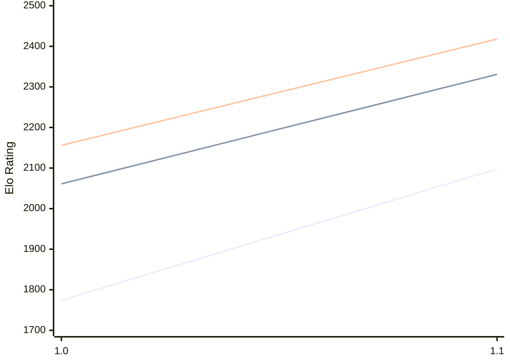

# Engine: Echekinator

Author: Timothee Fixy

Home: https://github.com/Tym972/Echekinator

## Elo Ratings E1 (Ultra 7 265T (1.50 GHz) - E-Core)

| Version | Published | STC 8.0+0.08s  | LTC 60.0+0.60s | VLTC 2m24s+1.12s | Comment |
| --- | --- | --- | --- | --- | --- |
| 1.3 | 2026-11-06 | 2620(+380) | 2925(+399) | 2952(+367) |  |
| 1.2 | 2026-10-14 | 2240(+482) | 2526(+505) | 2585(+533) |  |
| 1.0 | 2025-11-25 | 1758 | 2021 | 2052 |  |
 | | | cElo (∆ prev) | cElo (∆ prev) | cElo (∆ prev) | 

## Elo Ratings P1 (Ultra 7 265T (1.50 GHz) - P-Core)

| Version | Published | STC 8.0+0.08s  | LTC 60.0+0.60s | VLTC 2m24s+1.12s | Comment |
| --- | --- | --- | --- | --- | --- |
| 1.3 | 2026-11-06 | 2600(+506) | 2844(+438) | 2931(+409) |  |
| 1.2 | 2026-10-14 | 2094(+355) | 2406(+512) | 2522(+501) |  |
| 1.0 | 2025-11-25 | 1739 | 1894 | 2021 |  |
 | | | cElo (∆ prev) | cElo (∆ prev) | cElo (∆ prev) | 

## Elo Ratings T1 (i5-7500T 2.70GHz)

| Version | Published | STC 8.0+0.08s  | LTC 60.0+0.60s | VLTC 2m24s+1.12s | Comment |
| --- | --- | --- | --- | --- | --- |
| 1.1 | 2026-09-30 | 2098(+324) | 2331(+270) | 2418(+262) |  |
| 1.0 | 2025-11-25 | 1774 | 2061 | 2156 |  |
 | | | cElo (∆ prev) | cElo (∆ prev) | cElo (∆ prev) | 

<a href="https://github.com/computer-chess-index/cci/issues/new?template=submit-version.yml&title=[VERSION]+Echekinator+<version>&body=###%20Engine%20name%0AEchekinator%0A%0A###%20Version%0A1.1" target="_blank">Submit new version</a>

 Test Conditions:

GUI/CLI: <a href=https://github.com/cutechess/cutechess target="_blank">Cute-Chess</a> 
Elo Calculation: <a href=https://www.remi-coulom.fr/Bayesian-Elo/ target="_blank">Bayesian-Elo</a> 
CPU for P1: Intel(R) Core(TM) Ultra 7 265T (1.50 GHz) - P-Core 
CPU for E1: Intel(R) Core(TM) Ultra 7 265T (1.50 GHz) - E-Core 
CPU for T1: Intel(R) Core(TM) i5-7500T 2.70GHz 
Opening book: 8_moves_v3 
\* STC: 8.0+0.08s, LTC: 60.0+0.60s, VLTC: 2m24s+1.12s

 Lists:
Ratings: <a href=https://github.com/computer-chess-index/cci/blob/main/lists/CCIRatings.csv target="_blank">Complete list</a>

Generated: 2026-11-15 05:37:56

## Ratings Verlauf E1 / P1

```mermaid
%%{init: {"theme":"base","themeVariables":{"seriesColors:['#a3a3a3','#222221','#faa371']}}}%%
xychart-beta
  x-axis ["1.0", "1.2", "1.3"]
  y-axis "Elo Rating" 1700 --> 3000
  line "E1: STC (8.0+0.08s)" [1758, 2240, 2620]
  line "E1: LTC (60.0+0.60s)" [2021, 2526, 2925]
  line "E1: VLTC (2m24s+1.12s)" [2052, 2585, 2952]
  line "P1: STC (8.0+0.08s)" [1739, 2094, 2600]
  line "P1: LTC (60.0+0.60s)" [1894, 2406, 2844]
  line "P1: VLTC (2m24s+1.12s)" [2021, 2522, 2931]
```

## Ratings Verlauf T1

```mermaid
%%{init: {"theme":"base","themeVariables":{"seriesColors:['#a3a3a3','#222221','#faa371']}}}%%
xychart-beta
  x-axis ["1.0", "1.1"]
  y-axis "Elo Rating" 1700 --> 2500
  line "T1: STC (8.0+0.08s)" [1774, 2098]
  line "T1: LTC (60.0+0.60s)" [2061, 2331]
  line "T1: VLTC (2m24s+1.12s)" [2156, 2418]
```

## Detailed Evaluation Results

| Version | Time Control | Variant | Elo  | Range +/- | Matches | Score | Average Opponent Elo | Draws |
| --- | --- |--- | --- | --- | --- | --- | --- | --- |
| 1.3 | VLTC (2m24s+1.12s) | E1 | 2952 | 33 | 284 | 52% | 2928 | 40% |
|  |  | P1 | 2931 | 40 | 178 | 49% | 2936 | 48% |
|  | LTC (60.0+0.60s) | P1 | 2844 | 37 | 214 | 48% | 2843 | 46% |
|  |  | E1 | 2925 | 27 | 424 | 48% | 2935 | 42% |
|  | STC (8.0+0.08s) | P1 | 2600 | 46 | 164 | 56% | 2543 | 29% |
|  |  | E1 | 2620 | 32 | 340 | 54% | 2579 | 27% |
| --- | --- |--- | --- | --- | --- | --- | --- | --- |
| 1.2 | VLTC (2m24s+1.12s) | P1 | 2522 | 44 | 166 | 53% | 2488 | 35% |
|  |  | E1 | 2585 | 35 | 290 | 49% | 2591 | 27% |
|  | LTC (60.0+0.60s) | P1 | 2406 | 44 | 180 | 52% | 2372 | 26% |
|  |  | E1 | 2526 | 35 | 306 | 51% | 2495 | 24% |
|  | STC (8.0+0.08s) | P1 | 2094 | 45 | 174 | 47% | 2115 | 22% |
|  |  | E1 | 2240 | 34 | 308 | 47% | 2276 | 24% |
| --- | --- |--- | --- | --- | --- | --- | --- | --- |
| 1.1 | VLTC (2m24s+1.12s) | T1 | 2418 | 43 | 188 | 53% | 2383 | 27% |
|  | LTC (60.0+0.60s) | T1 | 2331 | 42 | 194 | 51% | 2321 | 28% |
|  | STC (8.0+0.08s) | T1 | 2098 | 37 | 268 | 49% | 2109 | 21% |
| --- | --- |--- | --- | --- | --- | --- | --- | --- |
| 1.0 | VLTC (2m24s+1.12s) | E1 | 2052 | 42 | 208 | 45% | 2152 | 24% |
|  |  | T1 | 2156 | 26 | 544 | 47% | 2196 | 24% |
|  |  | P1 | 2021 | 51 | 156 | 54% | 1971 | 15% |
|  | LTC (60.0+0.60s) | E1 | 2021 | 40 | 228 | 45% | 2099 | 23% |
|  |  | T1 | 2061 | 23 | 684 | 51% | 2049 | 24% |
|  |  | P1 | 1894 | 46 | 164 | 49% | 1916 | 25% |
|  | STC (8.0+0.08s) | E1 | 1758 | 42 | 204 | 50% | 1759 | 20% |
|  |  | T1 | 1774 | 22 | 796 | 48% | 1790 | 18% |
|  |  | P1 | 1739 | 40 | 216 | 50% | 1739 | 23% |