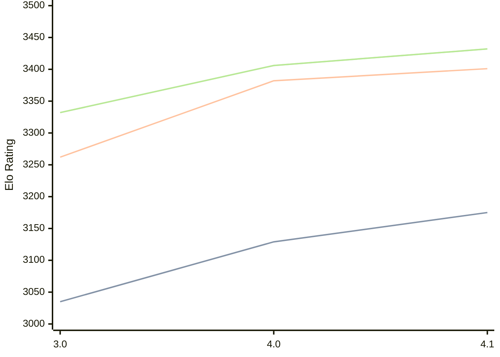

# Engine: Eleanor

Author: Mark Kasa

Home: https://github.com/rektdie/Eleanor

## Elo Ratings

| Version | Published | STC 8.0+0.08s  | LTC 60.0+0.60s | VLTC 2m24s+1.12s | Comment |
| --- | --- | --- | --- | --- | --- |
| 4.1 | 2026-04-21 | 3175(+46) | 3401(+19) | 3432(+26) |  |
| 4.0 | 2026-04-18 | 3129(+94) | 3382(+120) | 3406(+74) |  |
| 3.0 | 2025-12-05 | 3035 | 3262 | 3332 |  |
 | | | cElo (∆ prev) | cElo (∆ prev) | cElo (∆ prev) | 

<a href="https://github.com/computer-chess-index/cci/issues/new?template=submit-version.yml&title=[VERSION]+Eleanor+<version>&body=###%20Engine%20name%0AEleanor%0A%0A###%20Version%0A4.1" target="_blank">Submit new version</a>

 Test Conditions:

GUI/CLI: <a href=https://github.com/cutechess/cutechess target="_blank">Cute-Chess</a> 
Elo Calculation: <a href=https://www.remi-coulom.fr/Bayesian-Elo/ target="_blank">Bayesian-Elo</a> 
CPU: Intel(R) Core(TM) i5-7500T 2.70GHz 
Opening book: 8_moves_v3 
\* STC: 8.0+0.08s, LTC: 60.0+0.60s, VLTC: 2m24s+1.12s

 Lists:
Ratings: <a href=https://github.com/computer-chess-index/cci/blob/main/lists/CCIRatings.csv target="_blank">Complete list</a>

Generated: 2026-09-24 04:37:52

## Ratings Verlauf

## Detailed Evaluation Results

| Version | Time Control | Elo  | Range +/- | Matches | Score | Average Opponent Elo | Draws |
| --- | --- | --- | --- | --- | --- | --- | --- |
| 4.1 | VLTC (2m24s+1.12s) | 3432 | 23 | 464 | 49% | 3436 | 82% |
| 4.1 | LTC (60.0+0.60s) | 3401 | 24 | 410 | 49% | 3403 | 77% |
| 4.1 | STC (8.0+0.08s) | 3175 | 25 | 436 | 51% | 3163 | 61% |
| --- | --- | --- | --- | --- | --- | --- | --- |
| 4.0 | VLTC (2m24s+1.12s) | 3406 | 29 | 284 | 50% | 3406 | 81% |
| 4.0 | LTC (60.0+0.60s) | 3382 | 30 | 280 | 50% | 3379 | 76% |
| 4.0 | STC (8.0+0.08s) | 3129 | 32 | 264 | 50% | 3127 | 63% |
| --- | --- | --- | --- | --- | --- | --- | --- |
| 3.0 | VLTC (2m24s+1.12s) | 3332 | 26 | 368 | 50% | 3333 | 68% |
| 3.0 | LTC (60.0+0.60s) | 3262 | 27 | 358 | 52% | 3233 | 71% |
| 3.0 | STC (8.0+0.08s) | 3035 | 24 | 496 | 52% | 3006 | 50% |
| --- | --- | --- | --- | --- | --- | --- | --- |