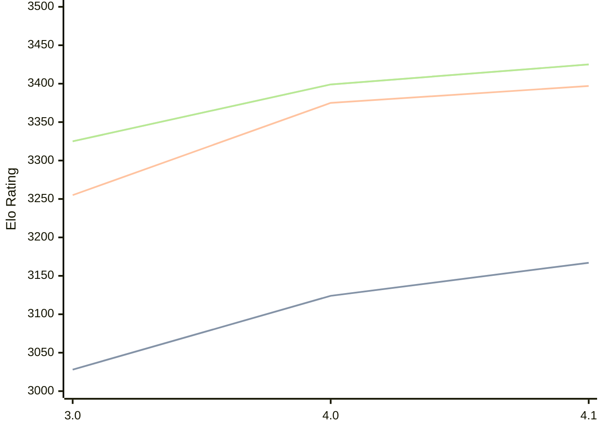

# Engine: Eleanor

Author: Mark Kasa

Home: https://github.com/rektdie/Eleanor

## Elo Ratings

| Version | Published | STC 8.0+0.08s  | LTC 60.0+0.60s | VLTC 2m24s+1.12s | Comment |
| --- | --- | --- | --- | --- | --- |
| 4.1 | 2026-04-21 | 3167(+43) | 3397(+22) | 3425(+26) |  |
| 4.0 | 2026-04-18 | 3124(+96) | 3375(+120) | 3399(+74) |  |
| 3.0 | 2025-12-05 | 3028 | 3255 | 3325 |  |
 | | | cElo (∆ prev) | cElo (∆ prev) | cElo (∆ prev) | 

<a href="https://github.com/computer-chess-index/cci/issues/new?template=submit-version.yml&title=[VERSION]+Eleanor+<version>&body=###%20Engine%20name%0AEleanor%0A%0A###%20Version%0A4.1" target="_blank">Submit new version</a>

 Test Conditions:

GUI/CLI: <a href=https://github.com/cutechess/cutechess target="_blank">Cute-Chess</a> 
Elo Calculation: <a href=https://www.remi-coulom.fr/Bayesian-Elo/ target="_blank">Bayesian-Elo</a> 
CPU: Intel(R) Core(TM) i5-7500T 2.70GHz 
Opening book: 8_moves_v3 
\* STC: 8.0+0.08s, LTC: 60.0+0.60s, VLTC: 2m24s+1.12s

 Lists:
Ratings: <a href=https://github.com/computer-chess-index/cci/blob/main/lists/CCIRatings.csv target="_blank">Complete list</a>

Generated: 2026-09-06 06:24:09

## Ratings Verlauf

## Detailed Evaluation Results

| Version | Time Control | Elo  | Range +/- | Matches | Score | Average Opponent Elo | Draws |
| --- | --- | --- | --- | --- | --- | --- | --- |
| 4.1 | VLTC (2m24s+1.12s) | 3425 | 23 | 456 | 49% | 3429 | 82% |
| 4.1 | LTC (60.0+0.60s) | 3397 | 25 | 398 | 50% | 3398 | 77% |
| 4.1 | STC (8.0+0.08s) | 3167 | 25 | 420 | 51% | 3158 | 60% |
| --- | --- | --- | --- | --- | --- | --- | --- |
| 4.0 | VLTC (2m24s+1.12s) | 3399 | 29 | 284 | 50% | 3399 | 81% |
| 4.0 | LTC (60.0+0.60s) | 3375 | 30 | 280 | 50% | 3372 | 76% |
| 4.0 | STC (8.0+0.08s) | 3124 | 32 | 264 | 50% | 3121 | 63% |
| --- | --- | --- | --- | --- | --- | --- | --- |
| 3.0 | VLTC (2m24s+1.12s) | 3325 | 26 | 368 | 50% | 3328 | 68% |
| 3.0 | LTC (60.0+0.60s) | 3255 | 27 | 358 | 52% | 3228 | 71% |
| 3.0 | STC (8.0+0.08s) | 3028 | 24 | 496 | 52% | 3000 | 50% |
| --- | --- | --- | --- | --- | --- | --- | --- |