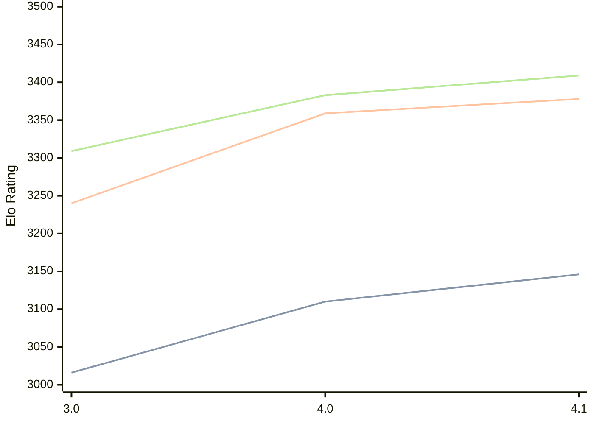

# Engine: Eleanor

Author: Mark Kasa

Home: https://github.com/rektdie/Eleanor

## Elo Ratings

| Version | Published | STC 8.0+0.08s  | LTC 60.0+0.60s | VLTC 2m24s+1.12s | Comment |
| --- | --- | --- | --- | --- | --- |
| 4.1 | 2026-04-21 | 3146(+36) | 3378(+19) | 3409(+26) |  |
| 4.0 | 2026-04-18 | 3110(+94) | 3359(+119) | 3383(+74) |  |
| 3.0 | 2025-12-05 | 3016(+new) | 3240(+new) | 3309(+new) |  |
| 2.0 | 2025-08-23 |  |  |  |  |
| 1.0 | 2025-06-02 |  |  |  |  |
 | | | cElo (∆ prev) | cElo (∆ prev) | cElo (∆ prev) | 

<a href="https://github.com/computer-chess-index/cci/issues/new?template=submit-version.yml&title=[VERSION]+Eleanor+<version>&body=###%20Engine%20name%0AEleanor%0A%0A###%20Version%0A4.1" target="_blank">Submit new version</a>

 Test Conditions:

GUI/CLI: <a href=https://github.com/cutechess/cutechess target="_blank">Cute-Chess</a> 
Elo Calculation: <a href=https://www.remi-coulom.fr/Bayesian-Elo/ target="_blank">Bayesian-Elo</a> 
CPU: Intel(R) Core(TM) i5-7500T 2.70GHz 
Opening book: 8_moves_v3 
\* STC: 8.0+0.08s, LTC: 60.0+0.60s, VLTC: 2m24s+1.12s

 Lists:
Ratings: <a href=https://github.com/computer-chess-index/cci/blob/main/lists/CCIRatings.csv target="_blank">Complete list</a>

Generated: 2026-05-20 06:24:23

## Ratings Verlauf

⬛ STC (8.0+0.08s) &nbsp;&nbsp; 🟧 LTC (60.0+0.60s) &nbsp;&nbsp; 🟩 VLTC (2m24s+1.12s)

dark mode: 🟩STC (8.0+0.08s) 🟧LTC (60.0+0.60s) ⬜VLTC (2m24s+1.12s)

## Detailed Evaluation Results

| Version | Time Control | Elo  | Range +/- | Matches | Score | Average Opponent Elo | Draws |
| --- | --- | --- | --- | --- | --- | --- | --- |
| 4.1 | VLTC (2m24s+1.12s) | 3409 | 26 | 348 | 49% | 3417 | 81% |
| 4.1 | LTC (60.0+0.60s) | 3378 | 28 | 308 | 49% | 3383 | 78% |
| 4.1 | STC (8.0+0.08s) | 3146 | 29 | 312 | 50% | 3141 | 60% |
| --- | --- | --- | --- | --- | --- | --- | --- |
| 4.0 | VLTC (2m24s+1.12s) | 3383 | 29 | 284 | 50% | 3383 | 81% |
| 4.0 | LTC (60.0+0.60s) | 3359 | 30 | 280 | 50% | 3356 | 76% |
| 4.0 | STC (8.0+0.08s) | 3110 | 32 | 264 | 50% | 3108 | 63% |
| --- | --- | --- | --- | --- | --- | --- | --- |
| 3.0 | VLTC (2m24s+1.12s) | 3309 | 26 | 368 | 50% | 3310 | 68% |
| 3.0 | LTC (60.0+0.60s) | 3240 | 27 | 358 | 52% | 3213 | 71% |
| 3.0 | STC (8.0+0.08s) | 3016 | 24 | 496 | 52% | 2988 | 50% |
| --- | --- | --- | --- | --- | --- | --- | --- |