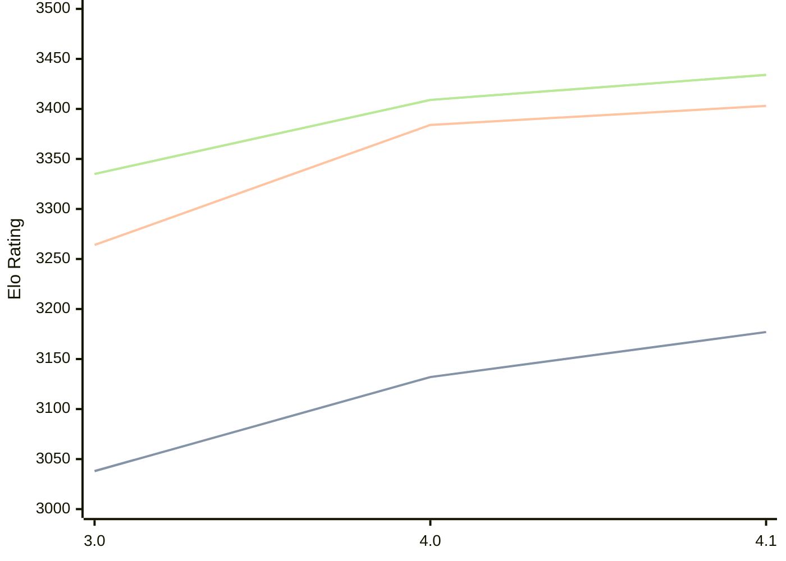

# Engine: Eleanor

Author: Mark Kasa

Home: https://github.com/rektdie/Eleanor

## Elo Ratings E1

| Version | Published | STC 8.0+0.08s  | LTC 60.0+0.60s | VLTC 2m24s+1.12s | Comment |
| --- | --- | --- | --- | --- | --- |
| 4.1 | 2026-04-21 | 3036 | 3359 | 3371 |  |
 | | | cElo (∆ prev) | cElo (∆ prev) | cElo (∆ prev) | 

## Elo Ratings P1

| Version | Published | STC 8.0+0.08s  | LTC 60.0+0.60s | VLTC 2m24s+1.12s | Comment |
| --- | --- | --- | --- | --- | --- |
| 4.1 | 2026-04-21 | 3314 | 3605 | 3603 |  |
 | | | cElo (∆ prev) | cElo (∆ prev) | cElo (∆ prev) | 

## Elo Ratings T1

| Version | Published | STC 8.0+0.08s  | LTC 60.0+0.60s | VLTC 2m24s+1.12s | Comment |
| --- | --- | --- | --- | --- | --- |
| 4.1 | 2026-04-21 | 3177(+45) | 3403(+19) | 3434(+25) |  |
| 4.0 | 2026-04-18 | 3132(+94) | 3384(+120) | 3409(+74) |  |
| 3.0 | 2025-12-05 | 3038 | 3264 | 3335 |  |
 | | | cElo (∆ prev) | cElo (∆ prev) | cElo (∆ prev) | 

<a href="https://github.com/computer-chess-index/cci/issues/new?template=submit-version.yml&title=[VERSION]+Eleanor+<version>&body=###%20Engine%20name%0AEleanor%0A%0A###%20Version%0A4.1" target="_blank">Submit new version</a>

 Test Conditions:

GUI/CLI: <a href=https://github.com/cutechess/cutechess target="_blank">Cute-Chess</a> 
Elo Calculation: <a href=https://www.remi-coulom.fr/Bayesian-Elo/ target="_blank">Bayesian-Elo</a> 
CPU for P1: Intel(R) Core(TM) Ultra 7 265T (1.50 GHz) - P-Core 
CPU for E1: Intel(R) Core(TM) Ultra 7 265T (1.50 GHz) - E-Core 
CPU for T1: Intel(R) Core(TM) i5-7500T 2.70GHz 
Opening book: 8_moves_v3 
\* STC: 8.0+0.08s, LTC: 60.0+0.60s, VLTC: 2m24s+1.12s

 Lists:
Ratings: <a href=https://github.com/computer-chess-index/cci/blob/main/lists/CCIRatings.csv target="_blank">Complete list</a>

Generated: 2026-10-10 04:38:10

## Ratings Verlauf

```mermaid
%%{init: {"theme":"base","themeVariables":{"seriesColors:['#a3a3a3','#222221','#faa371']}}}%%
xychart-beta
  x-axis ["3.0", "4.0", "4.1"]
  y-axis "Elo Rating" 3000 --> 3500
  line "" [3038, 3132, 3177]
  line "STC (8.0+0.08s)" [3038, 3132, 3177]
  line "LTC (60.0+0.60s)" [3264, 3384, 3403]
  line "" [3335, 3409, 3434]
  line "VLTC (2m24s+1.12s)" [3335, 3409, 3434]
```

## Detailed Evaluation Results

| Version | Time Control | Elo  | Range +/- | Matches | Score | Average Opponent Elo | Draws |
| --- | --- | --- | --- | --- | --- | --- | --- |
| 4.1 | VLTC (2m24s+1.12s) | 3434 | 22 | 468 | 49% | 3438 | 82% |
| 4.1 | VLTC (2m24s+1.12s) | 3603 | 43 | 156 | 63% | 3379 | 65% |
| 4.1 | VLTC (2m24s+1.12s) | 3371 | 39 | 194 | 60% | 3210 | 56% |
| 4.1 | LTC (60.0+0.60s) | 3403 | 24 | 414 | 50% | 3406 | 77% |
| 4.1 | LTC (60.0+0.60s) | 3605 | 44 | 140 | 55% | 3540 | 65% |
| 4.1 | LTC (60.0+0.60s) | 3359 | 44 | 168 | 63% | 3146 | 52% |
| 4.1 | STC (8.0+0.08s) | 3177 | 25 | 440 | 51% | 3166 | 60% |
| --- | --- | --- | --- | --- | --- | --- | --- |
| 4.1 | STC (8.0+0.08s) | 3314 | 35 | 224 | 46% | 3343 | 59% |
| --- | --- | --- | --- | --- | --- | --- | --- |
| 4.1 | STC (8.0+0.08s) | 3036 | 34 | 248 | 45% | 3077 | 54% |
| --- | --- | --- | --- | --- | --- | --- | --- |
| 4.0 | VLTC (2m24s+1.12s) | 3409 | 29 | 284 | 50% | 3409 | 81% |
| 4.0 | LTC (60.0+0.60s) | 3384 | 30 | 280 | 50% | 3382 | 76% |
| 4.0 | STC (8.0+0.08s) | 3132 | 32 | 264 | 50% | 3129 | 63% |
| --- | --- | --- | --- | --- | --- | --- | --- |
| 3.0 | VLTC (2m24s+1.12s) | 3335 | 26 | 368 | 50% | 3336 | 68% |
| 3.0 | LTC (60.0+0.60s) | 3264 | 27 | 358 | 52% | 3236 | 71% |
| 3.0 | STC (8.0+0.08s) | 3038 | 24 | 496 | 52% | 3008 | 50% |
| --- | --- | --- | --- | --- | --- | --- | --- |