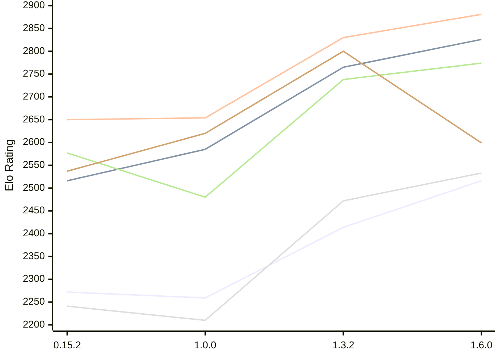

# Engine: ElephantGambit

Author: Ek Alexander Loodin

Home: https://github.com/looak/elephant

## Elo Ratings E1 (Ultra 7 265T (1.50 GHz) - E-Core)

| Version | Published | STC 8.0+0.08s  | LTC 60.0+0.60s | VLTC 2m24s+1.12s | Comment |
| --- | --- | --- | --- | --- | --- |
| 1.6.0 | 2026-11-19 | 2516(+102) | 2826(+61) | 2881(+51) |  |
| 1.3.2 | 2026-10-25 | 2414(+155) | 2765(+180) | 2830(+176) |  |
| 1.0.0 | 2026-10-14 | 2259(-13) | 2585(+69) | 2654(+4) |  |
| 0.15.2 | 2026-10-11 | 2272(+1454) | 2516(+new) | 2650(+27) |  |
| 0.15.1 | 2026-10-11 | 818 |  | 2623 |  |
 | | | cElo (∆ prev) | cElo (∆ prev) | cElo (∆ prev) | 

## Elo Ratings P1 (Ultra 7 265T (1.50 GHz) - P-Core)

| Version | Published | STC 8.0+0.08s  | LTC 60.0+0.60s | VLTC 2m24s+1.12s | Comment |
| --- | --- | --- | --- | --- | --- |
| 1.6.0 | 2026-11-19 | 2533(+61) | 2774(+36) | 2599(-201) |  |
| 1.3.2 | 2026-10-25 | 2472(+262) | 2738(+258) | 2800(+180) |  |
| 1.0.0 | 2026-10-14 | 2210(-31) | 2480(-97) | 2620(+83) |  |
| 0.15.2 | 2026-10-11 | 2241 | 2577 | 2537 |  |
 | | | cElo (∆ prev) | cElo (∆ prev) | cElo (∆ prev) | 

## Elo Ratings T1 (i5-7500T 2.70GHz)

| Version | Published | STC 8.0+0.08s  | LTC 60.0+0.60s | VLTC 2m24s+1.12s | Comment |
| --- | --- | --- | --- | --- | --- |
| 0.15.2 | 2026-10-11 | 2241 | 2577 | 2537 |  |
 | | | cElo (∆ prev) | cElo (∆ prev) | cElo (∆ prev) | 

<a href="https://github.com/computer-chess-index/cci/issues/new?template=submit-version.yml&title=[VERSION]+ElephantGambit+<version>&body=###%20Engine%20name%0AElephantGambit%0A%0A###%20Version%0A1.6.0" target="_blank">Submit new version</a>

 Test Conditions:

GUI/CLI: <a href=https://github.com/cutechess/cutechess target="_blank">Cute-Chess</a> 
Elo Calculation: <a href=https://www.remi-coulom.fr/Bayesian-Elo/ target="_blank">Bayesian-Elo</a> 
CPU for P1: Intel(R) Core(TM) Ultra 7 265T (1.50 GHz) - P-Core 
CPU for E1: Intel(R) Core(TM) Ultra 7 265T (1.50 GHz) - E-Core 
CPU for T1: Intel(R) Core(TM) i5-7500T 2.70GHz 
Opening book: 8_moves_v3 
\* STC: 8.0+0.08s, LTC: 60.0+0.60s, VLTC: 2m24s+1.12s

 Lists:
Ratings: <a href=https://github.com/computer-chess-index/cci/blob/main/lists/CCIRatings.csv target="_blank">Complete list</a>

Generated: 2026-11-21 05:38:05

## Ratings Verlauf E1 / P1

```mermaid
%%{init: {"theme":"base","themeVariables":{"seriesColors:['#a3a3a3','#222221','#faa371']}}}%%
xychart-beta
  x-axis ["0.15.2", "1.0.0", "1.3.2", "1.6.0"]
  y-axis "Elo Rating" 2200 --> 2900
  line "E1: STC (8.0+0.08s)" [2272, 2259, 2414, 2516]
  line "E1: LTC (60.0+0.60s)" [2516, 2585, 2765, 2826]
  line "E1: VLTC (2m24s+1.12s)" [2650, 2654, 2830, 2881]
  line "P1: STC (8.0+0.08s)" [2241, 2210, 2472, 2533]
  line "P1: LTC (60.0+0.60s)" [2577, 2480, 2738, 2774]
  line "P1: VLTC (2m24s+1.12s)" [2537, 2620, 2800, 2599]
```

## Detailed Evaluation Results

| Version | Time Control | Variant | Elo  | Range +/- | Matches | Score | Average Opponent Elo | Draws |
| --- | --- |--- | --- | --- | --- | --- | --- | --- |
| 1.6.0 | VLTC (2m24s+1.12s) | E1 | 2881 | 45 | 150 | 52% | 2863 | 41% |
|  |  | P1 | 2599 | 279 | 4 | 25% | 2799 | 0% |
|  | LTC (60.0+0.60s) | P1 | 2774 | 190 | 8 | 50% | 2773 | 25% |
|  |  | E1 | 2826 | 34 | 260 | 55% | 2786 | 40% |
|  | STC (8.0+0.08s) | P1 | 2533 | 251 | 4 | 63% | 2452 | 25% |
|  |  | E1 | 2516 | 54 | 108 | 52% | 2498 | 36% |
| --- | --- |--- | --- | --- | --- | --- | --- | --- |
| 1.3.2 | VLTC (2m24s+1.12s) | P1 | 2800 | 35 | 256 | 47% | 2832 | 38% |
|  |  | E1 | 2830 | 30 | 360 | 52% | 2812 | 34% |
|  | LTC (60.0+0.60s) | P1 | 2738 | 38 | 232 | 48% | 2757 | 33% |
|  |  | E1 | 2765 | 31 | 344 | 48% | 2778 | 33% |
|  | STC (8.0+0.08s) | P1 | 2472 | 40 | 208 | 50% | 2472 | 27% |
|  |  | E1 | 2414 | 35 | 268 | 50% | 2407 | 30% |
| --- | --- |--- | --- | --- | --- | --- | --- | --- |
| 1.0.0 | VLTC (2m24s+1.12s) | P1 | 2620 | 40 | 208 | 52% | 2611 | 28% |
|  |  | E1 | 2654 | 39 | 232 | 50% | 2661 | 24% |
|  | LTC (60.0+0.60s) | P1 | 2480 | 42 | 186 | 50% | 2498 | 29% |
|  |  | E1 | 2585 | 37 | 254 | 49% | 2587 | 26% |
|  | STC (8.0+0.08s) | P1 | 2210 | 39 | 236 | 57% | 2155 | 22% |
|  |  | E1 | 2259 | 38 | 256 | 50% | 2250 | 21% |
| --- | --- |--- | --- | --- | --- | --- | --- | --- |
| 0.15.2 | VLTC (2m24s+1.12s) | P1 | 2537 | 64 | 82 | 53% | 2504 | 28% |
|  |  | E1 | 2650 | 50 | 132 | 49% | 2661 | 28% |
|  | LTC (60.0+0.60s) | P1 | 2577 | 58 | 104 | 55% | 2516 | 28% |
|  |  | E1 | 2516 | 52 | 122 | 51% | 2496 | 30% |
|  | STC (8.0+0.08s) | P1 | 2241 | 65 | 90 | 55% | 2179 | 17% |
|  |  | E1 | 2272 | 49 | 156 | 55% | 2153 | 24% |
| --- | --- |--- | --- | --- | --- | --- | --- | --- |
| 0.15.1 | VLTC (2m24s+1.12s) | E1 | 2623 | 87 | 48 | 51% | 2601 | 19% |
|  | STC (8.0+0.08s) | P1 | 1728 | 331 | 16 | 100% | 695 | 0% |
|  |  | E1 | 818 | 341 | 6 | 100% | 251 | 0% |