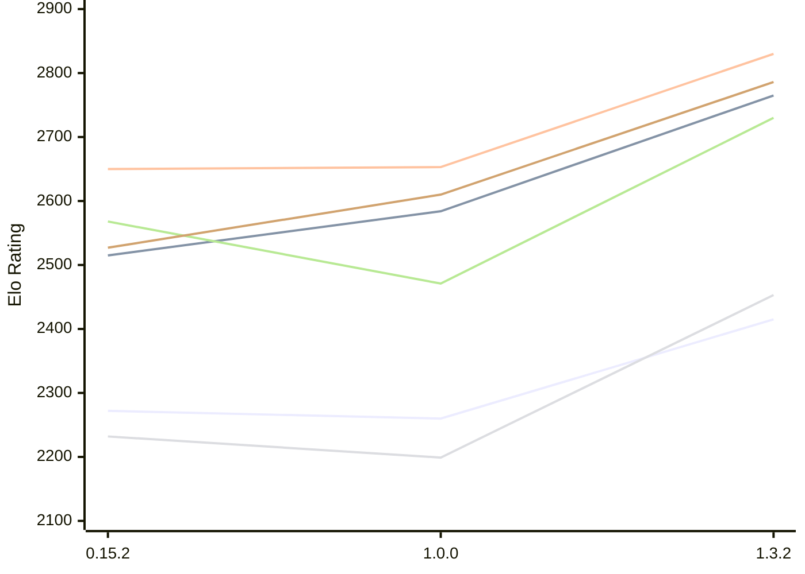

# Engine: ElephantGambit

Author: Ek Alexander Loodin

Home: https://github.com/looak/elephant

## Elo Ratings E1 (Ultra 7 265T (1.50 GHz) - E-Core)

| Version | Published | STC 8.0+0.08s  | LTC 60.0+0.60s | VLTC 2m24s+1.12s | Comment |
| --- | --- | --- | --- | --- | --- |
| 1.3.2 | 2026-10-25 | 2415(+155) | 2765(+181) | 2830(+177) |  |
| 1.0.0 | 2026-10-14 | 2260(-12) | 2584(+69) | 2653(+3) |  |
| 0.15.2 | 2026-10-11 | 2272(+1451) | 2515(+new) | 2650(+27) |  |
| 0.15.1 | 2026-10-11 | 821 |  | 2623 |  |
 | | | cElo (∆ prev) | cElo (∆ prev) | cElo (∆ prev) | 

## Elo Ratings P1 (Ultra 7 265T (1.50 GHz) - P-Core)

| Version | Published | STC 8.0+0.08s  | LTC 60.0+0.60s | VLTC 2m24s+1.12s | Comment |
| --- | --- | --- | --- | --- | --- |
| 1.3.2 | 2026-10-25 | 2453(+254) | 2730(+259) | 2786(+176) |  |
| 1.0.0 | 2026-10-14 | 2199(-33) | 2471(-97) | 2610(+83) |  |
| 0.15.2 | 2026-10-11 | 2232 | 2568 | 2527 |  |
 | | | cElo (∆ prev) | cElo (∆ prev) | cElo (∆ prev) | 

## Elo Ratings T1 (i5-7500T 2.70GHz)

| Version | Published | STC 8.0+0.08s  | LTC 60.0+0.60s | VLTC 2m24s+1.12s | Comment |
| --- | --- | --- | --- | --- | --- |
| 0.15.2 | 2026-10-11 | 2232 | 2568 | 2527 |  |
 | | | cElo (∆ prev) | cElo (∆ prev) | cElo (∆ prev) | 

<a href="https://github.com/computer-chess-index/cci/issues/new?template=submit-version.yml&title=[VERSION]+ElephantGambit+<version>&body=###%20Engine%20name%0AElephantGambit%0A%0A###%20Version%0A1.3.2" target="_blank">Submit new version</a>

 Test Conditions:

GUI/CLI: <a href=https://github.com/cutechess/cutechess target="_blank">Cute-Chess</a> 
Elo Calculation: <a href=https://www.remi-coulom.fr/Bayesian-Elo/ target="_blank">Bayesian-Elo</a> 
CPU for P1: Intel(R) Core(TM) Ultra 7 265T (1.50 GHz) - P-Core 
CPU for E1: Intel(R) Core(TM) Ultra 7 265T (1.50 GHz) - E-Core 
CPU for T1: Intel(R) Core(TM) i5-7500T 2.70GHz 
Opening book: 8_moves_v3 
\* STC: 8.0+0.08s, LTC: 60.0+0.60s, VLTC: 2m24s+1.12s

 Lists:
Ratings: <a href=https://github.com/computer-chess-index/cci/blob/main/lists/CCIRatings.csv target="_blank">Complete list</a>

Generated: 2026-11-18 05:38:24

## Ratings Verlauf E1 / P1

```mermaid
%%{init: {"theme":"base","themeVariables":{"seriesColors:['#a3a3a3','#222221','#faa371']}}}%%
xychart-beta
  x-axis ["0.15.2", "1.0.0", "1.3.2"]
  y-axis "Elo Rating" 2100 --> 2900
  line "E1: STC (8.0+0.08s)" [2272, 2260, 2415]
  line "E1: LTC (60.0+0.60s)" [2515, 2584, 2765]
  line "E1: VLTC (2m24s+1.12s)" [2650, 2653, 2830]
  line "P1: STC (8.0+0.08s)" [2232, 2199, 2453]
  line "P1: LTC (60.0+0.60s)" [2568, 2471, 2730]
  line "P1: VLTC (2m24s+1.12s)" [2527, 2610, 2786]
```

## Detailed Evaluation Results

| Version | Time Control | Variant | Elo  | Range +/- | Matches | Score | Average Opponent Elo | Draws |
| --- | --- |--- | --- | --- | --- | --- | --- | --- |
| 1.3.2 | VLTC (2m24s+1.12s) | P1 | 2786 | 37 | 236 | 47% | 2822 | 38% |
|  |  | E1 | 2830 | 31 | 344 | 52% | 2812 | 34% |
|  | LTC (60.0+0.60s) | P1 | 2730 | 39 | 220 | 48% | 2746 | 33% |
|  |  | E1 | 2765 | 31 | 344 | 48% | 2780 | 33% |
|  | STC (8.0+0.08s) | P1 | 2453 | 41 | 200 | 50% | 2461 | 27% |
|  |  | E1 | 2415 | 36 | 260 | 51% | 2406 | 30% |
| --- | --- |--- | --- | --- | --- | --- | --- | --- |
| 1.0.0 | VLTC (2m24s+1.12s) | P1 | 2610 | 41 | 204 | 52% | 2600 | 28% |
|  |  | E1 | 2653 | 39 | 232 | 50% | 2660 | 24% |
|  | LTC (60.0+0.60s) | P1 | 2471 | 43 | 182 | 50% | 2488 | 29% |
|  |  | E1 | 2584 | 37 | 254 | 49% | 2584 | 26% |
|  | STC (8.0+0.08s) | P1 | 2199 | 40 | 228 | 56% | 2148 | 22% |
|  |  | E1 | 2260 | 38 | 256 | 50% | 2250 | 21% |
| --- | --- |--- | --- | --- | --- | --- | --- | --- |
| 0.15.2 | VLTC (2m24s+1.12s) | P1 | 2527 | 64 | 82 | 53% | 2495 | 28% |
|  |  | E1 | 2650 | 50 | 132 | 49% | 2661 | 28% |
|  | LTC (60.0+0.60s) | P1 | 2568 | 58 | 104 | 55% | 2507 | 28% |
|  |  | E1 | 2515 | 52 | 122 | 51% | 2496 | 30% |
|  | STC (8.0+0.08s) | P1 | 2232 | 64 | 90 | 55% | 2171 | 17% |
|  |  | E1 | 2272 | 49 | 156 | 55% | 2153 | 24% |
| --- | --- |--- | --- | --- | --- | --- | --- | --- |
| 0.15.1 | VLTC (2m24s+1.12s) | E1 | 2623 | 87 | 48 | 51% | 2601 | 19% |
|  | STC (8.0+0.08s) | P1 | 1729 | 331 | 16 | 100% | 695 | 0% |
|  |  | E1 | 821 | 341 | 6 | 100% | 254 | 0% |