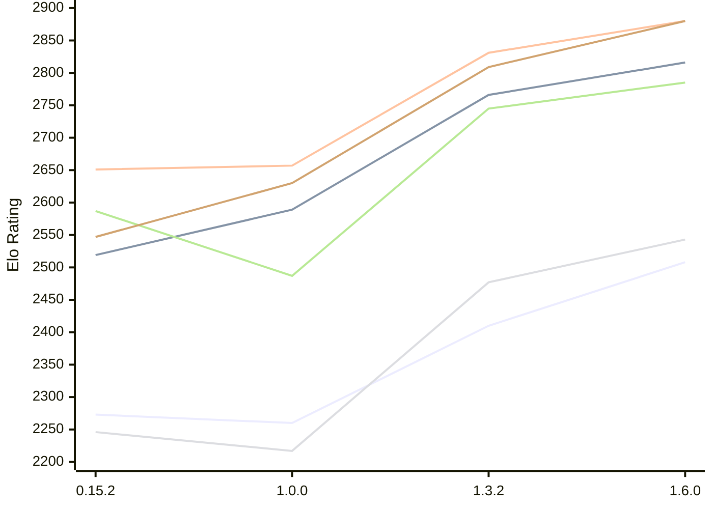

# Engine: ElephantGambit

Author: Ek Alexander Loodin

Home: https://github.com/looak/elephant

## Elo Ratings E1 (Ultra 7 265T (1.50 GHz) - E-Core)

| Version | Published | STC 8.0+0.08s  | LTC 60.0+0.60s | VLTC 2m24s+1.12s | Comment |
| --- | --- | --- | --- | --- | --- |
| 1.6.0 | 2026-11-19 | 2508(+98) | 2816(+50) | 2880(+49) |  |
| 1.3.2 | 2026-10-25 | 2410(+150) | 2766(+177) | 2831(+174) |  |
| 1.0.0 | 2026-10-14 | 2260(-13) | 2589(+70) | 2657(+6) |  |
| 0.15.2 | 2026-10-11 | 2273(+1455) | 2519(+new) | 2651(+27) |  |
| 0.15.1 | 2026-10-11 | 818 |  | 2624 |  |
 | | | cElo (∆ prev) | cElo (∆ prev) | cElo (∆ prev) | 

## Elo Ratings P1 (Ultra 7 265T (1.50 GHz) - P-Core)

| Version | Published | STC 8.0+0.08s  | LTC 60.0+0.60s | VLTC 2m24s+1.12s | Comment |
| --- | --- | --- | --- | --- | --- |
| 1.6.0 | 2026-11-19 | 2543(+66) | 2785(+40) | 2880(+71) |  |
| 1.3.2 | 2026-10-25 | 2477(+260) | 2745(+258) | 2809(+179) |  |
| 1.0.0 | 2026-10-14 | 2217(-29) | 2487(-100) | 2630(+83) |  |
| 0.15.2 | 2026-10-11 | 2246 | 2587 | 2547 |  |
 | | | cElo (∆ prev) | cElo (∆ prev) | cElo (∆ prev) | 

## Elo Ratings T1 (i5-7500T 2.70GHz)

| Version | Published | STC 8.0+0.08s  | LTC 60.0+0.60s | VLTC 2m24s+1.12s | Comment |
| --- | --- | --- | --- | --- | --- |
| 0.15.2 | 2026-10-11 | 2246 | 2587 | 2547 |  |
 | | | cElo (∆ prev) | cElo (∆ prev) | cElo (∆ prev) | 

<a href="https://github.com/computer-chess-index/cci/issues/new?template=submit-version.yml&title=[VERSION]+ElephantGambit+<version>&body=###%20Engine%20name%0AElephantGambit%0A%0A###%20Version%0A1.6.0" target="_blank">Submit new version</a>

 Test Conditions:

GUI/CLI: <a href=https://github.com/cutechess/cutechess target="_blank">Cute-Chess</a> 
Elo Calculation: <a href=https://www.remi-coulom.fr/Bayesian-Elo/ target="_blank">Bayesian-Elo</a> 
CPU for P1: Intel(R) Core(TM) Ultra 7 265T (1.50 GHz) - P-Core 
CPU for E1: Intel(R) Core(TM) Ultra 7 265T (1.50 GHz) - E-Core 
CPU for T1: Intel(R) Core(TM) i5-7500T 2.70GHz 
Opening book: 8_moves_v3 
\* STC: 8.0+0.08s, LTC: 60.0+0.60s, VLTC: 2m24s+1.12s

 Lists:
Ratings: <a href=https://github.com/computer-chess-index/cci/blob/main/lists/CCIRatings.csv target="_blank">Complete list</a>

Generated: 2026-11-24 05:38:10

## Ratings Verlauf E1 / P1

```mermaid
%%{init: {"theme":"base","themeVariables":{"seriesColors:['#a3a3a3','#222221','#faa371']}}}%%
xychart-beta
  x-axis ["0.15.2", "1.0.0", "1.3.2", "1.6.0"]
  y-axis "Elo Rating" 2200 --> 2900
  line "E1: STC (8.0+0.08s)" [2273, 2260, 2410, 2508]
  line "E1: LTC (60.0+0.60s)" [2519, 2589, 2766, 2816]
  line "E1: VLTC (2m24s+1.12s)" [2651, 2657, 2831, 2880]
  line "P1: STC (8.0+0.08s)" [2246, 2217, 2477, 2543]
  line "P1: LTC (60.0+0.60s)" [2587, 2487, 2745, 2785]
  line "P1: VLTC (2m24s+1.12s)" [2547, 2630, 2809, 2880]
```

## Detailed Evaluation Results

| Version | Time Control | Variant | Elo  | Range +/- | Matches | Score | Average Opponent Elo | Draws |
| --- | --- |--- | --- | --- | --- | --- | --- | --- |
| 1.6.0 | VLTC (2m24s+1.12s) | P1 | 2880 | 48 | 136 | 57% | 2820 | 40% |
|  |  | E1 | 2880 | 38 | 212 | 51% | 2873 | 42% |
|  | LTC (60.0+0.60s) | P1 | 2785 | 56 | 104 | 51% | 2776 | 29% |
|  |  | E1 | 2816 | 33 | 280 | 53% | 2790 | 39% |
|  | STC (8.0+0.08s) | P1 | 2543 | 47 | 148 | 46% | 2583 | 30% |
|  |  | E1 | 2508 | 51 | 120 | 51% | 2502 | 38% |
| --- | --- |--- | --- | --- | --- | --- | --- | --- |
| 1.3.2 | VLTC (2m24s+1.12s) | P1 | 2809 | 35 | 256 | 47% | 2842 | 38% |
|  |  | E1 | 2831 | 30 | 364 | 52% | 2813 | 34% |
|  | LTC (60.0+0.60s) | P1 | 2745 | 38 | 232 | 48% | 2765 | 33% |
|  |  | E1 | 2766 | 31 | 344 | 48% | 2781 | 33% |
|  | STC (8.0+0.08s) | P1 | 2477 | 40 | 208 | 50% | 2477 | 27% |
|  |  | E1 | 2410 | 35 | 280 | 50% | 2408 | 30% |
| --- | --- |--- | --- | --- | --- | --- | --- | --- |
| 1.0.0 | VLTC (2m24s+1.12s) | P1 | 2630 | 40 | 208 | 52% | 2620 | 28% |
|  |  | E1 | 2657 | 39 | 232 | 50% | 2664 | 24% |
|  | LTC (60.0+0.60s) | P1 | 2487 | 42 | 186 | 50% | 2504 | 29% |
|  |  | E1 | 2589 | 37 | 254 | 49% | 2589 | 26% |
|  | STC (8.0+0.08s) | P1 | 2217 | 39 | 236 | 57% | 2161 | 22% |
|  |  | E1 | 2260 | 38 | 256 | 50% | 2252 | 21% |
| --- | --- |--- | --- | --- | --- | --- | --- | --- |
| 0.15.2 | VLTC (2m24s+1.12s) | P1 | 2547 | 64 | 82 | 53% | 2515 | 28% |
|  |  | E1 | 2651 | 50 | 132 | 49% | 2662 | 28% |
|  | LTC (60.0+0.60s) | P1 | 2587 | 58 | 104 | 55% | 2526 | 28% |
|  |  | E1 | 2519 | 52 | 122 | 51% | 2499 | 30% |
|  | STC (8.0+0.08s) | P1 | 2246 | 65 | 90 | 55% | 2184 | 17% |
|  |  | E1 | 2273 | 49 | 156 | 55% | 2155 | 24% |
| --- | --- |--- | --- | --- | --- | --- | --- | --- |
| 0.15.1 | VLTC (2m24s+1.12s) | E1 | 2624 | 87 | 48 | 51% | 2603 | 19% |
|  | STC (8.0+0.08s) | P1 | 1729 | 331 | 16 | 100% | 694 | 0% |
|  |  | E1 | 818 | 341 | 6 | 100% | 252 | 0% |