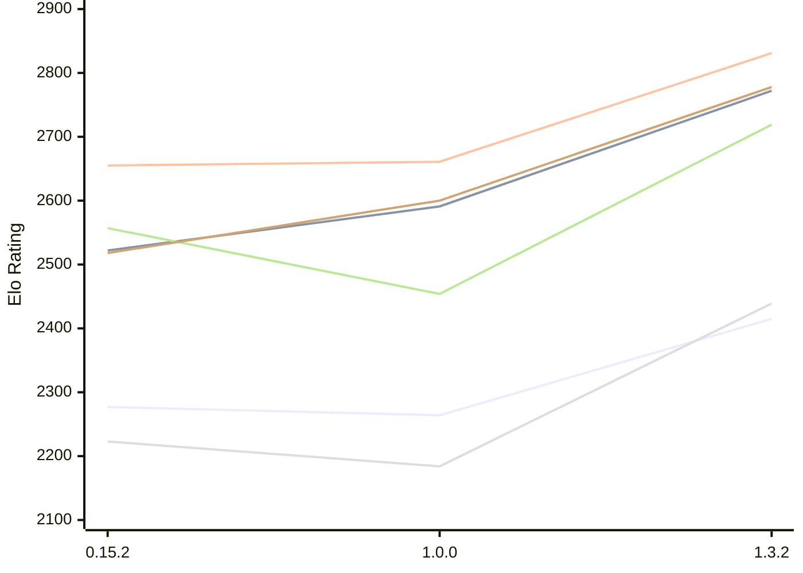

# Engine: ElephantGambit

Author: Ek Alexander Loodin

Home: https://github.com/looak/elephant

## Elo Ratings E1 (Ultra 7 265T (1.50 GHz) - E-Core)

| Version | Published | STC 8.0+0.08s  | LTC 60.0+0.60s | VLTC 2m24s+1.12s | Comment |
| --- | --- | --- | --- | --- | --- |
| 1.3.2 | 2026-10-25 | 2415(+151) | 2772(+181) | 2831(+170) |  |
| 1.0.0 | 2026-10-14 | 2264(-13) | 2591(+69) | 2661(+6) |  |
| 0.15.2 | 2026-10-11 | 2277(+1447) | 2522(+new) | 2655(+27) |  |
| 0.15.1 | 2026-10-11 | 830 |  | 2628 |  |
 | | | cElo (∆ prev) | cElo (∆ prev) | cElo (∆ prev) | 

## Elo Ratings P1 (Ultra 7 265T (1.50 GHz) - P-Core)

| Version | Published | STC 8.0+0.08s  | LTC 60.0+0.60s | VLTC 2m24s+1.12s | Comment |
| --- | --- | --- | --- | --- | --- |
| 1.3.2 | 2026-10-25 | 2439(+255) | 2719(+265) | 2778(+178) |  |
| 1.0.0 | 2026-10-14 | 2184(-39) | 2454(-103) | 2600(+82) |  |
| 0.15.2 | 2026-10-11 | 2223 | 2557 | 2518 |  |
 | | | cElo (∆ prev) | cElo (∆ prev) | cElo (∆ prev) | 

## Elo Ratings T1 (i5-7500T 2.70GHz)

| Version | Published | STC 8.0+0.08s  | LTC 60.0+0.60s | VLTC 2m24s+1.12s | Comment |
| --- | --- | --- | --- | --- | --- |
| 0.15.2 | 2026-10-11 | 2223 | 2557 | 2518 |  |
 | | | cElo (∆ prev) | cElo (∆ prev) | cElo (∆ prev) | 

<a href="https://github.com/computer-chess-index/cci/issues/new?template=submit-version.yml&title=[VERSION]+ElephantGambit+<version>&body=###%20Engine%20name%0AElephantGambit%0A%0A###%20Version%0A1.3.2" target="_blank">Submit new version</a>

 Test Conditions:

GUI/CLI: <a href=https://github.com/cutechess/cutechess target="_blank">Cute-Chess</a> 
Elo Calculation: <a href=https://www.remi-coulom.fr/Bayesian-Elo/ target="_blank">Bayesian-Elo</a> 
CPU for P1: Intel(R) Core(TM) Ultra 7 265T (1.50 GHz) - P-Core 
CPU for E1: Intel(R) Core(TM) Ultra 7 265T (1.50 GHz) - E-Core 
CPU for T1: Intel(R) Core(TM) i5-7500T 2.70GHz 
Opening book: 8_moves_v3 
\* STC: 8.0+0.08s, LTC: 60.0+0.60s, VLTC: 2m24s+1.12s

 Lists:
Ratings: <a href=https://github.com/computer-chess-index/cci/blob/main/lists/CCIRatings.csv target="_blank">Complete list</a>

Generated: 2026-11-16 05:38:06

## Ratings Verlauf E1 / P1

```mermaid
%%{init: {"theme":"base","themeVariables":{"seriesColors:['#a3a3a3','#222221','#faa371']}}}%%
xychart-beta
  x-axis ["0.15.2", "1.0.0", "1.3.2"]
  y-axis "Elo Rating" 2100 --> 2900
  line "E1: STC (8.0+0.08s)" [2277, 2264, 2415]
  line "E1: LTC (60.0+0.60s)" [2522, 2591, 2772]
  line "E1: VLTC (2m24s+1.12s)" [2655, 2661, 2831]
  line "P1: STC (8.0+0.08s)" [2223, 2184, 2439]
  line "P1: LTC (60.0+0.60s)" [2557, 2454, 2719]
  line "P1: VLTC (2m24s+1.12s)" [2518, 2600, 2778]
```

## Detailed Evaluation Results

| Version | Time Control | Variant | Elo  | Range +/- | Matches | Score | Average Opponent Elo | Draws |
| --- | --- |--- | --- | --- | --- | --- | --- | --- |
| 1.3.2 | VLTC (2m24s+1.12s) | P1 | 2778 | 37 | 228 | 47% | 2808 | 38% |
|  |  | E1 | 2831 | 31 | 340 | 52% | 2817 | 34% |
|  | LTC (60.0+0.60s) | P1 | 2719 | 40 | 208 | 48% | 2736 | 34% |
|  |  | E1 | 2772 | 31 | 332 | 48% | 2784 | 33% |
|  | STC (8.0+0.08s) | P1 | 2439 | 42 | 196 | 49% | 2450 | 27% |
|  |  | E1 | 2415 | 37 | 244 | 50% | 2400 | 32% |
| --- | --- |--- | --- | --- | --- | --- | --- | --- |
| 1.0.0 | VLTC (2m24s+1.12s) | P1 | 2600 | 41 | 200 | 52% | 2591 | 29% |
|  |  | E1 | 2661 | 39 | 224 | 50% | 2658 | 25% |
|  | LTC (60.0+0.60s) | E1 | 2591 | 37 | 254 | 49% | 2591 | 26% |
|  |  | P1 | 2454 | 44 | 174 | 49% | 2477 | 29% |
|  | STC (8.0+0.08s) | E1 | 2264 | 38 | 248 | 50% | 2255 | 22% |
|  |  | P1 | 2184 | 41 | 212 | 56% | 2136 | 22% |
| --- | --- |--- | --- | --- | --- | --- | --- | --- |
| 0.15.2 | VLTC (2m24s+1.12s) | P1 | 2518 | 64 | 82 | 53% | 2485 | 28% |
|  |  | E1 | 2655 | 50 | 132 | 49% | 2666 | 28% |
|  | LTC (60.0+0.60s) | P1 | 2557 | 58 | 104 | 55% | 2498 | 28% |
|  |  | E1 | 2522 | 52 | 122 | 51% | 2503 | 30% |
|  | STC (8.0+0.08s) | P1 | 2223 | 64 | 90 | 55% | 2163 | 17% |
|  |  | E1 | 2277 | 49 | 156 | 55% | 2160 | 24% |
| --- | --- |--- | --- | --- | --- | --- | --- | --- |
| 0.15.1 | VLTC (2m24s+1.12s) | E1 | 2628 | 87 | 48 | 51% | 2606 | 19% |
|  | STC (8.0+0.08s) | P1 | 1728 | 331 | 16 | 100% | 695 | 0% |
|  |  | E1 | 830 | 342 | 6 | 100% | 261 | 0% |