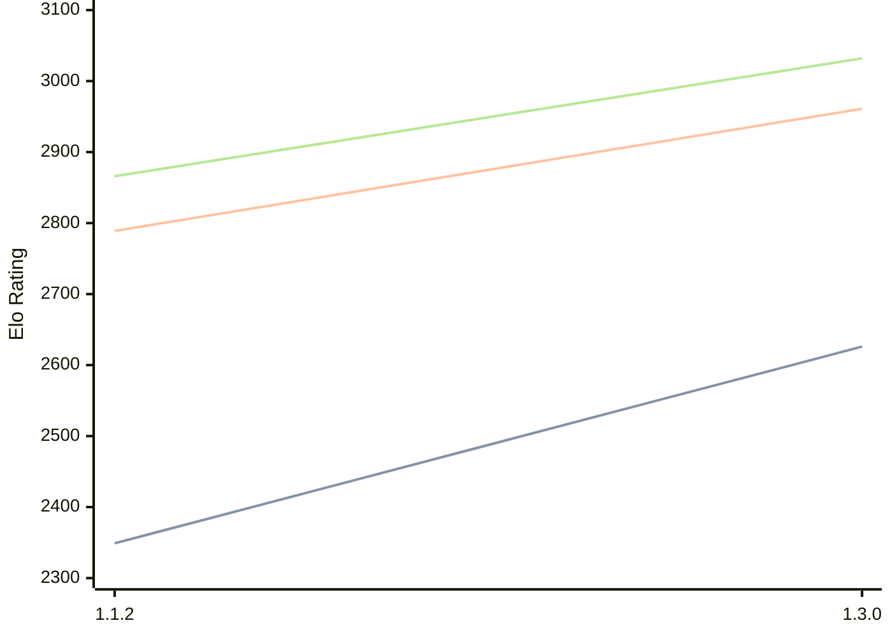

# Engine: Ember

Author: Daniel Krețu

Home: https://github.com/ExxDreamerCode/Ember

## Elo Ratings

| Version | Published | STC 8.0+0.08s  | LTC 60.0+0.60s | VLTC 2m24s+1.12s | Comment |
| --- | --- | --- | --- | --- | --- |
| 1.3.0 | 2026-08-28 | 2626(+new) | 2961(+new) | 3032(+new) |  |
| 1.2.0 | 2026-07-30 |  |  |  |  |
| 1.1.2 | 2026-07-08 | 2349(+new) | 2789(+new) | 2866(+new) |  |
| 1.1.1 | 2026-07-04 |  |  |  |  |
| 1.1.0 | 2026-06-26 |  |  |  |  |
| 1.0.0 | 2026-06-17 |  |  |  |  |
| 0.9.5 | 2026-06-14 |  |  |  |  |
| 0.9.4 | 2026-06-04 |  |  |  |  |
| 0.9.3 | 2026-06-03 |  |  |  |  |
| 0.9.2 | 2026-06-01 |  |  |  |  |
| 0.9.1 | 2026-05-31 |  |  |  |  |
 | | | cElo (∆ prev) | cElo (∆ prev) | cElo (∆ prev) | 

<a href="https://github.com/computer-chess-index/cci/issues/new?template=submit-version.yml&title=[VERSION]+Ember+<version>&body=###%20Engine%20name%0AEmber%0A%0A###%20Version%0A1.3.0" target="_blank">Submit new version</a>

 Test Conditions:

GUI/CLI: <a href=https://github.com/cutechess/cutechess target="_blank">Cute-Chess</a> 
Elo Calculation: <a href=https://www.remi-coulom.fr/Bayesian-Elo/ target="_blank">Bayesian-Elo</a> 
CPU: Intel(R) Core(TM) i5-7500T 2.70GHz 
Opening book: 8_moves_v3 
\* STC: 8.0+0.08s, LTC: 60.0+0.60s, VLTC: 2m24s+1.12s

 Lists:
Ratings: <a href=https://github.com/computer-chess-index/cci/blob/main/lists/CCIRatings.csv target="_blank">Complete list</a>

Generated: 2026-09-06 06:24:11

## Ratings Verlauf

## Detailed Evaluation Results

| Version | Time Control | Elo  | Range +/- | Matches | Score | Average Opponent Elo | Draws |
| --- | --- | --- | --- | --- | --- | --- | --- |
| 1.3.0 | VLTC (2m24s+1.12s) | 3032 | 36 | 220 | 50% | 3031 | 51% |
| 1.3.0 | LTC (60.0+0.60s) | 2961 | 33 | 264 | 53% | 2932 | 46% |
| 1.3.0 | STC (8.0+0.08s) | 2626 | 37 | 240 | 52% | 2607 | 33% |
| --- | --- | --- | --- | --- | --- | --- | --- |
| 1.1.2 | VLTC (2m24s+1.12s) | 2866 | 31 | 330 | 50% | 2861 | 41% |
| 1.1.2 | LTC (60.0+0.60s) | 2789 | 31 | 332 | 51% | 2766 | 38% |
| 1.1.2 | STC (8.0+0.08s) | 2349 | 33 | 316 | 49% | 2353 | 25% |
| --- | --- | --- | --- | --- | --- | --- | --- |