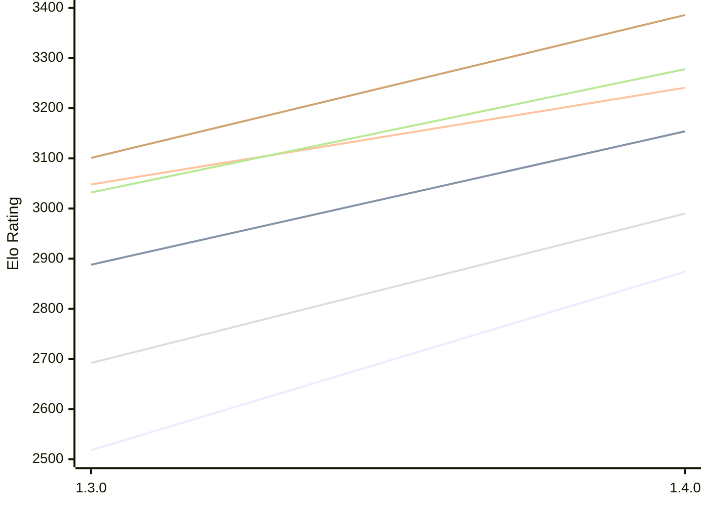
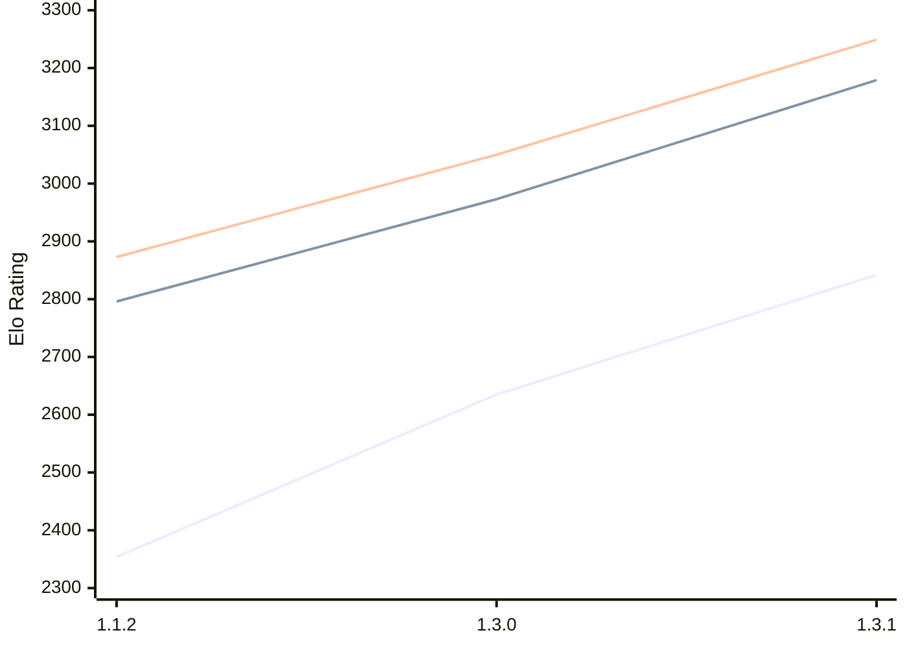

# Engine: Ember

Author: Daniel Krețu

Home: https://github.com/ExxDreamerCode/Ember

## Elo Ratings E1 (Ultra 7 265T (1.50 GHz) - E-Core)

| Version | Published | STC 8.0+0.08s  | LTC 60.0+0.60s | VLTC 2m24s+1.12s | Comment |
| --- | --- | --- | --- | --- | --- |
| 1.4.0 | 2026-10-15 | 2874(+356) | 3154(+266) | 3241(+193) |  |
| 1.3.0 | 2026-08-28 | 2518 | 2888 | 3048 |  |
 | | | cElo (∆ prev) | cElo (∆ prev) | cElo (∆ prev) | 

## Elo Ratings P1 (Ultra 7 265T (1.50 GHz) - P-Core)

| Version | Published | STC 8.0+0.08s  | LTC 60.0+0.60s | VLTC 2m24s+1.12s | Comment |
| --- | --- | --- | --- | --- | --- |
| 1.4.0 | 2026-10-15 | 2990(+298) | 3278(+246) | 3386(+285) |  |
| 1.3.0 | 2026-08-28 | 2692 | 3032 | 3101 |  |
 | | | cElo (∆ prev) | cElo (∆ prev) | cElo (∆ prev) | 

## Elo Ratings T1 (i5-7500T 2.70GHz)

| Version | Published | STC 8.0+0.08s  | LTC 60.0+0.60s | VLTC 2m24s+1.12s | Comment |
| --- | --- | --- | --- | --- | --- |
| 1.3.1 | 2026-09-18 | 2842(+207) | 3179(+206) | 3249(+199) |  |
| 1.3.0 | 2026-08-28 | 2635(+281) | 2973(+177) | 3050(+177) |  |
| 1.1.2 | 2026-07-08 | 2354 | 2796 | 2873 |  |
 | | | cElo (∆ prev) | cElo (∆ prev) | cElo (∆ prev) | 

<a href="https://github.com/computer-chess-index/cci/issues/new?template=submit-version.yml&title=[VERSION]+Ember+<version>&body=###%20Engine%20name%0AEmber%0A%0A###%20Version%0A1.3.1" target="_blank">Submit new version</a>

 Test Conditions:

GUI/CLI: <a href=https://github.com/cutechess/cutechess target="_blank">Cute-Chess</a> 
Elo Calculation: <a href=https://www.remi-coulom.fr/Bayesian-Elo/ target="_blank">Bayesian-Elo</a> 
CPU for P1: Intel(R) Core(TM) Ultra 7 265T (1.50 GHz) - P-Core 
CPU for E1: Intel(R) Core(TM) Ultra 7 265T (1.50 GHz) - E-Core 
CPU for T1: Intel(R) Core(TM) i5-7500T 2.70GHz 
Opening book: 8_moves_v3 
\* STC: 8.0+0.08s, LTC: 60.0+0.60s, VLTC: 2m24s+1.12s

 Lists:
Ratings: <a href=https://github.com/computer-chess-index/cci/blob/main/lists/CCIRatings.csv target="_blank">Complete list</a>

Generated: 2026-10-19 04:38:17

## Ratings Verlauf E1 / P1

```mermaid
%%{init: {"theme":"base","themeVariables":{"seriesColors:['#a3a3a3','#222221','#faa371']}}}%%
xychart-beta
  x-axis ["1.3.0", "1.4.0"]
  y-axis "Elo Rating" 2500 --> 3400
  line "E1: STC (8.0+0.08s)" [2518, 2874]
  line "E1: LTC (60.0+0.60s)" [2888, 3154]
  line "E1: VLTC (2m24s+1.12s)" [3048, 3241]
  line "P1: STC (8.0+0.08s)" [2692, 2990]
  line "P1: LTC (60.0+0.60s)" [3032, 3278]
  line "P1: VLTC (2m24s+1.12s)" [3101, 3386]
```

## Ratings Verlauf T1

```mermaid
%%{init: {"theme":"base","themeVariables":{"seriesColors:['#a3a3a3','#222221','#faa371']}}}%%
xychart-beta
  x-axis ["1.1.2", "1.3.0", "1.3.1"]
  y-axis "Elo Rating" 2300 --> 3300
  line "T1: STC (8.0+0.08s)" [2354, 2635, 2842]
  line "T1: LTC (60.0+0.60s)" [2796, 2973, 3179]
  line "T1: VLTC (2m24s+1.12s)" [2873, 3050, 3249]
```

## Detailed Evaluation Results

| Version | Time Control | Variant | Elo  | Range +/- | Matches | Score | Average Opponent Elo | Draws |
| --- | --- |--- | --- | --- | --- | --- | --- | --- |
| 1.4.0 | VLTC (2m24s+1.12s) | P1 | 3386 | 50 | 108 | 49% | 3386 | 58% |
|  |  | E1 | 3241 | 39 | 168 | 49% | 3247 | 68% |
|  | LTC (60.0+0.60s) | P1 | 3278 | 40 | 168 | 49% | 3283 | 62% |
|  |  | E1 | 3154 | 36 | 208 | 52% | 3136 | 55% |
|  | STC (8.0+0.08s) | P1 | 2990 | 42 | 170 | 52% | 2969 | 42% |
|  |  | E1 | 2874 | 37 | 216 | 51% | 2855 | 43% |
| --- | --- |--- | --- | --- | --- | --- | --- | --- |
| 1.3.1 | VLTC (2m24s+1.12s) | T1 | 3249 | 62 | 68 | 51% | 3235 | 62% |
|  | LTC (60.0+0.60s) | T1 | 3179 | 50 | 112 | 54% | 3143 | 52% |
|  | STC (8.0+0.08s) | T1 | 2842 | 56 | 96 | 54% | 2807 | 42% |
| --- | --- |--- | --- | --- | --- | --- | --- | --- |
| 1.3.0 | VLTC (2m24s+1.12s) | P1 | 3101 | 36 | 222 | 49% | 3110 | 49% |
|  |  | E1 | 3048 | 33 | 264 | 49% | 3059 | 50% |
|  |  | T1 | 3050 | 33 | 256 | 51% | 3042 | 53% |
|  | LTC (60.0+0.60s) | E1 | 2888 | 32 | 298 | 46% | 2927 | 41% |
|  |  | T1 | 2973 | 32 | 296 | 53% | 2946 | 45% |
|  |  | P1 | 3032 | 37 | 220 | 52% | 3011 | 45% |
|  | STC (8.0+0.08s) | E1 | 2518 | 34 | 280 | 43% | 2592 | 34% |
|  |  | T1 | 2635 | 35 | 264 | 52% | 2619 | 33% |
|  |  | P1 | 2692 | 35 | 254 | 48% | 2718 | 37% |
| --- | --- |--- | --- | --- | --- | --- | --- | --- |
| 1.1.2 | VLTC (2m24s+1.12s) | T1 | 2873 | 31 | 330 | 50% | 2867 | 41% |
|  | LTC (60.0+0.60s) | T1 | 2796 | 31 | 332 | 51% | 2773 | 38% |
|  | STC (8.0+0.08s) | T1 | 2354 | 33 | 316 | 49% | 2358 | 25% |