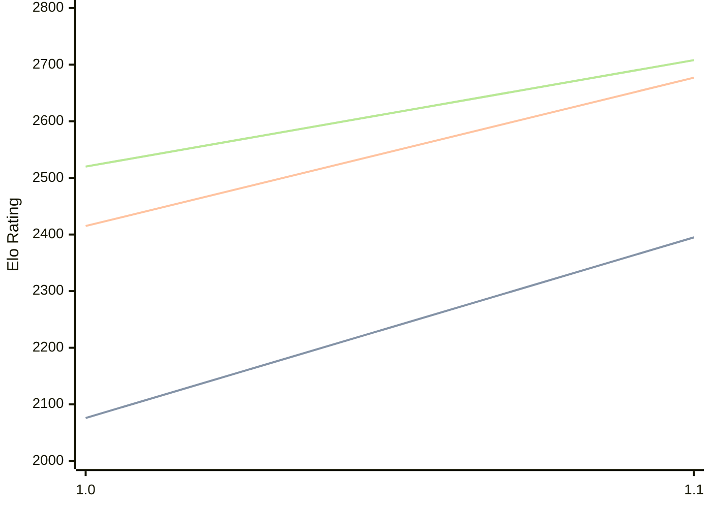

# Engine: Erinn

Author: Elias Niemann

Home: https://github.com/NichtElias/Erinn

## Elo Ratings

| Version | Published | STC 8.0+0.08s  | LTC 60.0+0.60s | VLTC 2m24s+1.12s | Comment |
| --- | --- | --- | --- | --- | --- |
| 1.1 | 2026-07-11 | 2395(+319) | 2677(+262) | 2708(+188) |  |
| 1.0 | 2026-06-10 | 2076 | 2415 | 2520 |  |
 | | | cElo (∆ prev) | cElo (∆ prev) | cElo (∆ prev) | 

<a href="https://github.com/computer-chess-index/cci/issues/new?template=submit-version.yml&title=[VERSION]+Erinn+<version>&body=###%20Engine%20name%0AErinn%0A%0A###%20Version%0A1.1" target="_blank">Submit new version</a>

 Test Conditions:

GUI/CLI: <a href=https://github.com/cutechess/cutechess target="_blank">Cute-Chess</a> 
Elo Calculation: <a href=https://www.remi-coulom.fr/Bayesian-Elo/ target="_blank">Bayesian-Elo</a> 
CPU: Intel(R) Core(TM) i5-7500T 2.70GHz 
Opening book: 8_moves_v3 
\* STC: 8.0+0.08s, LTC: 60.0+0.60s, VLTC: 2m24s+1.12s

 Lists:
Ratings: <a href=https://github.com/computer-chess-index/cci/blob/main/lists/CCIRatings.csv target="_blank">Complete list</a>

Generated: 2026-07-22 06:24:55

## Ratings Verlauf

⬛ STC (8.0+0.08s) &nbsp;&nbsp; 🟧 LTC (60.0+0.60s) &nbsp;&nbsp; 🟩 VLTC (2m24s+1.12s)

dark mode: 🟩STC (8.0+0.08s) 🟧LTC (60.0+0.60s) ⬜VLTC (2m24s+1.12s)

## Detailed Evaluation Results

| Version | Time Control | Elo  | Range +/- | Matches | Score | Average Opponent Elo | Draws |
| --- | --- | --- | --- | --- | --- | --- | --- |
| 1.1 | VLTC (2m24s+1.12s) | 2708 | 42 | 166 | 50% | 2708 | 48% |
| 1.1 | LTC (60.0+0.60s) | 2677 | 40 | 194 | 52% | 2664 | 41% |
| 1.1 | STC (8.0+0.08s) | 2395 | 35 | 248 | 48% | 2414 | 39% |
| --- | --- | --- | --- | --- | --- | --- | --- |
| 1.0 | VLTC (2m24s+1.12s) | 2520 | 32 | 316 | 50% | 2514 | 35% |
| 1.0 | LTC (60.0+0.60s) | 2415 | 30 | 368 | 56% | 2350 | 37% |
| 1.0 | STC (8.0+0.08s) | 2076 | 36 | 276 | 52% | 2044 | 25% |
| --- | --- | --- | --- | --- | --- | --- | --- |