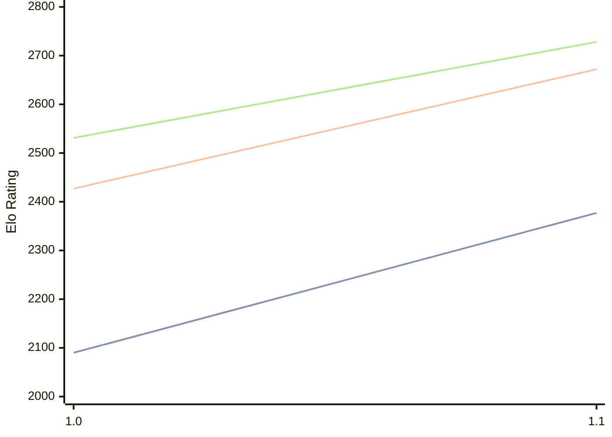

# Engine: Erinn

Author: Elias Niemann

Home: https://github.com/NichtElias/Erinn

## Elo Ratings

| Version | Published | STC 8.0+0.08s  | LTC 60.0+0.60s | VLTC 2m24s+1.12s | Comment |
| --- | --- | --- | --- | --- | --- |
| 1.1 | 2026-07-11 | 2377(+287) | 2672(+245) | 2728(+197) |  |
| 1.0 | 2026-06-10 | 2090 | 2427 | 2531 |  |
 | | | cElo (∆ prev) | cElo (∆ prev) | cElo (∆ prev) | 

<a href="https://github.com/computer-chess-index/cci/issues/new?template=submit-version.yml&title=[VERSION]+Erinn+<version>&body=###%20Engine%20name%0AErinn%0A%0A###%20Version%0A1.1" target="_blank">Submit new version</a>

 Test Conditions:

GUI/CLI: <a href=https://github.com/cutechess/cutechess target="_blank">Cute-Chess</a> 
Elo Calculation: <a href=https://www.remi-coulom.fr/Bayesian-Elo/ target="_blank">Bayesian-Elo</a> 
CPU: Intel(R) Core(TM) i5-7500T 2.70GHz 
Opening book: 8_moves_v3 
\* STC: 8.0+0.08s, LTC: 60.0+0.60s, VLTC: 2m24s+1.12s

 Lists:
Ratings: <a href=https://github.com/computer-chess-index/cci/blob/main/lists/CCIRatings.csv target="_blank">Complete list</a>

Generated: 2026-09-03 04:34:56

## Ratings Verlauf

## Detailed Evaluation Results

| Version | Time Control | Elo  | Range +/- | Matches | Score | Average Opponent Elo | Draws |
| --- | --- | --- | --- | --- | --- | --- | --- |
| 1.1 | VLTC (2m24s+1.12s) | 2728 | 32 | 276 | 50% | 2727 | 51% |
| 1.1 | LTC (60.0+0.60s) | 2672 | 29 | 352 | 51% | 2673 | 45% |
| 1.1 | STC (8.0+0.08s) | 2377 | 27 | 428 | 47% | 2402 | 40% |
| --- | --- | --- | --- | --- | --- | --- | --- |
| 1.0 | VLTC (2m24s+1.12s) | 2531 | 32 | 316 | 50% | 2526 | 35% |
| 1.0 | LTC (60.0+0.60s) | 2427 | 30 | 368 | 56% | 2361 | 37% |
| 1.0 | STC (8.0+0.08s) | 2090 | 36 | 276 | 52% | 2059 | 25% |
| --- | --- | --- | --- | --- | --- | --- | --- |