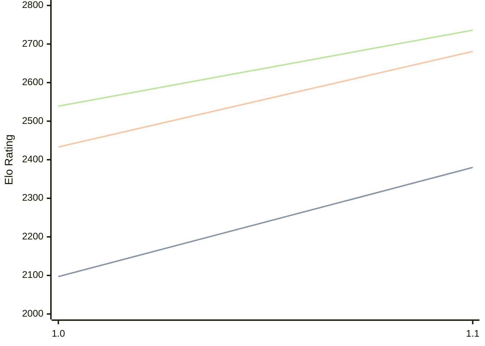

# Engine: Erinn

Author: Elias Niemann

Home: https://github.com/NichtElias/Erinn

## Elo Ratings E1

| Version | Published | STC 8.0+0.08s  | LTC 60.0+0.60s | VLTC 2m24s+1.12s | Comment |
| --- | --- | --- | --- | --- | --- |
| 1.1 | 2026-07-11 | 1643 | 2537 | 2597 |  |
 | | | cElo (∆ prev) | cElo (∆ prev) | cElo (∆ prev) | 

## Elo Ratings P1

| Version | Published | STC 8.0+0.08s  | LTC 60.0+0.60s | VLTC 2m24s+1.12s | Comment |
| --- | --- | --- | --- | --- | --- |
| 1.1 | 2026-07-11 | 1975 | 2734 | 2793 |  |
 | | | cElo (∆ prev) | cElo (∆ prev) | cElo (∆ prev) | 

## Elo Ratings T1

| Version | Published | STC 8.0+0.08s  | LTC 60.0+0.60s | VLTC 2m24s+1.12s | Comment |
| --- | --- | --- | --- | --- | --- |
| 1.1 | 2026-07-11 | 2380(+283) | 2681(+248) | 2736(+197) |  |
| 1.0 | 2026-06-10 | 2097 | 2433 | 2539 |  |
 | | | cElo (∆ prev) | cElo (∆ prev) | cElo (∆ prev) | 

<a href="https://github.com/computer-chess-index/cci/issues/new?template=submit-version.yml&title=[VERSION]+Erinn+<version>&body=###%20Engine%20name%0AErinn%0A%0A###%20Version%0A1.1" target="_blank">Submit new version</a>

 Test Conditions:

GUI/CLI: <a href=https://github.com/cutechess/cutechess target="_blank">Cute-Chess</a> 
Elo Calculation: <a href=https://www.remi-coulom.fr/Bayesian-Elo/ target="_blank">Bayesian-Elo</a> 
CPU for P1: Intel(R) Core(TM) Ultra 7 265T (1.50 GHz) - P-Core 
CPU for E1: Intel(R) Core(TM) Ultra 7 265T (1.50 GHz) - E-Core 
CPU for T1: Intel(R) Core(TM) i5-7500T 2.70GHz 
Opening book: 8_moves_v3 
\* STC: 8.0+0.08s, LTC: 60.0+0.60s, VLTC: 2m24s+1.12s

 Lists:
Ratings: <a href=https://github.com/computer-chess-index/cci/blob/main/lists/CCIRatings.csv target="_blank">Complete list</a>

Generated: 2026-10-09 14:11:19

## Ratings Verlauf

```mermaid
%%{init: {"theme":"base","themeVariables":{"seriesColors:['#a3a3a3','#222221','#faa371']}}}%%
xychart-beta
  x-axis ["1.0", "1.1"]
  y-axis "Elo Rating" 2000 --> 2800
  line "" [2097, 2380]
  line "STC (8.0+0.08s)" [2097, 2380]
  line "LTC (60.0+0.60s)" [2433, 2681]
  line "" [2539, 2736]
  line "VLTC (2m24s+1.12s)" [2539, 2736]
```

## Detailed Evaluation Results

| Version | Time Control | Elo  | Range +/- | Matches | Score | Average Opponent Elo | Draws |
| --- | --- | --- | --- | --- | --- | --- | --- |
| 1.1 | VLTC (2m24s+1.12s) | 2597 | 47 | 136 | 53% | 2572 | 44% |
| 1.1 | VLTC (2m24s+1.12s) | 2736 | 31 | 302 | 50% | 2736 | 52% |
| 1.1 | VLTC (2m24s+1.12s) | 2793 | 45 | 140 | 51% | 2784 | 47% |
| 1.1 | LTC (60.0+0.60s) | 2537 | 45 | 156 | 50% | 2535 | 37% |
| 1.1 | LTC (60.0+0.60s) | 2681 | 27 | 404 | 50% | 2688 | 45% |
| 1.1 | LTC (60.0+0.60s) | 2734 | 53 | 110 | 54% | 2697 | 38% |
| 1.1 | STC (8.0+0.08s) | 2380 | 26 | 448 | 47% | 2404 | 40% |
| --- | --- | --- | --- | --- | --- | --- | --- |
| 1.1 | STC (8.0+0.08s) | 1975 | 48 | 158 | 48% | 2020 | 22% |
| --- | --- | --- | --- | --- | --- | --- | --- |
| 1.1 | STC (8.0+0.08s) | 1643 | 52 | 138 | 47% | 1679 | 18% |
| --- | --- | --- | --- | --- | --- | --- | --- |
| 1.0 | VLTC (2m24s+1.12s) | 2539 | 32 | 316 | 50% | 2533 | 35% |
| 1.0 | LTC (60.0+0.60s) | 2433 | 30 | 368 | 56% | 2368 | 37% |
| 1.0 | STC (8.0+0.08s) | 2097 | 36 | 276 | 52% | 2066 | 25% |
| --- | --- | --- | --- | --- | --- | --- | --- |