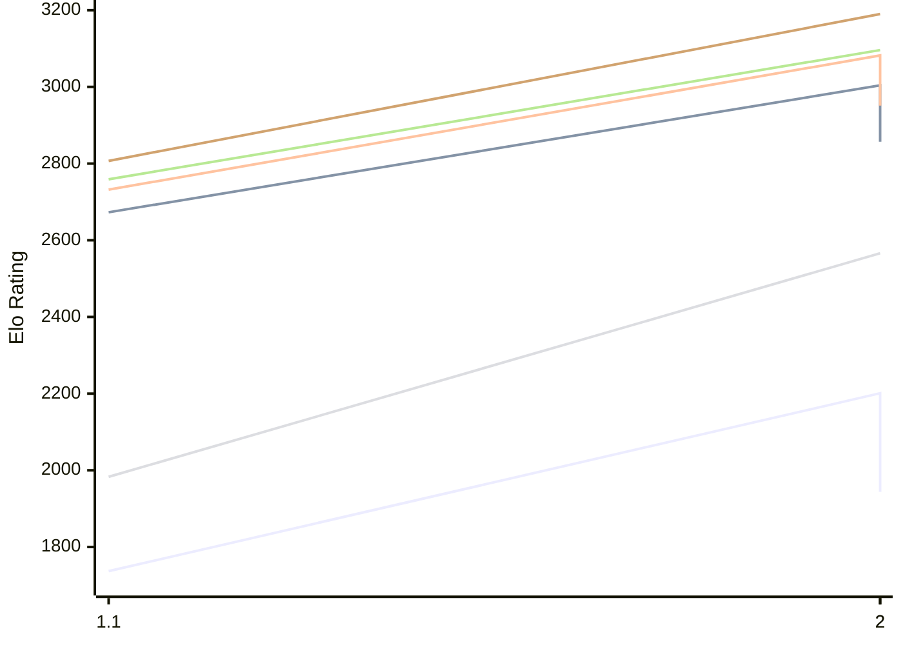
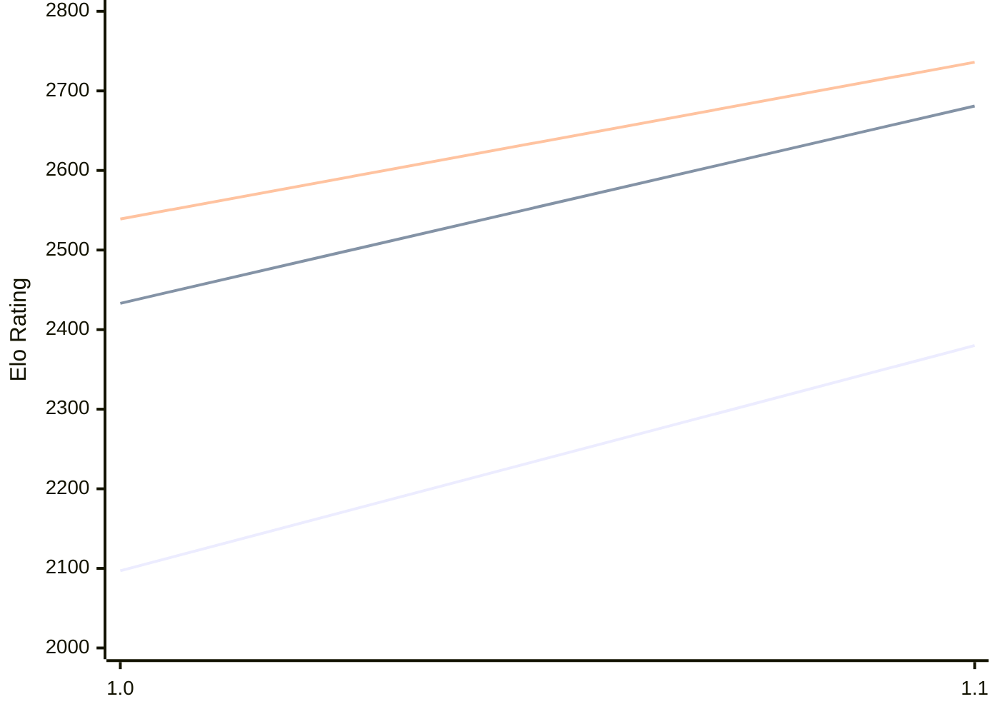

# Engine: Erinn

Author: Elias Niemann

Home: https://github.com/NichtElias/Erinn

## Elo Ratings E1 (Ultra 7 265T (1.50 GHz) - E-Core)

| Version | Published | STC 8.0+0.08s  | LTC 60.0+0.60s | VLTC 2m24s+1.12s | Comment |
| --- | --- | --- | --- | --- | --- |
| 2 | 2026-10-01 | 1944(-257) | 2857(-147) | 2951(-131) |  |
| 2 | 2026-10-01 | 2201(+464) | 3004(+331) | 3082(+350) |  |
| 1.1 | 2026-07-11 | 1737 | 2673 | 2732 |  |
 | | | cElo (∆ prev) | cElo (∆ prev) | cElo (∆ prev) | 

## Elo Ratings P1 (Ultra 7 265T (1.50 GHz) - P-Core)

| Version | Published | STC 8.0+0.08s  | LTC 60.0+0.60s | VLTC 2m24s+1.12s | Comment |
| --- | --- | --- | --- | --- | --- |
| 2 | 2026-10-01 | 2566(+583) | 3096(+337) | 3190(+383) |  |
| 1.1 | 2026-07-11 | 1983 | 2759 | 2807 |  |
 | | | cElo (∆ prev) | cElo (∆ prev) | cElo (∆ prev) | 

## Elo Ratings T1 (i5-7500T 2.70GHz)

| Version | Published | STC 8.0+0.08s  | LTC 60.0+0.60s | VLTC 2m24s+1.12s | Comment |
| --- | --- | --- | --- | --- | --- |
| 1.1 | 2026-07-11 | 2380(+283) | 2681(+248) | 2736(+197) |  |
| 1.0 | 2026-06-10 | 2097 | 2433 | 2539 |  |
 | | | cElo (∆ prev) | cElo (∆ prev) | cElo (∆ prev) | 

<a href="https://github.com/computer-chess-index/cci/issues/new?template=submit-version.yml&title=[VERSION]+Erinn+<version>&body=###%20Engine%20name%0AErinn%0A%0A###%20Version%0A1.1" target="_blank">Submit new version</a>

 Test Conditions:

GUI/CLI: <a href=https://github.com/cutechess/cutechess target="_blank">Cute-Chess</a> 
Elo Calculation: <a href=https://www.remi-coulom.fr/Bayesian-Elo/ target="_blank">Bayesian-Elo</a> 
CPU for P1: Intel(R) Core(TM) Ultra 7 265T (1.50 GHz) - P-Core 
CPU for E1: Intel(R) Core(TM) Ultra 7 265T (1.50 GHz) - E-Core 
CPU for T1: Intel(R) Core(TM) i5-7500T 2.70GHz 
Opening book: 8_moves_v3 
\* STC: 8.0+0.08s, LTC: 60.0+0.60s, VLTC: 2m24s+1.12s

 Lists:
Ratings: <a href=https://github.com/computer-chess-index/cci/blob/main/lists/CCIRatings.csv target="_blank">Complete list</a>

Generated: 2026-11-06 05:37:59

## Ratings Verlauf E1 / P1

```mermaid
%%{init: {"theme":"base","themeVariables":{"seriesColors:['#a3a3a3','#222221','#faa371']}}}%%
xychart-beta
  x-axis ["1.1", "2", "2"]
  y-axis "Elo Rating" 1700 --> 3200
  line "E1: STC (8.0+0.08s)" [1737, 2201, 1944]
  line "E1: LTC (60.0+0.60s)" [2673, 3004, 2857]
  line "E1: VLTC (2m24s+1.12s)" [2732, 3082, 2951]
  line "P1: STC (8.0+0.08s)" [1983, 2566]
  line "P1: LTC (60.0+0.60s)" [2759, 3096]
  line "P1: VLTC (2m24s+1.12s)" [2807, 3190]
```

## Ratings Verlauf T1

```mermaid
%%{init: {"theme":"base","themeVariables":{"seriesColors:['#a3a3a3','#222221','#faa371']}}}%%
xychart-beta
  x-axis ["1.0", "1.1"]
  y-axis "Elo Rating" 2000 --> 2800
  line "T1: STC (8.0+0.08s)" [2097, 2380]
  line "T1: LTC (60.0+0.60s)" [2433, 2681]
  line "T1: VLTC (2m24s+1.12s)" [2539, 2736]
```

## Detailed Evaluation Results

| Version | Time Control | Variant | Elo  | Range +/- | Matches | Score | Average Opponent Elo | Draws |
| --- | --- |--- | --- | --- | --- | --- | --- | --- |
| 2 | VLTC (2m24s+1.12s) | E1 | 2951 | 89 | 44 | 59% | 2865 | 23% |
|  |  | P1 | 3190 | 39 | 192 | 47% | 3214 | 49% |
|  |  | E1 | 3082 | 36 | 230 | 52% | 3062 | 46% |
|  | LTC (60.0+0.60s) | E1 | 2857 | 88 | 40 | 60% | 2768 | 40% |
|  |  | P1 | 3096 | 41 | 182 | 55% | 3050 | 45% |
|  |  | E1 | 3004 | 32 | 286 | 51% | 2998 | 45% |
|  | STC (8.0+0.08s) | E1 | 1944 | 109 | 32 | 64% | 1805 | 16% |
|  |  | P1 | 2566 | 43 | 202 | 52% | 2533 | 16% |
|  |  | E1 | 2201 | 35 | 318 | 55% | 2147 | 14% |
| --- | --- |--- | --- | --- | --- | --- | --- | --- |
| 1.1 | VLTC (2m24s+1.12s) | P1 | 2807 | 45 | 140 | 51% | 2799 | 47% |
|  |  | E1 | 2732 | 46 | 140 | 53% | 2708 | 46% |
|  |  | T1 | 2736 | 31 | 302 | 50% | 2736 | 52% |
|  | LTC (60.0+0.60s) | P1 | 2759 | 50 | 126 | 54% | 2720 | 40% |
|  |  | E1 | 2673 | 45 | 156 | 50% | 2672 | 37% |
|  |  | T1 | 2681 | 27 | 404 | 50% | 2688 | 45% |
|  | STC (8.0+0.08s) | E1 | 1737 | 48 | 162 | 46% | 1787 | 17% |
|  |  | T1 | 2380 | 26 | 448 | 47% | 2404 | 40% |
|  |  | P1 | 1983 | 43 | 200 | 49% | 2010 | 21% |
| --- | --- |--- | --- | --- | --- | --- | --- | --- |
| 1.0 | VLTC (2m24s+1.12s) | T1 | 2539 | 32 | 316 | 50% | 2533 | 35% |
|  | LTC (60.0+0.60s) | T1 | 2433 | 30 | 368 | 56% | 2368 | 37% |
|  | STC (8.0+0.08s) | T1 | 2097 | 36 | 276 | 52% | 2066 | 25% |