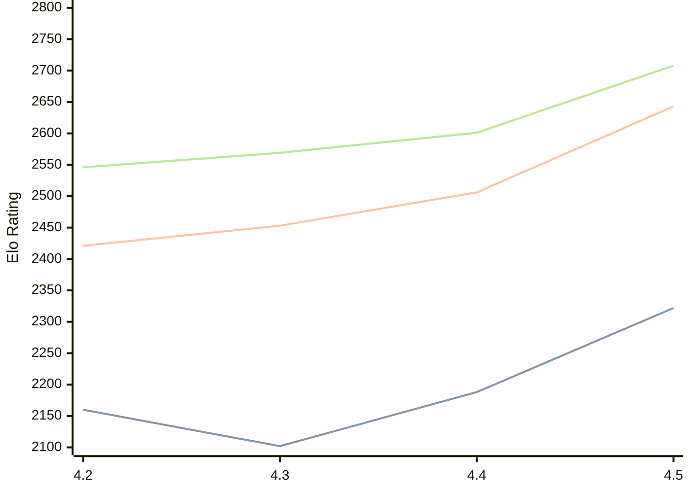

# Engine: Eubos

Author: Chris Bolt

Home: https://github.com/cjbolt/EubosChess

## Elo Ratings

| Version | Published | STC 8.0+0.08s  | LTC 60.0+0.60s | VLTC 2m24s+1.12s | Comment |
| --- | --- | --- | --- | --- | --- |
| 4.5 | 2026-06-09 | 2322(+134) | 2643(+137) | 2708(+107) |  |
| 4.4 | 2026-05-06 | 2188(+86) | 2506(+53) | 2601(+32) |  |
| 4.3 | 2026-01-29 | 2102(-58) | 2453(+32) | 2569(+23) |  |
| 4.2 | 2025-10-16 | 2160 | 2421 | 2546 |  |
 | | | cElo (∆ prev) | cElo (∆ prev) | cElo (∆ prev) | 

<a href="https://github.com/computer-chess-index/cci/issues/new?template=submit-version.yml&title=[VERSION]+Eubos+<version>&body=###%20Engine%20name%0AEubos%0A%0A###%20Version%0A4.5" target="_blank">Submit new version</a>

 Test Conditions:

GUI/CLI: <a href=https://github.com/cutechess/cutechess target="_blank">Cute-Chess</a> 
Elo Calculation: <a href=https://www.remi-coulom.fr/Bayesian-Elo/ target="_blank">Bayesian-Elo</a> 
CPU: Intel(R) Core(TM) i5-7500T 2.70GHz 
Opening book: 8_moves_v3 
\* STC: 8.0+0.08s, LTC: 60.0+0.60s, VLTC: 2m24s+1.12s

 Lists:
Ratings: <a href=https://github.com/computer-chess-index/cci/blob/main/lists/CCIRatings.csv target="_blank">Complete list</a>

Generated: 2026-09-06 06:24:22

## Ratings Verlauf

## Detailed Evaluation Results

| Version | Time Control | Elo  | Range +/- | Matches | Score | Average Opponent Elo | Draws |
| --- | --- | --- | --- | --- | --- | --- | --- |
| 4.5 | VLTC (2m24s+1.12s) | 2708 | 30 | 358 | 49% | 2714 | 36% |
| 4.5 | LTC (60.0+0.60s) | 2643 | 29 | 396 | 49% | 2649 | 27% |
| 4.5 | STC (8.0+0.08s) | 2322 | 29 | 420 | 47% | 2356 | 23% |
| --- | --- | --- | --- | --- | --- | --- | --- |
| 4.4 | VLTC (2m24s+1.12s) | 2601 | 32 | 320 | 48% | 2620 | 30% |
| 4.4 | LTC (60.0+0.60s) | 2506 | 32 | 334 | 49% | 2510 | 27% |
| 4.4 | STC (8.0+0.08s) | 2188 | 32 | 344 | 50% | 2182 | 23% |
| --- | --- | --- | --- | --- | --- | --- | --- |
| 4.3 | VLTC (2m24s+1.12s) | 2569 | 30 | 388 | 50% | 2558 | 27% |
| 4.3 | LTC (60.0+0.60s) | 2453 | 31 | 368 | 49% | 2458 | 24% |
| 4.3 | STC (8.0+0.08s) | 2102 | 28 | 452 | 50% | 2087 | 21% |
| --- | --- | --- | --- | --- | --- | --- | --- |
| 4.2 | VLTC (2m24s+1.12s) | 2546 | 36 | 266 | 52% | 2529 | 24% |
| 4.2 | LTC (60.0+0.60s) | 2421 | 35 | 272 | 50% | 2418 | 26% |
| 4.2 | STC (8.0+0.08s) | 2160 | 34 | 310 | 52% | 2132 | 22% |
| --- | --- | --- | --- | --- | --- | --- | --- |