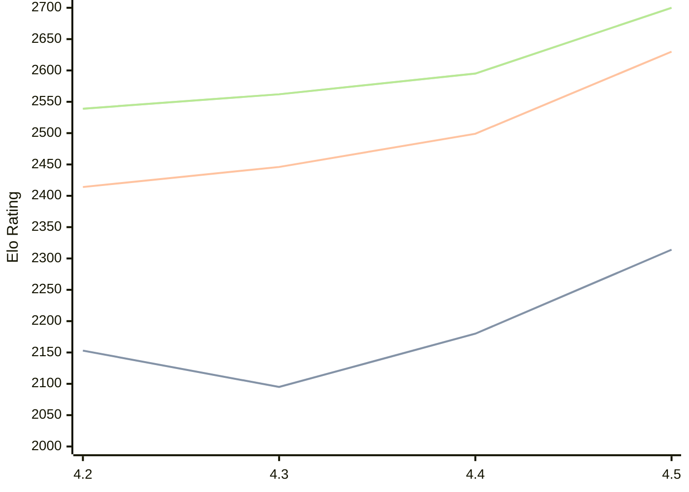

# Engine: Eubos

Author: Chris Bolt

Home: https://github.com/cjbolt/EubosChess

## Elo Ratings

| Version | Published | STC 8.0+0.08s  | LTC 60.0+0.60s | VLTC 2m24s+1.12s | Comment |
| --- | --- | --- | --- | --- | --- |
| 4.5 | 2026-06-09 | 2314(+134) | 2630(+131) | 2700(+105) |  |
| 4.4 | 2026-05-06 | 2180(+85) | 2499(+53) | 2595(+33) |  |
| 4.3 | 2026-01-29 | 2095(-58) | 2446(+32) | 2562(+23) |  |
| 4.2 | 2025-10-16 | 2153 | 2414 | 2539 |  |
 | | | cElo (∆ prev) | cElo (∆ prev) | cElo (∆ prev) | 

<a href="https://github.com/computer-chess-index/cci/issues/new?template=submit-version.yml&title=[VERSION]+Eubos+<version>&body=###%20Engine%20name%0AEubos%0A%0A###%20Version%0A4.5" target="_blank">Submit new version</a>

 Test Conditions:

GUI/CLI: <a href=https://github.com/cutechess/cutechess target="_blank">Cute-Chess</a> 
Elo Calculation: <a href=https://www.remi-coulom.fr/Bayesian-Elo/ target="_blank">Bayesian-Elo</a> 
CPU: Intel(R) Core(TM) i5-7500T 2.70GHz 
Opening book: 8_moves_v3 
\* STC: 8.0+0.08s, LTC: 60.0+0.60s, VLTC: 2m24s+1.12s

 Lists:
Ratings: <a href=https://github.com/computer-chess-index/cci/blob/main/lists/CCIRatings.csv target="_blank">Complete list</a>

Generated: 2026-08-20 06:25:04

## Ratings Verlauf

⬛ STC (8.0+0.08s) &nbsp;&nbsp; 🟧 LTC (60.0+0.60s) &nbsp;&nbsp; 🟩 VLTC (2m24s+1.12s)

dark mode: 🟩STC (8.0+0.08s) 🟧LTC (60.0+0.60s) ⬜VLTC (2m24s+1.12s)

## Detailed Evaluation Results

| Version | Time Control | Elo  | Range +/- | Matches | Score | Average Opponent Elo | Draws |
| --- | --- | --- | --- | --- | --- | --- | --- |
| 4.5 | VLTC (2m24s+1.12s) | 2700 | 31 | 330 | 49% | 2708 | 36% |
| 4.5 | LTC (60.0+0.60s) | 2630 | 30 | 368 | 49% | 2643 | 28% |
| 4.5 | STC (8.0+0.08s) | 2314 | 30 | 404 | 47% | 2350 | 23% |
| --- | --- | --- | --- | --- | --- | --- | --- |
| 4.4 | VLTC (2m24s+1.12s) | 2595 | 32 | 320 | 48% | 2614 | 30% |
| 4.4 | LTC (60.0+0.60s) | 2499 | 32 | 334 | 49% | 2502 | 27% |
| 4.4 | STC (8.0+0.08s) | 2180 | 32 | 344 | 50% | 2174 | 23% |
| --- | --- | --- | --- | --- | --- | --- | --- |
| 4.3 | VLTC (2m24s+1.12s) | 2562 | 30 | 388 | 50% | 2552 | 27% |
| 4.3 | LTC (60.0+0.60s) | 2446 | 31 | 368 | 49% | 2452 | 24% |
| 4.3 | STC (8.0+0.08s) | 2095 | 28 | 452 | 50% | 2080 | 21% |
| --- | --- | --- | --- | --- | --- | --- | --- |
| 4.2 | VLTC (2m24s+1.12s) | 2539 | 36 | 266 | 52% | 2522 | 24% |
| 4.2 | LTC (60.0+0.60s) | 2414 | 35 | 272 | 50% | 2411 | 26% |
| 4.2 | STC (8.0+0.08s) | 2153 | 34 | 310 | 52% | 2126 | 22% |
| --- | --- | --- | --- | --- | --- | --- | --- |