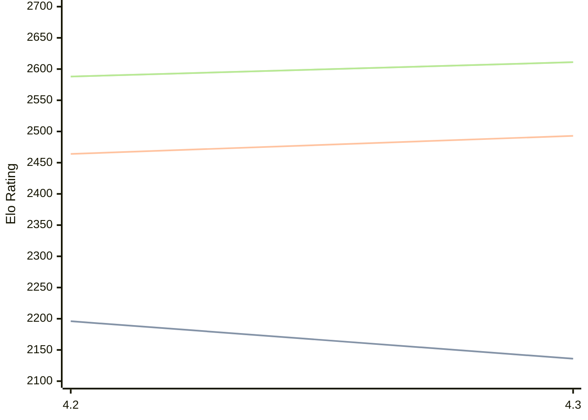

# Engine: Eubos

Author: Chris Bolt

Home: https://github.com/cjbolt/EubosChess

## Ratings nach Version

| Version | Published | STC 8.0+0.08s  | LTC 60.0+0.60s | VLTC 2m24s+1.12s | Comment |
| --- | --- | --- | --- | --- | --- |
| 4.3 | 2026-01-29 | 2136(-60) | 2493(+29) | 2611(+23) |  |
| 4.2 | 2025-10-16 | 2196(+new) | 2464(+new) | 2588(+new) |  |
| 4.1 | 2025-08-23 |  |  |  |  |
| 4.0 | 2025-04-13 |  |  |  |  |
| 3.9 | 2025-03-25 |  |  |  |  |
| 3.8.1 | 2025-01-07 |  |  |  |  |
| 3.7 | 2024-11-24 |  |  |  |  |
| 3.6 | 2024-06-19 |  |  |  |  |
| 3.5 | 2024-05-06 |  |  |  |  |
| 3.4 | 2024-04-04 |  |  |  |  |
| 3.3 | 2024-02-23 |  |  |  |  |
| 3.2 | 2024-02-23 |  |  |  |  |
| 3.1 | 2024-02-09 |  |  |  |  |
| 3.0 | 2024-01-02 |  |  |  |  |
| 2.27 | 2023-12-11 |  |  |  |  |
| 2.26 | 2023-11-27 |  |  |  |  |
| 2.25 | 2023-11-21 |  |  |  |  |
| 2.24 | 2023-10-31 |  |  |  |  |
| 2.23 | 2023-08-21 |  |  |  |  |
| 2.22 | 2023-07-02 |  |  |  |  |
| 2.21 | 2023-05-21 |  |  |  |  |
| 2.20 | 2023-05-06 |  |  |  |  |
| 2.19 | 2023-03-01 |  |  |  |  |
| 2.18 | 2023-01-30 |  |  |  |  |
| 2.17 | 2022-12-23 |  |  |  |  |
| 2.16 | 2022-12-18 |  |  |  |  |
| 2.15 | 2022-10-30 |  |  |  |  |
| 2.14 | 2022-09-05 |  |  |  |  |
| 2.13 | 2022-08-01 |  |  |  |  |
| 2.12 | 2022-06-10 |  |  |  |  |
| 2.11 | 2022-04-30 |  |  |  |  |
| 2.10 | 2022-03-18 |  |  |  |  |
| 2.9 | 2022-02-28 |  |  |  |  |
| 2.8 | 2022-02-18 |  |  |  |  |
| 2.7 | 2022-02-05 |  |  |  |  |
| 2.6 | 2022-01-17 |  |  |  |  |
| 2.5 | 2022-01-12 |  |  |  |  |
| 2.4 | 2021-12-14 |  |  |  |  |
| 2.3 | 2021-11-28 |  |  |  |  |
| 2.2 | 2021-03-16 |  |  |  |  |
| 2.1 | 2021-03-01 |  |  |  |  |
| 2.0 | 2021-01-06 |  |  |  |  |
| 1.1.6 | 2020-12-04 |  |  |  |  |
| 1.1.5 | 2020-11-14 |  |  |  |  |
| 1.1.4 | 2020-10-27 |  |  |  |  |
| 1.1.3 | 2020-10-03 |  |  |  |  |
| 1.1.2 | 2020-09-22 |  |  |  |  |
| 1.1.1 | 2020-09-13 |  |  |  |  |
| 1.1.0 | 2020-08-29 |  |  |  |  |
| 1.0.9 | 2020-08-28 |  |  |  |  |
| 1.0.8 | 2020-06-02 |  |  |  |  |
| 1.0.7 | 2020-03-14 |  |  |  |  |
| 1.0.6 | 2020-03-10 |  |  |  |  |
| 1.0.5 | 2020-03-09 |  |  |  |  |
| 1.0.4 | 2020-02-22 |  |  |  |  |
| 1.0.3 | 2020-02-04 |  |  |  |  |
| 1.0.2 | 2020-01-28 |  |  |  |  |
| 1.0.1 | 2020-01-27 |  |  |  |  |
 | | | cElo (∆ prev) | cElo (∆ prev) | cElo (∆ prev) | 

<a href="https://github.com/computer-chess-index/cci/issues/new?template=submit-version.yml&title=[VERSION]+Eubos+<version>&body=###%20Engine%20name%0AEubos%0A%0A###%20Version%0A4.3" target="_blank">Submit new version</a>

 Test Conditions:

GUI/CLI: <a href=https://github.com/cutechess/cutechess target="_blank">Cute-Chess</a> 
Elo Calculation: <a href=https://www.remi-coulom.fr/Bayesian-Elo/ target="_blank">Bayesian-Elo</a> 
CPU: Intel(R) Core(TM) i5-7500T 2.70GHz 
Opening book: 8_moves_v3 
\* STC: 8.0+0.08s, LTC: 60.0+0.60s, VLTC: 2m24s+1.12s

 Lists:
Ratings: <a href=https://github.com/computer-chess-index/cci/blob/main/lists/CCIRatings.csv target="_blank">Complete list</a>

Generated: 2026-04-24 06:24:30

## Ratings Verlauf

⬛ STC (8.0+0.08s) &nbsp;&nbsp; 🟧 LTC (60.0+0.60s) &nbsp;&nbsp; 🟩 VLTC (2m24s+1.12s)

dark mode: 🟩STC (8.0+0.08s) 🟧LTC (60.0+0.60s) ⬜VLTC (2m24s+1.12s)

